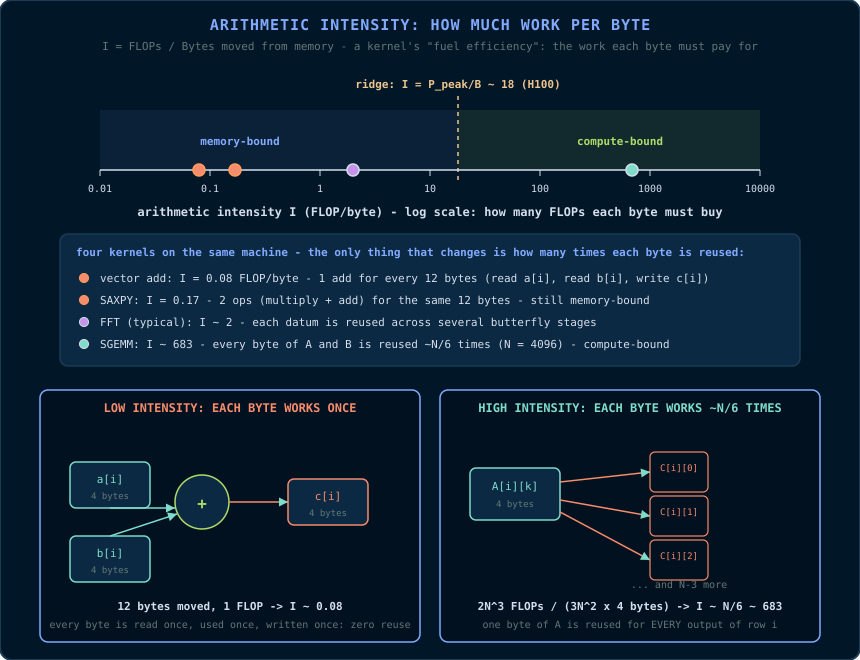
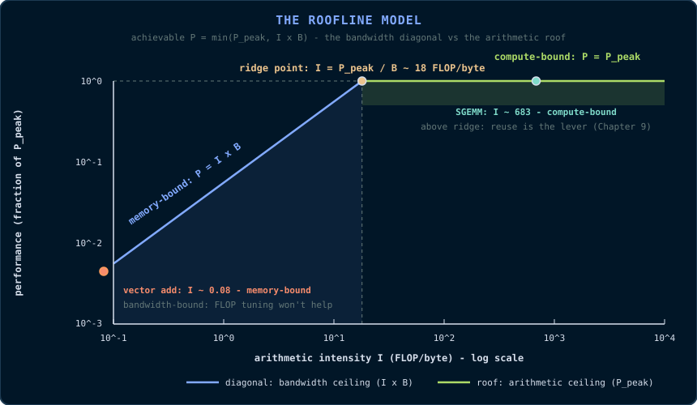
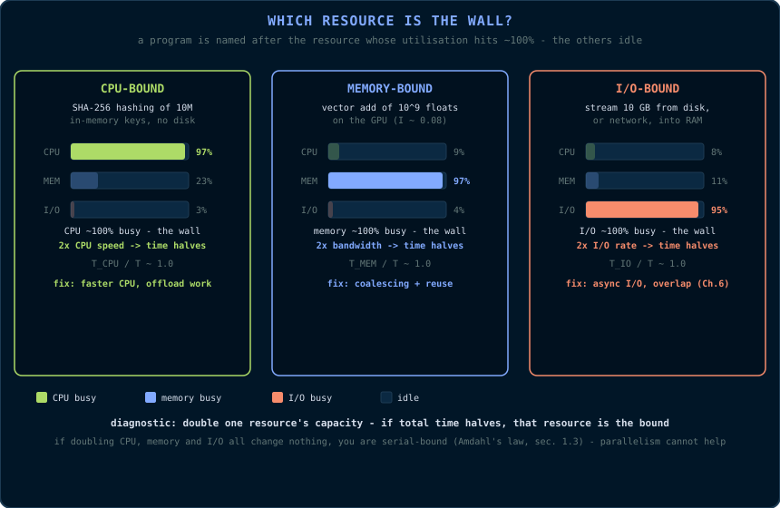

# Chapter 1: The Mathematics of Parallelism

> *"A fast program is not the same thing as a parallel program. The mathematics
> below is the difference between the two."*

Before we touch a single CUDA API, we must understand what parallelism can and
cannot buy us. This chapter establishes the mathematical vocabulary of the
entire book: *speedup*, *efficiency*, *Amdahl's law*, *scaling*, *Flynn's
taxonomy*, and the *roofline model*. None of these ideas are optional context;
they are the instruments you will use to decide, for every kernel in this book,
whether a given optimisation is worth the effort.

## 1.1 Latency, Throughput, and the Meaning of "Faster"

When we say a program is "slow", we usually mean one of two things, and the
distinction matters enormously on a GPU.

- **Latency** is the time between the start of an operation and its
  completion. A network round trip has latency. A single memory access has
  latency. Latency is measured in time units (nanoseconds, milliseconds).
- **Throughput** is the number of operations completed per unit time. A
  pipeline that processes 60 frames per second has a throughput of 60 Hz.
  Throughput is measured in operations per second.

A CPU is designed to **minimise latency**: a small number of very fast cores,
each executing one instruction stream with a branch predictor, out-of-order
execution, and large caches to hide the latency of DRAM.

A GPU is designed to **maximise throughput**: a very large number of simple
execution units, none of which is individually fast, but which together
complete millions of operations per clock. The GPU hides latency not by
predicting what happens next, but by having so many independent threads in
flight that the hardware always has something to do while others wait.

This is the first primitive of the book:

> **Primitive - latency hiding.** If an execution unit must wait for a slow
> operation (a memory access, a division), the unit is idle. The GPU avoids
> idleness by switching to another ready thread. The cost of the wait is
> hidden, not eliminated.

Consequently, a GPU is a poor tool for a single sequential computation and an
excellent tool for a computation that can be decomposed into many independent
pieces. The mathematics of that decomposition is the subject of this chapter.

## 1.2 Speedup and Efficiency

Let \\(T_1\\) be the time a program takes to solve a problem on a single
processing unit (a single core, a single thread), and let \\(T_p\\) be the time
it takes on \\(p\\) processing units. We define:

**Speedup** - the ratio of the serial time to the parallel time:

\\[ S(p) = \frac{T_1}{T_p} \\]

A perfect speedup of \\(p\\) means the \\(p\\)-fold work is done in
\\(\frac{1}{p}\\) the time. We then define:

**Efficiency** - the speedup per processing unit:

\\[ E(p) = \frac{S(p)}{p} = \frac{T_1}{p \cdot T_p} \\]

An efficiency of 1.0 (100%) is ideal: every processing unit contributes
proportionally. An efficiency of 0.5 means half of the processing units'
potential is being wasted. Efficiency is the honest measure; speedup is the
flattering one. A vendor will report "10x speedup on 64 cores" and omit that
the efficiency is 0.156.

**Why efficiency matters on a GPU.** A GPU may have tens of thousands of
threads in flight. If the achievable efficiency is 20%, you are paying for
five times more hardware than you are using. Almost every optimisation in this
book is, at heart, an attempt to raise efficiency - by keeping threads busy,
by keeping memory transactions full, and by removing serialisation points.

## 1.3 Amdahl's Law

Gene Amdahl observed in 1967 that any program has a serial fraction: the part
that cannot be parallelised (initialisation, I/O, a single reduction step, a
dependency chain). Let \\(f\\) be the fraction of the *serial* execution time
that is strictly serial. The parallelisable fraction is \\((1 - f)\\). If the
parallel part is perfectly parallelised across \\(p\\) units, the best possible
total time is:

\\[ T_p = f \cdot T_1 + \frac{(1 - f) \cdot T_1}{p} \\]

and therefore the maximum speedup is:

\\[ S(p) = \frac{T_1}{f \cdot T_1 + \frac{(1 - f) \cdot T_1}{p}}
= \frac{1}{f + \frac{1 - f}{p}} \\]

The crucial property is the limit as \\(p \to \infty\\):

\\[ \lim_{p \to \infty} S(p) = \frac{1}{f} \\]

**The serial fraction is a hard ceiling.** If 5% of your program is serial,
no amount of parallelism can exceed a 20x speedup, because the serial part
still takes \\(0.05 \cdot T_1\\) regardless of how many units you add.

**An intuition: the manager and the cashiers.** Picture a shop with \\(p\\)
cashiers and one manager who must personally approve every transaction. The
cashiers are the parallel part; the manager is the serial fraction. Hiring
more cashiers shortens the queue only up to the point where the manager
becomes the bottleneck - and no number of cashiers removes the manager. On a
GPU, the "manager" is anything that cannot be parallelised: host launch
overhead, a single reduction step, a dependency chain. Amdahl's law is just
the arithmetic of that manager's unavoidable time.

**Worked example.** Consider a kernel launch pipeline: 10 microseconds of host
overhead (serial) plus a kernel that takes 100 microseconds on one GPU and
scales perfectly. Here \\(f = 10/110 \\approx 0.091\\). The maximum speedup is
\\(1/0.091 \\approx 11\\). No matter how many GPUs you buy, the pipeline cannot
be faster than 11x. This is why Chapter 6 (streams and asynchronous execution)
is dedicated to hiding host overhead: the serial fraction is the enemy.

**Why Amdahl's law is pessimistic.** Amdahl assumed the *problem size is
fixed*. If the problem grows with the number of processing units, the
conclusion changes. That is the subject of the next section.

## 1.4 Gustafson-Barsis Law

John Gustafson and Edwin Barsis argued in 1988 that in practice the problem
size is not fixed: given more hardware, users solve *larger* problems in the
same wall-clock time. Let \\(s\\) be the serial fraction of the *parallel*
execution time (the time when all \\(p\\) units are busy). The scaled speedup
is:

\\[ S(p) = p + (1 - p) \cdot s \\]

Unlike Amdahl's law, this grows *linearly* with \\(p\\) for fixed \\(s\\).
The two laws answer different questions:

- **Amdahl:** "How much faster does my *fixed* workload run with more units?"
- **Gustafson:** "How much *larger* a workload can I run in the same time with
  more units?"

**Why both matter for GPU programming.** When you increase the image resolution
or the matrix dimension, you are doing Gustafson scaling: the workload grows,
and the GPU's parallel fraction grows with it. When you optimise a fixed-size
kernel, you are fighting Amdahl's law. Knowing which regime you are in tells
you which optimisation is worthwhile.

## 1.5 Strong Scaling and Weak Scaling

These two terms name the two regimes above:

- **Strong scaling** - fixed problem size, increasing units. The limit is
  Amdahl's law. Used for latency-critical workloads where the problem size is
  dictated by the application (a 1080p frame must be processed at 60 Hz).
- **Weak scaling** - fixed problem size *per unit*, increasing units. The
  total problem grows with the units. The limit is Gustafson's law. Used for
  throughput workloads (larger batch, larger grid).

Every kernel configuration decision in this book is a strong-vs-weak scaling
decision in miniature: whether to use more threads per element (weak, more
parallel work per unit) or fewer threads doing more work each (strong, fixed
total work).

## 1.6 Types of Parallelism

Parallelism is not one idea but several, and each maps to different hardware:

- **Task parallelism** - different *functions* run concurrently on different
  data (e.g., decode one frame while filtering another). On a GPU, task
  parallelism is coarse and limited: a GPU has few independent "task" slots,
  but they correspond to *streams* (Chapter 6).
- **Data parallelism** - the *same* function runs on many data elements. This
  is the natural mode of the GPU: one kernel, millions of elements.
- **Pipeline parallelism** - a computation is split into stages; each stage
  processes a different element simultaneously. The classic example is a
  convolution pipeline: stage one loads, stage two computes, stage three
  stores. On a GPU, pipeline parallelism appears both at the hardware level
  (the memory pipeline, the instruction pipeline) and at the application level
  (double buffering, Chapter 6).

A GPU is a **data-parallel** machine. When you read "massively parallel", the
word "parallel" means "data parallel". Task parallelism on a GPU is an
afterthought; data parallelism is the design centre.

## 1.7 Flynn's Taxonomy: SISD, SIMD, SIMT, MIMD

Michael Flynn's 1966 taxonomy classifies computers by whether they operate on
one or many *instruction streams* and one or many *data streams*. The four
combinations are:

- **SISD** (single instruction, single data) - a conventional scalar CPU core.
  One instruction stream, one data stream. Your laptop's cores, in scalar mode.
- **SIMD** (single instruction, multiple data) - one instruction operates on a
  *vector* of data elements simultaneously. Examples: SSE and AVX on x86 CPUs.
  The programmer (or compiler) explicitly packs data into wide registers; a
  256-bit AVX register holds eight 32-bit floats, and one instruction adds all
  eight at once.
- **MIMD** (multiple instruction, multiple data) - each processing unit runs
  its own instruction stream on its own data. Examples: multi-core CPUs, GPU
  streaming multiprocessors as a whole.
- **SIMT** (single instruction, multiple threads) - NVIDIA's execution model,
  a hybrid of SIMD and MIMD. The hardware fetches *one* instruction per cycle
  for a *group* of threads (a **warp**, defined in Chapter 2), but each thread
  has its own registers, its own program counter, and its own data. This
  combination - one instruction, many independent thread contexts - is the
  single most important architectural idea in this book.

**Why SIMT is not SIMD.** In SIMD, the data elements are explicitly packed
into a vector register, and divergence is impossible: all lanes execute the
same instruction, always. In SIMT, threads *appear* to execute independently;
the hardware executes them in lockstep *when their control flow agrees*. If
threads in the same warp take different branches, the hardware serialises the
branches (Chapter 5). SIMT gives you the programming convenience of MIMD
(each thread can follow its own data-dependent path) with the cost of SIMD
when paths diverge.

## 1.8 Arithmetic Intensity and the Roofline Model

The roofline model, introduced by Williams, Waterman and Patterson in 2009, is
the most useful performance model in this book. It answers one question: *for
a given computation, is the limit set by the arithmetic units or by the memory
system?*

### 1.8.1 Why "per byte"? The question the ratio answers

Before the formula, the intuition - because the formula is only confusing
until you can *feel* the ratio.

A GPU has two completely different kinds of resources:

- **The arithmetic units** (FP32 cores): they can do work at a fixed maximum
  rate, \\(P_{\text{peak}}\\) FLOP/s. They are the *workers*.
- **The memory system** (DRAM, L2, the bus): it can deliver data at a fixed
  maximum rate, \\(B\\) bytes/s. It is the *supply line*.

Here is the catch that defines everything: **the workers cannot work on data
they do not have.** Before the FP32 cores can add two numbers, those two
numbers must physically travel from DRAM across the bus and into the chip.
That travel is not free - it consumes memory bandwidth, and bandwidth is a
finite, per-second budget.

So imagine each kernel as a *transaction*: it moves some number of bytes out
of memory, and for each byte it does some number of FLOPs. The ratio

\\[ I = \frac{\text{FLOPs}}{\text{Bytes}} \\]

is a *productivity measure*: **how much work do you get out of each byte of
data you bother to ship?** It is exactly like fuel efficiency - miles per
gallon. "Arithmetic intensity" is **work per byte**: FLOPs per byte moved.

Why is this ratio the single most important number in GPU programming?
Because it decides *which one of the two resources runs out first*:

- A kernel with **low intensity** (few FLOPs per byte) uses up the memory
  system's byte budget long before the arithmetic units are tired. The
  arithmetic units then sit idle, waiting for the next byte to arrive. Such a
  kernel is **memory-bound** - no amount of extra arithmetic horsepower helps,
  because the bottleneck is the supply line.
- A kernel with **high intensity** (many FLOPs per byte) makes the arithmetic
  units the bottleneck instead: the supply line could easily deliver more
  data, but the workers cannot chew through it fast enough. Such a kernel is
  **compute-bound** - extra bandwidth is wasted, because the bottleneck is the
  workers.

What raises a kernel's intensity? **Reusing data.** If a byte is loaded once
and used for many operations, it "pays for itself" many times over. If it is
loaded, used once, and discarded, it is expensive fuel.

Read the diagram from left to right: every kernel on the same machine moves
the same kinds of bytes, but gets wildly different amounts of work out of
them. A vector add ships 12 bytes (two reads, one write) to earn a single
FLOP - intensity 0.08, deep in memory-bound territory. A dense matrix multiply
reuses each loaded byte for hundreds of operations - intensity ~683, deep in
compute-bound territory. *Nothing about the machine changed; only the
reuse.* This is why Chapter 9's matrix multiply is the book's crowning
optimisation: it is the art of raising intensity.

### 1.8.2 The ridge point: where the two limits meet

Let \\(P_{\text{peak}}\\) be the machine's peak floating-point throughput
(FLOP/s) and \\(B\\) its peak memory bandwidth (bytes/s). If a kernel has
intensity \\(I\\), then while the memory system delivers bytes, the workers
can at most produce:

\\[ P \le \min(P_{\text{peak}},\; I \cdot B) \\]

The two limits meet at the **ridge point** - the intensity at which the
supply line and the workers are exactly balanced:

\\[ I_{\text{ridge}} = \frac{P_{\text{peak}}}{B} \\]

In words: if your intensity is below the ridge point, you are **memory-bound**
and performance is capped by bandwidth (\\(I \cdot B\\)); if above, you are
**compute-bound** and capped by peak FLOP rate. The diagram above *is* the
model: the diagonal is the bandwidth ceiling (\\(P = I \cdot B\\)), the roof
is the arithmetic ceiling (\\(P_{\text{peak}}\\)), and the ridge point is
where the two meet. Every kernel in this book is a dot on this picture; its
distance from the ridge tells you which resource to optimise.

**The ridge point as a break-even efficiency.** You can read
\\(I_{\text{ridge}}\\) as: "the minimum work-per-byte a kernel must achieve
on this machine, or the workers will starve." It converts the machine's two
raw specs into a single number you can compare any kernel against - which is
why every hardware chapter in this book quotes it (e.g., §2.1).

**An intuition: the factory and the freight line.** Think of the machine as a
factory (the FP32 cores, capable of \\(P_{\text{peak}}\\) units of work per
second) supplied by a freight line (the memory bus, capable of \\(B\\) bytes
per second). Every byte that arrives buys you \\(I\\) units of work. If the
freight line delivers less work per second than the factory can consume, the
factory idles between deliveries - that is *memory-bound*, and no amount of
factory (arithmetic) tuning helps. If the freight line delivers more than the
factory can consume, the line backs up - that is *compute-bound*, and buying
more bandwidth is wasted money. The ridge point is the intensity at which both
are exactly busy: the only intensity where adding either resource pays off.

**Worked numbers.** An RTX-class GPU with \\(P_{\text{peak}} = 40\\) TFLOP/s
of FP32 and \\(B = 1\\) TB/s has a ridge point of
\\(I_{\text{ridge}} = 40\\) FLOP/byte. Now compute the intensity of a vector
add, carefully - this is the calculation that explains the entire field of
GPU memory optimisation. Each output element \\(c[i] = a[i] + b[i]\\) does
exactly **1 FLOP** (one addition), but it must first **read two 4-byte floats
and write one 4-byte float** - 12 bytes moved:

\\[ I = \frac{1\\ \text{FLOP}}{(2\\ \text{reads} + 1\\ \text{write}) \times
4\\ \text{bytes}} = \frac{1}{12} \approx 0.08\\ \text{FLOP/byte} \\]

That is 500× below the ridge point - deep in memory-bound territory. No
amount of arithmetic optimisation will make a vector add faster; only
bandwidth optimisation will (coalesced accesses, §2.7; avoiding redundant
reads, Chapter 7). This single observation explains why Chapter 7 is devoted
to memory: for most real kernels, *the bytes are the problem, not the
arithmetic*.

### 1.8.3 The wider taxonomy: CPU-bound, memory-bound, I/O-bound

The roofline model classifies the two resources *inside* a GPU. But the
question it answers - *"which resource is the wall?"* - is older and wider
than GPUs, and every program on every machine is eventually limited by one of
three resources:

- **The CPU** - the instruction-issue capacity of the processor.
- **The memory system** - DRAM bandwidth and latency.
- **An input/output device** - disk, network, PCIe bus, GPU transfer.

We name the program after whichever one is the wall:

> **Definition - the bound of a program.** A program is *bound by resource
> \\(R\\)* if its total execution time is approximately the time it spends
> using (or waiting on) \\(R\\). Concretely: \\(R\\)'s utilisation is
> near 100% while the other resources idle, and *increasing \\(R\\)'s
> capacity alone reduces total time proportionally, while increasing any other
> resource's capacity changes nothing.*

If we split the total time \\(T\\) into the time each resource is busy -
\\(T_{\text{CPU}}\\), \\(T_{\text{mem}}\\),
\\(T_{\text{io}}\\) - plus an irreducible overhead, the three verdicts
fall out of one ratio:

- **CPU-bound**: \\(T_{\text{CPU}} / T \approx 1\\). The processor
  is the wall. *Example: SHA-256 hashing of ten million in-memory keys.* The
  data is already in RAM, so memory and I/O idle while the CPU executes
  thousands of instructions per key. A faster CPU halves the time; faster RAM
  or a faster disk changes nothing.
- **Memory-bound**: \\(T_{\text{mem}} / T \approx 1\\). DRAM
  bandwidth or latency is the wall. *Example: the vector add of §1.8.2.*
  \\(I = 0.08\\), 500× below the ridge: the FP32 units idle while bytes
  stream. Faster memory helps; more arithmetic horsepower changes nothing -
  the roofline's exact verdict.
- **I/O-bound**: \\(T_{\text{io}} / T \approx 1\\). Bytes must cross
  into or out of the machine (disk, network, PCIe, `cudaMemcpy`), and that
  crossing is the wall. *Example: streaming 10 GB from disk.* The CPU and
  memory idle for nearly the whole run, waiting for sectors. A faster disk -
  or asynchronous I/O (Chapter 6) - helps; a faster CPU changes nothing.

**How to find your bound in practice.** The definition suggests a two-minute
test: pick a resource, double its capacity, re-measure, and repeat:

| You double... | ...and total time halves? | Then you are |
|---|---|---|
| CPU clock | ✓ | CPU-bound |
| Memory bandwidth | ✓ | Memory-bound |
| Disk / network / PCIe rate | ✓ | I/O-bound |
| All three | ✗ | Serial-bound (Amdahl, §1.3) |

**Why this matters before you write a single kernel.** Every optimisation in
this book is a bet that you know which resource is the wall. Coalescing
(§2.7) is a bet that the kernel is memory-bound. Register tiling (Chapter 9)
is a bet that it is compute-bound. Streams and asynchronous transfers
(Chapter 6) are a bet that it is I/O-bound. The roofline's *compute-bound* is
simply the GPU-side name for CPU-bound: the arithmetic units are the wall,
seen from the device side of the PCIe bus. Optimise the wrong resource and
the wall does not move - which is why Chapter 16's profiler exists: to tell
you which resource is actually saturated *before* you spend a week on the
wrong fix.

## 1.9 The Cost of Synchronisation

Parallel work must occasionally rendezvous: threads must agree on an order, or
share a partial result. The primitive operations are introduced in Chapter 5,
but the *economics* belong here.

Three costs attend any synchronisation point:

1. **Idle time.** While threads wait at a barrier, their execution units do
   nothing. The barrier converts available parallelism into a serial stall.
2. **Memory visibility cost.** For one thread to see another thread's write,
   the write must be flushed and made visible (caches must be coherent or
   bypassed). On a GPU this is not free.
3. **Load imbalance.** A barrier is only as fast as the *slowest* thread
   reaching it. If one thread does ten times the work of its neighbours, every
   barrier in the loop pays for the straggler.

The engineering corollary is: **minimise the number of synchronisation points,
and make the work between them as balanced as possible.** The optimised
reduction in Chapter 8 exists almost entirely to reduce the number of
block-level barriers from \\(\log_2 N\\) to a constant.

## 1.10 A Vocabulary Summary

The terms defined in this chapter are the book's working vocabulary:

| Term | Definition | First used in anger |
|---|---|---|
| Latency | Time from start to completion of one operation | §1.1 |
| Throughput | Operations completed per unit time | §1.1 |
| Speedup \\(S(p)\\) | \\(T_1 / T_p\\) | §1.2 |
| Efficiency \\(E(p)\\) | \\(S(p)/p\\) | §1.2 |
| Serial fraction \\(f\\) | The non-parallelisable fraction | §1.3 |
| Strong scaling | Fixed problem, more units | §1.5 |
| Weak scaling | Fixed per-unit problem, more units | §1.5 |
| SIMT | Single instruction, multiple threads | §1.7 |
| Arithmetic intensity \\(I\\) | FLOPs per byte moved | §1.8 |
| Ridge point | \\(P_{\text{peak}} / B\\) | §1.8 |
| Memory-bound | \\(I < I_{\text{ridge}}\\), limited by bandwidth | §1.8 |
| Compute-bound | \\(I > I_{\text{ridge}}\\), limited by FLOPs | §1.8 |
| CPU-bound | \\(T_{\text{CPU}} / T \approx 1\\), limited by the processor | §1.8 |
| I/O-bound | \\(T_{\text{IO}} / T \approx 1\\), limited by disk/network/PCIe | §1.8 |

## Deeper Explanation: The Two Laws Are Two Questions, Not Two Truths

Students often ask "which law is correct?" The honest answer is that both are
correct, and they are correct for different questions. Amdahl's law asks: "If
I keep the problem exactly the same size and add more processors, how much
faster can it possibly go?" It assumes a fixed workload and a fixed serial
fraction, and it tells you that the serial part is an unremovable floor.
Gustafson's law asks the opposite question: "If I add more processors and
proportionally enlarge the problem, how much work can I finish in the same
wall-clock time?" It assumes the workload grows with the hardware, which is
how real users actually behave: when a machine gets bigger, they run bigger
models, higher-resolution images, or larger batches rather than re-running the
same small problem faster.

Both laws matter on a GPU, often in the same afternoon. When you are trying
to make a fixed 1080p frame process in time for a 60 Hz display, you are in
Amdahl's regime: the work is fixed, and every microsecond of host overhead or
synchronisation is a serial fraction that caps your speedup. When you are
training a model and you increase the batch size because you now have more
GPUs, you are in Gustafson's regime: the total work grows with the hardware,
and the parallel fraction grows with it, so scaling looks much better.

The practical skill is knowing which question you are answering before you
quote a number. A "10x speedup" claim is only meaningful if you also state the
problem size, the hardware, and whether the serial fraction was measured or
assumed. This is why Chapter 16 insists on recording the exact environment and
methodology for every performance claim: without that context, a speedup
number is not a fact, it is an anecdote.

There is also a deeper scientific point hidden in Amdahl's law: the serial
fraction is not a fixed property of a program, it is a property of the
*decomposition* you choose. A reduction that looks serial in one formulation
can become parallel with a tree. A host-side copy that looks like overhead can
be hidden with streams. The laws do not tell you what `f` is; they tell you
what `f` *costs*. Finding ways to shrink `f` is one of the main activities of
GPU engineering, and it is the thread that connects every chapter of this
book.

## Common Pitfalls

- Quoting speedup without efficiency. A "64× speedup on 128 cores" is a 50%
  efficiency; the machine is half idle.
- Forgetting the serial fraction includes *host-side* overhead. On a GPU,
  launch overhead, copies, and synchronization are part of `f` - sometimes the
  dominant part.
- Treating memory-bound kernels as compute-bound. If `I < ridge`, adding FLOPs
  will not help; the roofline says the memory system is the wall.
- Confusing strong and weak scaling when designing experiments. Always state
  whether the problem size is fixed or grows with the device count.

## Check Your Understanding

Why is efficiency a more honest metric than speedup?

Efficiency divides speedup by the number of processing units. A vendor can
report "10× speedup on 64 cores", but efficiency is only 10/64 ≈ 0.156: 84% of
the hardware is wasted. Efficiency exposes the waste that raw speedup hides.

A kernel has 2% serial time. What is the Amdahl ceiling?

The maximum speedup is 1/f = 1/0.02 = 50×, no matter how many cores or GPUs
you add. The 2% serial part alone takes 2% of the original time, so total time
can never go below that.

Vector add has intensity 0.08 FLOP/byte on a machine with ridge 40. Is it memory-bound or compute-bound?

Memory-bound. 0.08 is far below the ridge point, so the bandwidth diagonal
caps performance at I × B. The FP32 units are idle waiting for bytes; extra
arithmetic throughput changes nothing.

## Key Takeaways

- Parallelism buys throughput, not latency; the GPU hides latency by keeping many warps in flight.
- Speedup S(p) = T1 / Tp; efficiency S(p) / p is the honest metric.
- Amdahl's law: a serial fraction f caps speedup at 1/f, no matter how many units you add.
- Gustafson-Barsis: when the problem grows with the hardware, scaled speedup grows linearly.
- Arithmetic intensity I = FLOPs / bytes, compared with the ridge point P_peak / B, decides memory-bound vs compute-bound.
- A program is bound by the resource whose utilisation is ~100%: CPU-bound, memory-bound, or I/O-bound. Double one resource's capacity - if time halves, that is the wall.
- SIMT executes one instruction per warp; divergent control flow serialises the divergent paths.

## 1.11 Exercises

1. A kernel has a serial fraction of \\(f = 0.02\\). What is the maximum
   speedup Amdahl's law permits, regardless of hardware?
2. A vector add moves 4 bytes per element read and 4 bytes per element
   written, and performs 1 FLOP per element. Compute its arithmetic intensity.
3. On a machine with a ridge point of 40 FLOP/byte, is the vector add
   memory-bound or compute-bound? What is the maximum utilisation of peak
   FLOPs achievable?
4. Explain, in your own words, why a GPU designed for throughput would
   willingly execute a warp of threads in lockstep even though each thread has
   its own program counter.
5. A program downloads 10 GB from the network at 2 GB/s and compresses it on
   the CPU at 20 GB/s. Estimate the CPU utilisation. Is the program CPU-bound,
   memory-bound or I/O-bound? Which single change - a 2× faster CPU or a 2×
   faster network - speeds it up more?
