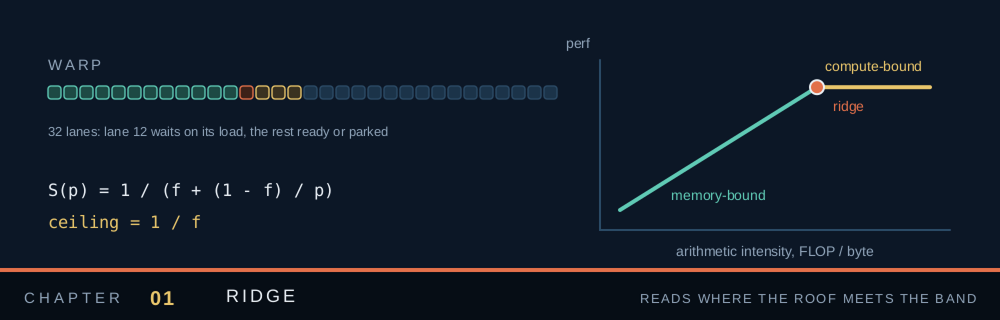

# Chapter 1: The Mathematics of Parallelism

This chapter covers

- Why an operation that waits on memory is not fixed by faster arithmetic
- The two ratios that measure the effect of adding units
- The serial part of a program, and the ceiling it puts on the run time
- The same program with a workload that grows with the machine
- How a computation divides into tasks, data, and pipeline stages
- The four machine designs of Flynn's taxonomy
- Whether bytes or FLOPs set the limit, and how to tell which

Adding units does not speed up every program. It speeds up a program only when the work splits into pieces that can run at the same time. This chapter gives you the arithmetic for deciding whether yours does. You will measure operations by latency and throughput, and split a program into the part that divides and the part that does not. Then you will find which of two resources, arithmetic or memory, runs out first. The machine itself is Chapter 2's subject, so the units stay abstract here.

The example is a vector addition. You have two arrays \\(A\\) and \\(B\\) of \\(N\\) elements and compute \\(C[i] = A[i] + B[i]\\) for each \\(i\\). Every element is independent of every other, so the work divides cleanly, and \\(N\\) is small enough to follow by hand.

## 1.1 Latency, throughput, and concurrency

The **latency** of an operation is the time from its start to its completion. To add one element you read \\(A[i]\\), read \\(B[i]\\), add the two values, and write \\(C[i]\\). A read takes about 500 cycles on the machines in this book, and the add takes about 4; Chapter 2 measures a specific accelerator.

> **NOTE:** The 500-cycle read and the 40 TFLOP/s machine later in this chapter are teaching figures. They set the scale of the problem, and Chapter 2 replaces them with measured numbers for a named processor.

The two reads of an element are independent, so they overlap, and the add waits about 500 cycles for them. The adder then works for 4 cycles and idles for the rest of the wait unless you give it other work.

**Throughput** is the number of operations completed per unit time. Latency describes one operation; throughput describes a stream. To connect them, count. Suppose \\(C\\) operations are in flight at all times and each takes \\(L\\) time to finish. Every window of \\(L\\) time sees all \\(C\\) of them complete, so the stream finishes \\(C\\) operations per \\(L\\) time:

\\[ \text{throughput} = \frac{C}{L} \\\]

This is **Little's law**. It gives you two ways to raise throughput: shorten each operation, or keep more of them in flight. If the latency is fixed, only the second is open to you.

Take a memory system that can begin a read every 2 cycles, a throughput of half a read per cycle. Each read takes 500 cycles, so you need

\\[ C = \text{throughput} \times L = \frac{1}{2} \times 500 = 250 \\\]

reads in flight to sustain that rate. With one read in flight the same memory returns one result every 500 cycles. Holding 250 in flight raises throughput by 250 times without making any single read faster. Figure 1.1 shows the two cases.

Not every operation counts toward \\(C\\). The two reads of one element overlap, but the add waits for both. The write waits for the add, so that element supplies at most two operations at once. A program of such chains stays at a low \\(C\\) however many units run it, and the extra units idle. A program of many independent elements has a large \\(C\\) and keeps its units busy. Chapter 2 shows how a machine supplies \\(C\\); the arithmetic here is enough for now.

<figure>
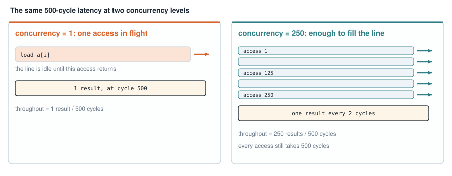
<figcaption><b>Figure 1.1</b> The same 500-cycle latency at two concurrency levels. Raising the concurrency to 250 changes the throughput by 250 times and the latency not at all.</figcaption>
</figure>

Animation 1 puts this on two units. Unit 0 waits on a read while unit 1 computes, and unit 0 resumes when its value arrives.

<figure class="anim">
<video class="motion" src="../../figures/ch01-vadd.mp4" autoplay loop muted playsinline preload="metadata" aria-label="Two units of four workers each. Unit 0 asks for its vector operands and waits; unit 1 keeps computing while unit 0 waits; when unit 0's values arrive it resumes and writes its sums. The failing case gives every worker element 0, so all four write c[0]." data-chapters="[[0.0, &quot;stall&quot;], [12.26, &quot;switch&quot;], [26.54, &quot;resume&quot;], [35.38, &quot;bad index&quot;]]">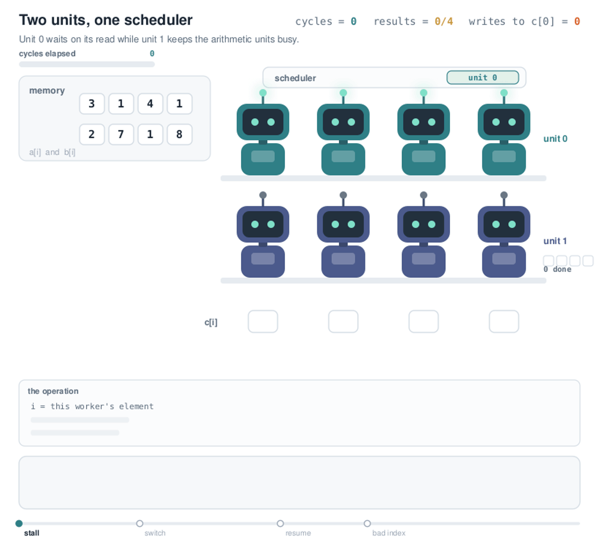</video>
<figcaption><b>Animation 1</b> Unit 0 waits on a read while unit 1 computes, and unit 0 resumes when its value arrives. The failing case breaks the index.</figcaption>
</figure>

## 1.2 Speedup and efficiency

Dividing a program over \\(p\\) units divides only the work that divides. Take a program that reads its input, computes over it, and writes the result. The read takes 20 microseconds, the compute phase 100, and the write 10, so one unit takes 130 microseconds. The compute phase is the only part that scales with \\(p\\).

| Units \\(p\\) | Compute (us) | Read and write (us) | Total \\(T_p\\) (us) |
|---|---|---|---|
| 1 | 100 | 30 | 130 |
| 2 | 50 | 30 | 80 |
| 4 | 25 | 30 | 55 |
| 8 | 12.5 | 30 | 42.5 |

Each added unit removes less than the one before. The second unit removes 50 microseconds, the next two remove 25, and the next four remove 12.5. **Speedup** and **efficiency** turn that pattern into two numbers. Speedup is the single-unit time over the parallel time:

\\[ S(p) = \frac{T_1}{T_p} \\\]

\\(T_1\\) is the time on one unit and \\(T_p\\) the time on \\(p\\) units. **Efficiency** is the speedup divided by \\(p\\), the units that could in principle have helped:

\\[ E(p) = \frac{S(p)}{p} = \frac{T_1}{p \cdot T_p} \\\]

An efficiency near 1 means the added units did useful work; near 0 most of them sat idle. The table below reads the four runs through both definitions.

| Units \\(p\\) | Time \\(T_p\\) (us) | Speedup \\(S(p)\\) | Efficiency \\(E(p)\\) |
|---|---|---|---|
| 1 | 130 | 1.00 | 1.00 |
| 2 | 80 | 1.63 | 0.81 |
| 4 | 55 | 2.36 | 0.59 |
| 8 | 42.5 | 3.06 | 0.38 |

Two units give \\(S = 1.63\\) and \\(E = 0.81\\), so the second unit did most of what it could. Eight units give \\(S = 3.06\\) and \\(E = 0.38\\), so under half of the added capacity became speed. The first table explains why. The 30 microseconds of reading and writing never shrink, so they take a larger share of every shorter run. Section 1.3 turns that into a formula.

The definitions also bound the result. Since \\(T_p \ge T_1/p\\), dividing by \\(T_p\\) gives \\(S(p) \le p\\), and dividing by \\(p\\) gives \\(0 < E(p) \le 1\\). That bound assumes each unit does the same work at the same speed. A measured speedup can exceed the unit count, which is called **superlinear speedup**, usually because the per-unit data starts fitting in cache. Equality needs every unit busy from start to finish. Four things break that ideal. Work may not divide, the parallel version may add work, some units may finish early, and the units may compete for one shared resource.

Report both numbers. A claim of "10x on 64 cores" has \\(E = 10/64 = 0.156\\), so 84% of the added capacity sat idle. The speedup alone hides that.

## 1.3 Amdahl's law: the part that cannot divide

The first table fixes 30 microseconds of reading and writing that no unit count reduces. Write that as a formula. Let \\(f\\) be the fraction of the single-unit time spent in stages that do not divide, so \\(f = 30/130 = 0.23\\). The remaining \\(1 - f\\) spreads over the \\(p\\) units:

\\[ T_p = f \cdot T_1 + \frac{(1 - f) \cdot T_1}{p} \\\]

The first term has no \\(p\\) in it, so it is a floor under the run time: adding units cannot pass it. The second term shrinks with each unit. Substitute the formula into \\(S = T_1/T_p\\):

\\[ S(p) = \frac{1}{f + \frac{1 - f}{p}} \\\]

Now let \\(p\\) grow. The second term in the denominator vanishes, so the speedup approaches

\\[ S_{\max} = \frac{1}{f} \\\]

This is **Amdahl's law**, and \\(f\\) is the **serial fraction**. It caps a fixed workload, and the cap depends only on \\(f\\). With \\(f = 0.23\\) the cap is \\(1/0.23 = 4.3\\); the eight-unit run reaches 3.06 and no unit count passes 4.3.

<figure>
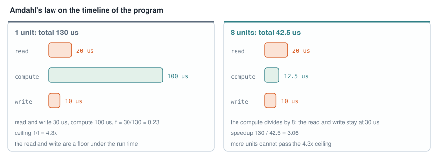
<figcaption><b>Figure 1.2</b> The same phases on one unit and on eight. The compute phase divides by eight, and the read and the write do not divide at all.</figcaption>
</figure>

<!-- FIGURE (section 1.4): two panels beside Figure 1.2. Left, Amdahl: the serial bar stays fixed while the parallel bar is squeezed shorter as units are added. Right, Gustafson: the parallel bar on one unit is stretched longer while the parallel run stays the same length. -->

The cap rises sharply as the serial fraction falls.

| Serial fraction \\(f\\) | Ceiling \\(1/f\\) | Units to reach half the ceiling |
|---|---|---|
| 0.001 | 1,000 | 999 |
| 0.01 | 100 | 99 |
| 0.05 | 20 | 19 |
| 0.10 | 10 | 9 |
| 0.25 | 4 | 3 |

The last column comes from the same formula. The speedup reaches half its ceiling when the parallel term has shrunk to the size of the serial one. That condition is \\(f = (1 - f)/p\\), so \\(p = 1/f - 1\\). Each unit after that point removes less than the one before. A serial fraction of 1% caps the program at 100 times, and reaching half of that takes 99 units.

<figure>
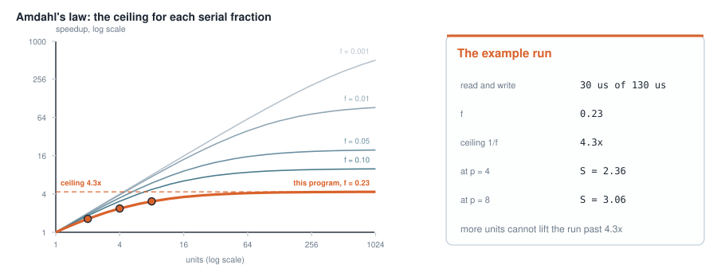
<figcaption><b>Figure 1.3</b> Amdahl's law as a family of curves. Each curve is one serial fraction, and each flattens at its ceiling 1/f. The example run climbs the f = 0.23 curve and stops at 3.06 on eight units.</figcaption>
</figure>

Animation 2 runs the example along its curve and then raises the serial fraction, the way a larger input read would.

<figure class="anim">
<video class="motion" src="../../figures/ch01-amdahl-multi.mp4" autoplay loop muted playsinline preload="metadata" aria-label="A log-log plot of speedup against unit count. Four thin curves for serial fractions 0.001, 0.01, 0.05, and 0.10 appear in turn and flatten at their ceilings. A point climbs a thick f = 0.23 curve from S = 1.00 at p = 1 to S = 3.06 at p = 8, under a dashed 4.3 ceiling. In the last step the curve drops to f = 0.375 with a 2.7 ceiling, and the point at p = 8 falls to S = 2.2." data-chapters="[[0.0, &quot;the curves&quot;], [23.7, &quot;our run&quot;], [45.66, &quot;slow read&quot;]]">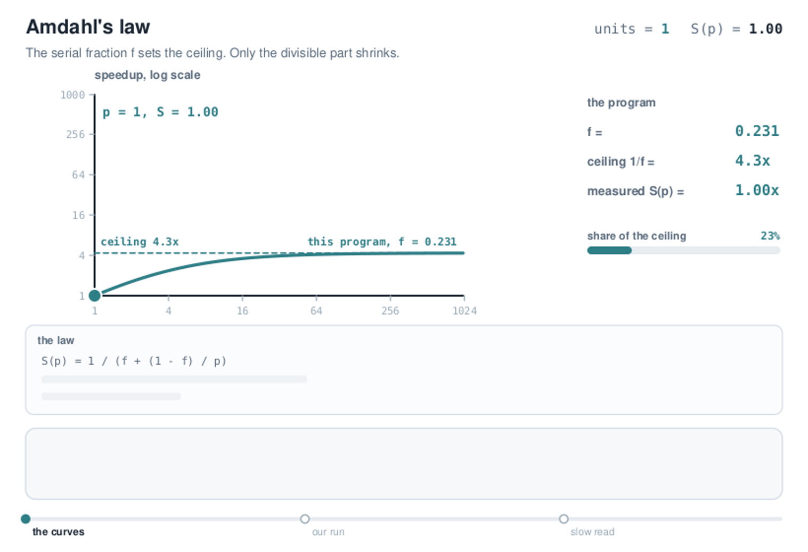</video>
<figcaption><b>Animation 2</b> Amdahl's law as a family of curves. The point climbs the f = 0.23 curve to 3.06 at eight units; the failing case raises f and lowers the ceiling.</figcaption>
</figure>

Measure \\(f\\) before you buy units, because it hides in places that are easy to miss. Starting the program, combining partial results, and any dependency chain all add to it. Those often make up a larger share than the code you set out to speed up. Amdahl's formula also assumes the divisible part scales perfectly. Real programs exchange data at every join, so a measured curve bends earlier than the formula predicts.

## 1.4 Gustafson-Barsis: growing the problem with the machine

Amdahl's law holds the problem size fixed. Someone who buys a larger machine usually grows the problem instead: a bigger batch, a higher-resolution image, a longer simulation. The extra units go to extra work, and that changes the answer.

Suppose a run on 1,000 units spends 1% of its time in serial work, so \\(s = 0.01\\). The run takes 1 second, of which 10 milliseconds is serial and 990 milliseconds is divisible. On one unit the serial part still takes 10 milliseconds, and the divisible part takes 1,000 times as long. One unit therefore needs \\(0.01 + 1000 \times 0.99 = 990.01\\) seconds. That gives a scaled speedup of 990. Amdahl's law uses a different fraction: Gustafson's \\(s\\) is the serial share of the parallel run, while Amdahl's \\(f\\) is the serial share of the single-unit run. Here the single-unit run is 990.01 seconds and the serial part is still 0.01 seconds, so \\(f = 0.01/990.01 \approx 0.00001\\). The two laws agree because growing the problem shrinks \\(f\\), the fraction Amdahl cares about; the 100-times ceiling in section 1.3 belonged to a fixed problem with \\(f = 0.01\\).

As a formula, let \\(s\\) be the serial share of the parallel run. The divisible part takes \\(p\\) times as long on one unit:

\\[ T_1 = s \cdot T_p + p \cdot (1 - s) \cdot T_p \\\]

Divide by \\(T_p\\):

\\[ S(p) = \frac{T_1}{T_p} = s + p \cdot (1 - s) = p + (1 - p) \cdot s \\\]

This is the **Gustafson-Barsis** law. A program therefore has two speedups, and both are correct because the two laws ask different questions. Amdahl's asks how much faster a fixed problem runs; Gustafson's asks how much larger a problem runs in the same time. A batch that grows with the machine is a Gustafson problem, and a frame at a fixed resolution is an Amdahl problem.

## 1.5 Strong and weak scaling

The two questions give the two standard ways to measure a parallel program.

- **Strong scaling** holds the problem size fixed and adds units, so the run time should fall toward the Amdahl floor. A frame that must arrive within 16.7 ms is measured this way, because the display fixes the frame size.
- **Weak scaling** holds the work per unit fixed and adds units, so the problem grows and the run time should stay flat. A training batch that grows with the machine is measured this way.

| Experiment | Problem size | A good result looks like |
|---|---|---|
| Strong scaling | fixed | time falls as units are added |
| Weak scaling | grows with the units | time stays flat |

One weak-scaling run shows the loss. One unit finishes 1,000 elements in 1 ms; sixteen units take 16,000 elements, the same 1,000 each. If the time stays at 1 ms, the machine scaled perfectly. Suppose it rises to 1.25 ms. The extra 0.25 ms is work that grows with the unit count, such as data exchange and the barrier waits of section 1.9.

State which design an experiment uses. A speedup without it cannot be checked, because the two designs have different ceilings.

## 1.6 How a computation divides

All the formulas so far assume that the work divides. How it divides decides what the hardware can do with it, and three arrangements cover most programs.

The first is two different jobs that must both run, such as decoding one video frame while filtering the previous one. Each job has its own instruction sequence and runs different code, so extra arithmetic units do not speed either one up. A machine expresses this with independent queues of work (Chapter 6). Two queues that read different data overlap well; two queues that both want the arithmetic units queue behind one another.

The second is one job over a large array, as in the vector addition of section 1.1. Ten million elements pass through the same instruction sequence, one element per unit. The work grows with the machine, so the hardware can be built wide. This is what a wide parallel machine is for, and the rest of the book uses it.

The third sits between the two. Split a convolution into a load stage, a compute stage, and a store stage, and let different elements occupy the three stages at once. Once the stages fill, the pipeline retires one element per stage-time even though each element needs three stage-times from load to store. The slowest stage sets that rate.

A short batch does not fill the pipeline, and the fill cost has a formula. For \\(N\\) elements and \\(S\\) stages, running elements one after another through all stages costs \\(S \cdot N\\) stage-times. The pipelined run costs \\(S\\) stage-times to fill plus one for each remaining element, \\(S + (N - 1)\\). The speedup is \\(SN/(S + N - 1)\\). Set \\(S = N = 5\\) and you get \\(25/9\\), about 2.8. The speedup approaches \\(S\\) only as \\(N\\) grows and the \\(S - 1\\) fill stage-times are amortised.

The three have standard names: **task parallelism**, **data parallelism**, and **pipeline parallelism**. A wide machine is built for data parallelism, so a specification that says "massively parallel" means that kind. The other two appear later and matter less on such a machine.

## 1.7 Flynn's taxonomy: instruction and data streams

A machine can be classified by two counts. The first is how many instruction streams it runs at once. The second is how many data streams those instructions work on. Flynn defined four classes from those counts: SISD, SIMD, MISD, and MIMD. MISD is rare in practice; one use is a redundant fault-tolerant system that runs the same data through different instruction streams so a faulty stream can be outvoted. GPUs add a fifth term, SIMT, which NVIDIA introduced as a variation on SIMD. The vector addition shows how the classes differ.

Run the add over eight elements on each type. A scalar unit performs eight adds in sequence. A processor with a wide vector register packs the eight numbers into one register and performs one add for all eight. A multi-core processor runs the add on one core and a different computation on another. A thread-parallel processor sends one instruction to a group of threads. Figure 1.4 draws the four side by side.

<figure>
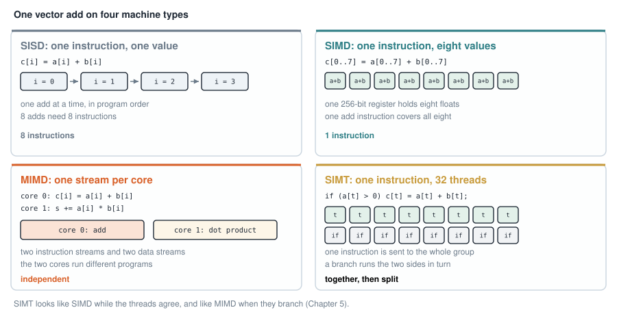
<figcaption><b>Figure 1.4</b> The same vector add on four machine types. The names, in order, are SISD, SIMD, MIMD and SIMT. SISD, SIMD and MIMD are Flynn's classes; SIMT is NVIDIA's extension of SIMD.</figcaption>
</figure>

Each name encodes the two counts. The first letter is the instruction count, S for single or M for multiple. The second letter is the data count, S or M, except in SIMT, where T stands for threads.

**SISD** is single instruction, single data: one scalar unit, one add per element, eight separate adds for eight elements.

**SIMD** is single instruction, multiple data: the packed-register case. The compiler packs the eight values into one wide register, and one vector add covers all eight. AVX is the x86 name for this, and NEON is the ARM name.

**MIMD** is multiple instruction, multiple data: each unit fetches and decodes its own instruction stream. A multi-core processor is MIMD, and so are two programs running on different cores.

**SIMT** is not one of Flynn's classes; it is NVIDIA's extension of SIMD. SIMT is single instruction, multiple threads. One instruction is sent to a group of threads, and each thread applies it to its own data in its own registers. The threads share an instruction stream but not their state. When the threads disagree about a branch, the group runs the two paths one after the other instead of at once. Chapter 2 describes how the hardware forms the group and charges the divergence.

Animation 3 runs the four designs in order.

<figure class="anim">
<video class="motion" src="../../figures/ch01-flynn.mp4" autoplay loop muted playsinline preload="metadata" aria-label="Eight element cells under one instruction slot. SISD: one scalar core, a pill travels to one cell at a time and the instruction counter reaches 8. SIMD: a dashed register frame encloses all eight cells and one VADDPS pill covers them, one instruction. MIMD: two slots, core 0 ADD and core 1 DOT, each with its own instruction counter. SIMT: one slot sends to eight threads, one instruction, all eight cells fill. Divergence: the slot branches on a[i] > 2, the then threads fill while the others wait, then the else threads fill, two instructions." data-chapters="[[0.0, &quot;SISD&quot;], [15.77, &quot;SIMD&quot;], [26.17, &quot;MIMD&quot;], [37.08, &quot;SIMT&quot;], [50.04, &quot;diverge&quot;]]">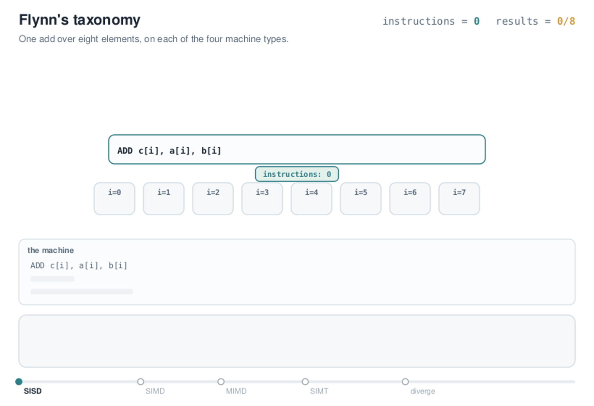 2, the then threads fill while the others wait, then the else threads fill, two instructions."></video>
<figcaption><b>Animation 3</b> Flynn's classes, one machine at a time, plus NVIDIA's SIMT. SISD runs eight adds. SIMD packs them into one register. MIMD runs two cores on two programs. SIMT sends one instruction to a group of threads. The failing case splits the group on a branch.</figcaption>
</figure>

## 1.8 Arithmetic intensity and the roofline

A program that works on arrays moves bytes and performs floating-point operations. An add or a multiply on real numbers is one **FLOP**. Each kind of work has a ceiling: the arithmetic units sustain \\(P_{\text{peak}}\\) FLOP/s and the memory system \\(B\\) bytes/s. A program that performs \\(F\\) FLOPs while moving \\(D\\) bytes needs at least \\(F / P_{\text{peak}}\\) seconds of arithmetic. It also needs at least \\(D / B\\) seconds of memory traffic. Whichever is larger sets the run time, and the ratio \\(F / D\\) tells you which one it is.

### 1.8.1 Arithmetic intensity: work per byte

Count the ratio for the vector addition. Each element reads two 4-byte numbers, writes one 4-byte number, and performs one add, so the operation moves 12 bytes per FLOP:

\\[ I = \frac{1\ \text{FLOP}}{12\ \text{bytes}} \approx 0.08\ \text{FLOP/byte} \\\]

A dense matrix multiply reuses every value it loads. An \\(N \times N\\) multiply performs \\(2N^3\\) FLOPs, \\(N\\) multiplies and \\(N\\) adds for each of the \\(N^2\\) outputs. It touches \\(3N^2\\) values of 4 bytes each, one set per matrix, so

\\[ I = \frac{2N^3}{3N^2 \times 4} = \frac{N}{6}\ \text{FLOP/byte} \\\]

At \\(N = 4{,}096\\) that is about 680 FLOP/byte, nearly four orders of magnitude above the vector addition. The two programs use the same machine and differ in how often each loaded value is reused. That ratio is the **arithmetic intensity** of the operation, and Figure 1.5 puts the two on the same scale.

<figure>
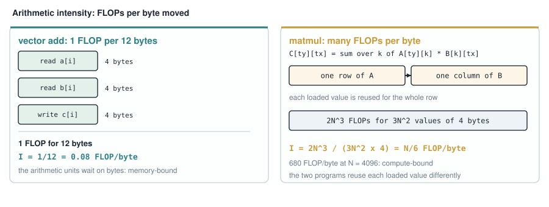
<figcaption><b>Figure 1.5</b> Where an operation sits on the intensity scale follows from its reuse. The vector add touches 12 bytes per FLOP, and the matrix multiply amortises the same bytes over many FLOPs.</figcaption>
</figure>

### 1.8.2 The ridge point

The two ceilings meet at one intensity. Bandwidth caps a memory-bound program at \\(I \cdot B\\) FLOP/s, and arithmetic caps a compute-bound program at \\(P_{\text{peak}}\\). Set the caps equal and solve:

\\[ I \cdot B = P_{\text{peak}} \quad \Longrightarrow \quad I_{\text{ridge}} = \frac{P_{\text{peak}}}{B} \\\]

That intensity is the **ridge point**. Below it bandwidth is the smaller cap, so the program is **memory-bound** and extra arithmetic throughput buys nothing. Above it arithmetic is the smaller cap, so the program is **compute-bound** and extra bandwidth buys nothing. On an illustrative machine with 40 TFLOP/s of FP32 and 1 TB/s of bandwidth, the ridge is 40 FLOP/byte. The vector addition reaches 0.08, so bandwidth caps it at \\(0.08 \times 1 = 0.08\\) TFLOP/s, about 0.2% of peak. Section 2.1 runs the same calculation for a specific accelerator and gets about 18 FLOP/byte.

<figure>
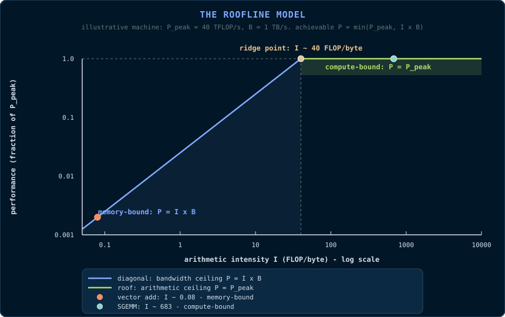
<figcaption><b>Figure 1.6</b> The roofline for the illustrative machine. Bandwidth caps operations on the diagonal, and the arithmetic roof caps them past the ridge point at 40 FLOP/byte.</figcaption>
</figure>

Animation 4 puts the inner loop of a matrix multiply on that plot. With no reuse the inner loop moves eight values for eight FLOPs, an intensity of 0.25. Holding a 16 by 16 tile of the output in registers reuses each loaded value 16 times. That raises the intensity to about 4, still below the ridge. The tile raises the loop's bandwidth ceiling sixteenfold, though at 4 FLOP/byte it is still memory-bound.

<figure class="anim">
<video class="motion" src="../../figures/ch01-roofline.mp4" autoplay loop muted playsinline preload="metadata" aria-label="The inner loop of a matrix multiply on a roofline plot, one k at a time. Four k steps move eight values for eight FLOPs, which sits at 0.25 FLOP/byte on the diagonal. A 16 by 16 tile in registers reuses each value 16 times and lifts the operation to about 4 FLOP/byte. The last step removes the tile and the operation falls back to the diagonal." data-chapters="[[0.0, &quot;the loop&quot;], [18.42, &quot;reuse&quot;], [37.62, &quot;no tile&quot;]]">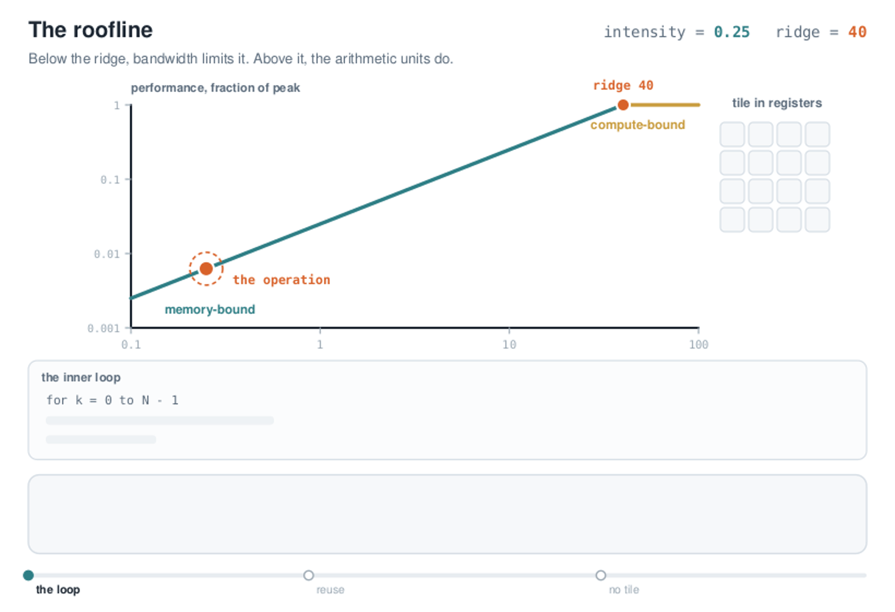</video>
<figcaption><b>Animation 4</b> The inner loop of the matrix multiply, one k at a time. The tile lifts the operation toward the ridge, and the last step removes it.</figcaption>
</figure>

A memory-bound operation such as the vector addition speeds up only when it moves fewer bytes. Removing redundant reads and grouping each unit's accesses into large transactions (section 2.7) both reduce the byte count. Chapter 9 takes the other side. It holds a block of the matrix in registers, so each loaded value is reused many times and the operation moves toward the ridge.

### 1.8.3 CPU-bound, memory-bound, and I/O-bound

The same three labels apply to a whole program. Run it, watch which resource stays busy, and the busy resource names the program:

- **CPU-bound**: the processor stays busy, and the memory and I/O resources idle.
- **Memory-bound**: the memory system stays busy, and the processor waits for bytes.
- **I/O-bound**: a disk or a network link stays busy, and the processor waits for data.

A video encoder that spends 98% of its time in CPU arithmetic and 2% reading frames is CPU-bound. A faster disk does nothing for it, and a CPU twice as fast nearly halves the run. The way to confirm the label is to double the capacity of one resource and measure again.

| Double the... | ...and the time halves? | Then the program is |
|---|---|---|
| CPU clock | ✓ | CPU-bound |
| Memory bandwidth | ✓ | Memory-bound |
| Disk or network rate | ✓ | I/O-bound |
| Double the number of units | ✗ | Serial-bound (section 1.3) |

<figure>

<figcaption><b>Figure 1.7</b> Three programs, each with one resource pinned near 100%. The bound is the pinned resource.</figcaption>
</figure>

Section 2.7 uses this to explain memory access grouping for memory-bound programs, Chapter 9 for compute-bound programs, and Chapter 6 for I/O-bound programs. *Compute-bound* and *CPU-bound* name the same case: the processor is the resource that runs out first. Profiling (Chapter 16) measures which resource is saturated before you optimise.

## 1.9 The cost of synchronisation

Most parallel computations combine partial results, and the units cannot combine them without meeting. The meeting point is a **barrier**: every unit in the group arrives, and none continues until the last one does. The mechanism is Chapter 5's subject; the price belongs here.

Suppose a group of units does 1,000 cycles of work between barriers and each barrier costs 100 cycles. The barrier occupies 100 of every 1,100 cycles, so the group waits about 9% of the time. That 9% is lost efficiency per unit. Each unit does 1,000 cycles of work in 1,100, so its efficiency is \\(1000/1100 \approx 0.91\\). In Gustafson's terms this lost share is \\(s\\), the serial share of the parallel run, so the speedup keeps growing at about \\(0.91p\\). If the total work is fixed instead, each unit's share shrinks as \\(p\\) grows while the 100-cycle barrier does not, so the barrier takes a larger share of every shorter run, the speedup flattens, and Amdahl's law applies. The waiting is not the whole cost. A result written by one unit is not visible to another until it is published, and publication takes time of its own. A barrier also releases its units only when the slowest one arrives, so one slow unit delays every other unit.

A program that avoids the barrier pays none of this: give each unit its own output and combine the results once at the end. Chapter 8 uses that rule to cut the block-level barriers of a reduction from \\(\log_2 N\\) to a constant.

## Summary

- Latency is the time for one operation and throughput is the rate for a stream. Little's law, throughput equals concurrency over latency, shows that concurrency raises throughput without shortening latency.
- Speedup is \\(T_1 / T_p\\), and efficiency is \\(S(p)/p\\). Efficiency reports the share of the added units that did useful work.
- Amdahl's law caps a fixed workload at \\(1/f\\), where \\(f\\) is the serial fraction of the single-unit time. Reaching half the ceiling takes \\(1/f - 1\\) units.
- Gustafson-Barsis applies when the problem grows with the machine, and it gives a scaled speedup near \\(p\\).
- Strong scaling fixes the problem size, and weak scaling fixes the work per unit. State which one an experiment uses.
- Work divides as tasks, data, or pipeline stages. A pipeline of \\(S\\) stages over \\(N\\) elements speeds up by \\(SN/(S + N - 1)\\).
- Flynn's taxonomy names a machine by its instruction and data streams: SISD, SIMD, MISD, and MIMD. A GPU runs SIMT, NVIDIA's variation on SIMD.
- Arithmetic intensity against the ridge point decides whether bytes or FLOPs set the limit. A doubling test identifies the bound of a whole program.
- A barrier costs the slowest unit's arrival plus the time to publish results. An algorithm that avoids one pays neither.

Chapter 2 leaves the arithmetic and describes the machine that runs these programs: the streaming multiprocessor, the warp, and the memory hierarchy.

## Exercises

1. A read has a latency of 400 cycles, and the arithmetic units accept one operation every 4 cycles. How many operations must be in flight to keep the units busy?
2. A program takes 10.0 s on one unit, 5.5 s on two, and 4.0 s on four. Compute the speedup and the efficiency at each count.
3. A program spends 10 microseconds on each of two input and output phases and 100 microseconds on the compute phase. Compute the serial fraction and the Amdahl ceiling.
4. The same program grows its batch with the unit count, and the serial share of the parallel run falls to 0.001. Estimate the scaled speedup on 1,000 units.
5. A vector add reads two arrays and writes a third, 4 bytes per element each, and performs one add per element. Compute its arithmetic intensity, then say whether it is memory-bound on a machine with a ridge point of 40 FLOP/byte.
6. An \\(N \times N\\) matrix multiply has an intensity of \\(N/6\\) FLOP/byte. At what \\(N\\) does it cross a ridge point of 40 FLOP/byte?
7. A program downloads 10 GB from the network at 2 GB/s and compresses it on the CPU at 20 GB/s. Estimate the CPU utilisation, name the bound, and say which single change helps more: a 2x faster CPU or a 2x faster network.
8. Explain why a program whose operations form one long dependency chain gains nothing from more units, even when every unit is fast.
9. Name each of these machines. A scalar unit; a wide vector add; four cores each running its own program; one instruction sent to many threads. Which one is not a Flynn class?

## Sources and Further Reading

- Gene M. Amdahl, "Validity of the Single Processor Approach to Achieving Large-Scale Computing Capabilities," AFIPS Conference Proceedings, 1967. The paper behind Amdahl's law.
- John L. Gustafson, "Reevaluating Amdahl's Law," Communications of the ACM 31(5), 1988. The paper behind Gustafson's scaled-speedup law.
- Samuel Williams, Andrew Waterman, and David Patterson, "Roofline: An Insightful Visual Performance Model for Multicore Architectures," Communications of the ACM 52(4), 2009. The original roofline paper.
- Michael E. Flynn, "Very High-Speed Computing Systems," Proceedings of the IEEE 54(12), 1966. The taxonomy of section 1.7.
- NVIDIA, *CUDA C++ Programming Guide*, "Compute Capabilities" appendix, for per-generation limits: <https://docs.nvidia.com/cuda/cuda-c-programming-guide/>
- NVIDIA, *CUDA C++ Best Practices Guide*, for the optimisation workflow: <https://docs.nvidia.com/cuda/cuda-c-best-practices-guide/>
