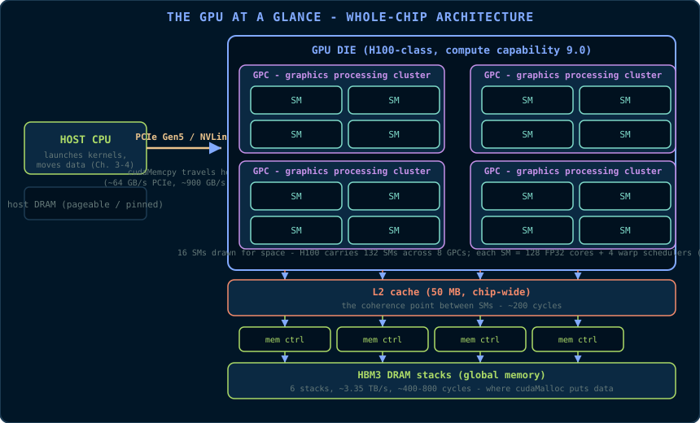
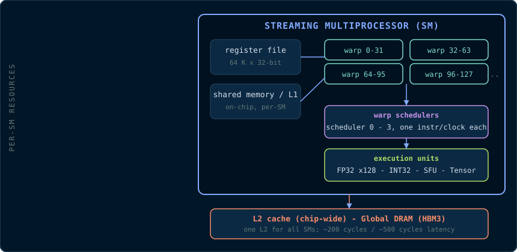
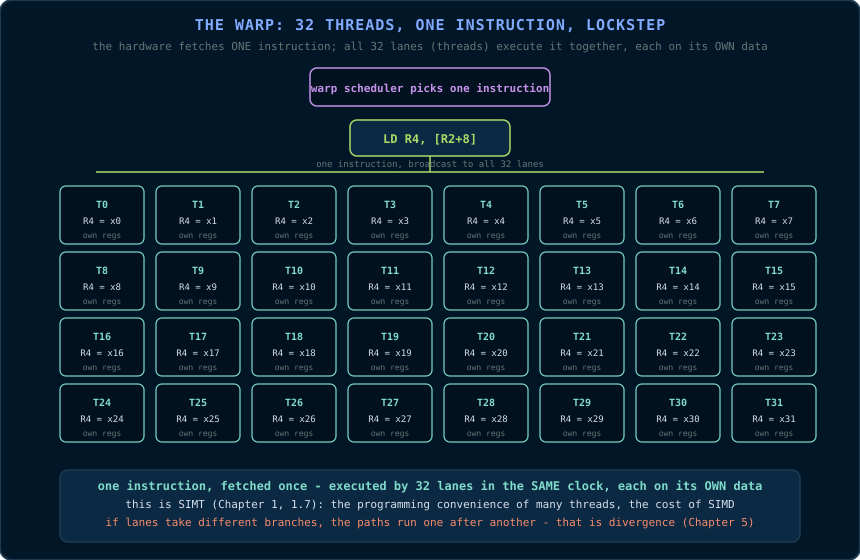
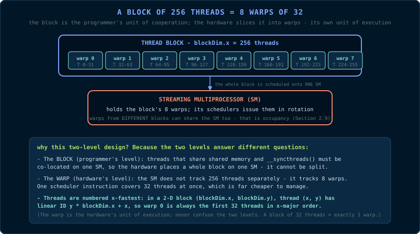
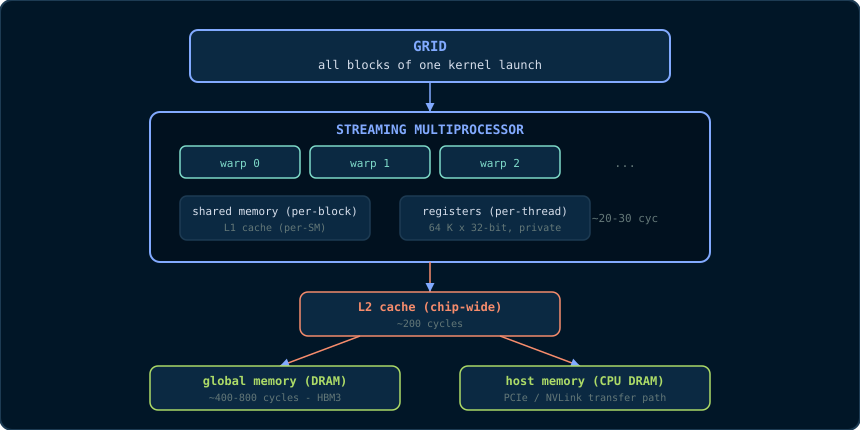
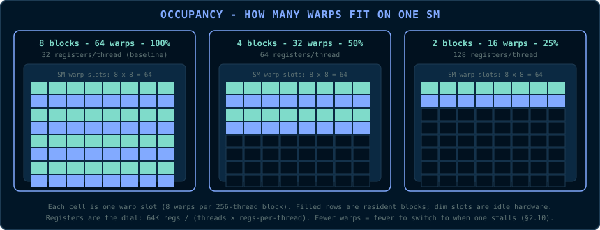
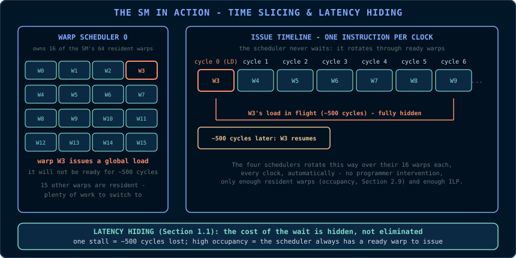

# Chapter 2: GPU Hardware from First Principles

> *"The programming model is a fiction that the hardware honours. To write fast
> kernels you must know where the fiction ends."*

CUDA's programming model presents a pleasant abstraction: a grid of blocks, a
block of threads, a hierarchy of memories. The hardware underneath is messier,
and the mess is exactly where performance lives. This chapter strips the
programming model away and describes the machine: the *streaming
multiprocessor*, the *warp*, the *memory hierarchy*, and the rules of
*coalescing* and *occupancy*. Every term defined here is used in every later
chapter.

We take as our running example a modern NVIDIA GPU of the Hopper family
(compute capability 9.0, such as the H100). Numbers differ between
generations, but the structure does not.

## 2.1 The GPU at a Glance

A GPU is a collection of identical compute clusters plus a memory system. The
H100, for example, has:

- **132 streaming multiprocessors (SMs)** - the compute clusters;
- **128 FP32 cores per SM** - the arithmetic units;
- **64 KB to 228 KB of shared memory per SM**, configurable;
- **64 K registers per SM**, partitioned among the threads;
- **50 MB of L2 cache**, shared by all SMs;
- **HBM3 DRAM** with a bandwidth of roughly **3.35 TB/s**.

Read the diagram as the whole machine, top to bottom: the host CPU lives
across a bus; the die is organised into *graphics processing clusters*
(GPCs), each holding several SMs; every SM funnels into one chip-wide L2; L2
feeds the memory controllers; the controllers drive the HBM3 stacks. This is
the physical map that every later chapter's reasoning walks along.

**Why these numbers?** The headline figures are design consequences, not
arbitrary specifications:

- **Why so many SMs?** A GPU is a throughput machine (Chapter 1, §1.1). Chip
  area is spent on many small compute clusters rather than a few large cores,
  because parallelism - not single-thread speed - is the product. 132 SMs is
  what fits when each SM is deliberately small.
- **Why 128 FP32 cores per SM?** Each SM has four warp schedulers (§2.2), and
  a scheduler issues one *warp* instruction per clock - 32 lanes at once. 128
  = 4 × 32: one full warp per scheduler per clock, with no lane sharing. The
  number is dictated by the warp, the fundamental unit of execution.
- **Why 64 K registers?** Registers are the SM's working storage for resident
  warps. A deeper register file holds more warps, which hides more latency
  (§2.9) - at the price of chip area and clock speed. 64 K is the engineered
  balance.
- **Why is DRAM so fast yet so far?** HBM3 stacks memory vertically beside
  the die on a silicon interposer, with thousands of narrow channels - that
  is where 3.35 TB/s comes from. But every access still leaves the chip, which
  is why latency stays in the hundreds of cycles (§2.6), and why the on-chip
  memory hierarchy exists at all.

The arithmetic rate of such a chip is on the order of 60-70 TFLOP/s in FP32.
The memory bandwidth is 3.35 TB/s. Applying the roofline formula from Chapter 1:

\\[ I_{\text{ridge}} = \frac{60 \times 10^{12}\ \text{FLOP/s}}{3.35 \times 10^{12}\ \text{B/s}} \approx 18\ \text{FLOP/byte} \\]

Any kernel below roughly 18 FLOP/byte is memory-bound on this machine. Keep
this number in your pocket; it will explain most of the optimisation chapters.

## 2.2 The Streaming Multiprocessor (SM)

The SM is the GPU's unit of compute. It is best thought of as a **small,
heavily multithreaded processor** - closer to a 128-lane vector machine than
to a CPU core.

Each SM contains:

- **FP32 cores** (also called CUDA cores): single-precision floating-point
  units, one FMA (fused multiply-add) per core per clock. An FMA computes
  \\(a \cdot b + c\\) in one instruction, so counting it as *two* FLOPs is why
  peak FLOP rates look so large.
- **INT32 cores**: integer units, which in modern architectures share the
  dispatch but have their own register ports.
- **Tensor cores**: specialised matrix-multiply units for AI workloads. They
  are a separate pipeline; we note them here and return in Chapter 11.
- **Special function units (SFUs)**: fast approximate transcendental functions
  (`sin`, `cos`, `exp`, `log`, `1/x`, `rsqrt`). Each SFU serves the whole
  warp, one result per clock per unit.
- **A register file** of 64 K 32-bit registers.
- **A shared memory / L1 cache** unit.
- **Four warp schedulers** (on modern SMs), each able to issue one
  instruction per clock to a warp.

The important consequence: **the SM is not a multicore CPU.** It does not have
one instruction stream per core. It has a small number of *warp schedulers*,
each feeding instructions to a *warp* of threads. The threads are the data
parallelism; the scheduler is the control.

Here is the internal anatomy of one SM, drawn to scale in the sense that
matters (everything on the left feeds the four schedulers on the right):

Read the diagram as a data-flow picture: warps live in the register file,
share memory and arithmetic units through the schedulers, and reach the rest
of the chip through the L1/L2 path. The four schedulers are the control
plane; the FP32/INT32/SFU/Tensor units are the data plane; shared memory and
registers are the on-chip storage.

## 2.3 The Warp

> **Primitive - warp.** A warp is a group of **32 consecutive threads** that
> are scheduled and executed together. The warp is the hardware's unit of
> execution, exactly as the *thread* is the programmer's unit of logic.

**A picture first.** Forget definitions for a moment and look at the diagram:
one instruction is fetched once and broadcast to 32 lanes, and all 32 lanes
execute it in the same clock - but each lane applies it to its *own* registers
and its *own* data:

That is the entire idea of a warp. The scheduler does not manage 32 threads
as 32 separate things; it manages them as *one row of 32 seats*. When it
issues an instruction, every occupied seat executes it simultaneously, on
whatever that seat's thread happens to be holding.

**Why 32?** The number is an architectural constant of every NVIDIA GPU to
date. It is a deliberate engineering balance, not a magic value:

- **It amortises instruction cost.** Fetching and decoding an instruction
  costs the same whether it serves one thread or thirty-two. A wider warp
  means the fixed cost of each instruction is spread over more useful work.
- **It is a power of two.** Warp boundaries fall at 32, 64, 96, ... which
  makes thread-to-warp arithmetic (integer division and modulo by 32) free on
  the hardware.
- **It matches the memory system's granularity.** 32 threads × 4 bytes = 128
  bytes - exactly one cache line (§2.7). A warp of consecutive threads can be
  satisfied by one memory transaction. This is not a coincidence; it is how
  coalescing became cheap.

The cost of a large warp is that divergence (§ below) is coarser: one thread
taking a different branch forces the whole warp to pay. Thirty-two balances
instruction amortisation against divergence waste, and every generation has
kept it.

**How a warp executes - and what "lockstep" means.** The warp scheduler picks
an instruction for the warp; the instruction is fetched once and issued to all
32 lanes at the same time. Each lane (thread) has its **own registers**, so
each lane can hold different data - but all lanes execute the *same*
instruction at the *same* time. This is SIMT (Chapter 1, §1.7), and the
difference from a CPU is the whole game: a CPU runs one instruction stream per
core; a GPU runs one instruction stream per *32 threads*.

**Consequence: divergence.** If two threads in a warp take different branches
of an `if`, the hardware cannot execute both paths simultaneously. It executes
the `then` path with the other lanes masked off, then the `else` path, then
reconverges. The two paths run *serially*, each using the full warp's
instruction slots. A 50/50 branch costs double. Chapter 5 returns to this.

**Consequence: one instruction, many data.** Because all 32 lanes share one
instruction, a single memory load instruction issued to a warp is, in fact, 32
loads. How those 32 loads are serviced by the memory system is the subject of
§2.7 (coalescing).

**The empty-seat footnote.** When you launch a kernel with 1,000 threads, the
hardware creates 32 warps: 31 full warps (32 × 31 = 992 threads) plus one
partial warp of 8 threads. The remaining 24 lanes of that last warp are
disabled but still occupy scheduling slots - dead weight that costs occupancy
(§2.9) without doing work. This is why real kernels are launched with block
sizes that are multiples of 32 (Chapter 3).

## 2.4 Blocks, Grids, and the Hardware's View

CUDA's programming model (Chapter 3) organises threads as: a **grid** of
**thread blocks**, each block a group of **threads**. The hardware maps this
hierarchy as follows:

- A **thread block** is scheduled onto **one SM**, as a unit. All threads of a
  block run on the same SM, which is what makes block-level shared memory and
  `__syncthreads()` possible.
- A block is partitioned into **warps** by consecutive thread IDs. Threads 0-31
  form warp 0, threads 32-63 form warp 1, and so on. For a 2-D block, the
  threads are linearised in x-major order (x varies fastest).
- The SM runs **many blocks concurrently**, time-slicing its warps. How many
  depends on occupancy (§2.9).

**Why two levels? An analogy: rooms and rows.** Think of a block as a *room*
and a warp as a *row of seats* inside it. The programmer says: "here is a room
of 256 people who must be able to talk to each other." The hardware answers:
"I cannot track 256 individuals cheaply, so I will seat them in 8 rows of 32
and march each row as one unit." The room (block) is the *unit of
cooperation* - everyone in it can share memory and synchronise. The row
(warp) is the *unit of execution* - the hardware only ever moves whole rows at
a time.

The block is the programmer's unit of *cooperation*; the warp is the hardware's
unit of *execution*. Never confuse the two levels:

- You, the programmer, choose the **block** size (Chapter 3's `blockDim`) -
  and you choose it in multiples of 32 so that no warp is partially empty.
- The hardware, invisibly, slices your blocks into **warps** - you never
  create a warp, and you rarely address one directly. It exists purely so the
  SM can schedule 32 threads with the cost of one.

## 2.5 The Memory Hierarchy

The GPU memory hierarchy is a hierarchy of *distance and size*:

From top to bottom, each level is larger and slower:

**1. Registers.** Private to a single thread; 32-bit wide; up to 255 per
thread. There is no address for a register - it is named by the instruction
(`R0`, `R1`, ...). Access is free, but there are only 64 K per SM, shared by
all threads. Register pressure directly limits occupancy (§2.9).

**2. Shared memory.** Private to a *block*; on-chip; configurable as part of
the SM's 228 KB (H100) unified L1/shared resource. Access latency is ~20-30
cycles, versus ~400+ cycles for global memory. Shared memory is the
programmer's explicitly managed cache - the workhorse of Chapter 7.

**3. L1 cache.** On-chip, per-SM, unified with shared memory. Global loads
that hit L1 avoid the trip to DRAM. L1 lines are 128 bytes.

**4. L2 cache.** On-chip, shared by *all* SMs, 50 MB on H100. It caches
global, constant, and texture accesses. L2 is the coherence point between SMs:
two blocks on different SMs communicate through L2 (or explicitly through
atomics, Chapter 5).

**5. Global memory.** The GPU's DRAM (HBM3), the largest and slowest level.
This is where `cudaMalloc` puts data (Chapter 4). Bandwidth is enormous
(3.35 TB/s), latency is enormous (hundreds of cycles). The entire optimisation
enterprise is, mostly, keeping global traffic low.

**6. Constant and texture memory.** Two specialised read-only paths. Constant
memory is a small (64 KB) cache that broadcasts a single value to all threads
in a warp *for free* when they read the same address - ideal for kernel
parameters. Texture memory is a cached read-only path with hardware support
for 2-D spatial locality and interpolation - used for images. Both are
discussed in Chapter 7.

**7. Local memory.** A misnomer: "local" memory is actually global memory
allocated per-thread, used when a thread's register demand exceeds the
register file (a *register spill*). Local memory is slow; spills are to be
avoided. The compiler reports spills with `--ptxas-options=-v`.

## 2.6 The Latency Table

The numbers below are typical orders of magnitude for a modern GPU; treat them
as teaching figures, not datasheet values:

| Resource | Approximate latency | Notes |
|---|---|---|
| Register | ~0 cycles | Operand to instruction |
| Shared memory | ~20-30 cycles | On-chip, banked |
| L1 hit | ~30 cycles | Per-SM |
| L2 hit | ~200 cycles | Chip-wide |
| Global DRAM | ~400-800 cycles | HBM3 |
| Host memory (PCIe) | ~1,000+ cycles + transfer time | Off-chip, CPU side |

The table is a map of *physical distance*, not a marketing sheet. Registers
sit on the SM, a few millimetres from the arithmetic units; shared memory and
L1 are on the same die; L2 spans the whole chip; DRAM is a separate package
beside the die on an interposer; host memory is across a bus and an OS
boundary. Every step off the SM adds distance *and* arbitration - more
circuits competing for the same wires. The 20× gap between shared memory and
DRAM is not a tuning detail; it is the difference between an on-chip wire and
an off-chip trip, and it is the entire reason the optimisation chapters exist.

The lesson: **one global memory access costs roughly 30 shared-memory
accesses.** Any algorithm that can restructure itself to reuse data in shared
memory is buying speed with engineering effort - and Chapter 7 will show the
accounting in detail.

## 2.7 Coalescing: How a Warp Reads Memory

**What it is.** Coalescing is the difference between a GPU program that uses
its memory system well and one that wastes most of the bandwidth it buys -
and it is the most common reason a kernel is slower than it should be.

Start with what a warp is actually doing when it reads memory. A warp is 32
threads executing the same instruction together, and when that instruction is
a load, all 32 threads go to memory at once. Each thread wants its own piece
of data - a `float`, say, four bytes. The question is what the memory system
does with those 32 separate requests, and the answer depends entirely on
where the data lives.

If the 32 threads want 32 pieces of data packed next to each other in memory,
the memory system can treat the whole thing as one job: it fetches one
contiguous block and hands each thread its slice. The entire warp is served
by one transaction, or two at most. If the 32 threads want data scattered
across memory - every 32nd `float`, or addresses with no pattern at all - the
memory system cannot group them. Each thread's request becomes its own
transaction, and the warp pays 32 trips to memory for exactly the same amount
of useful data.

That property - the degree to which a warp's accesses can be grouped into a
few transactions - is **coalescing**. A warp whose accesses group well is
*coalesced*; a warp whose accesses sprawl is *uncoalesced*. Everything else
in this section is the machinery behind this one idea: memory transactions
are expensive, and coalescing is how you make a warp buy as few of them as
possible.

> **Primitive - coalescing.** A warp load is serviced at sector granularity
> (32 bytes; four sectors per 128-byte cache line). The load is *coalesced*
> when the warp's addresses fall in as few sectors as possible, and
> *uncoalesced* when they sprawl. The cost of a warp load is, to a first
> approximation, the number of sectors it touches.

**The machinery: sectors and transactions.** The memory system does not
deliver 32 arbitrary 4-byte pieces - it delivers in fixed-size chunks,
32-byte **sectors**, a quarter of a 128-byte cache line. And it charges
roughly the same per chunk whether the chunk is full or not: addressing a
DRAM row, decoding the address, driving the bus - that setup cost is paid
*per transaction*, not per byte.

So the only number that matters for a warp load is: **how many sectors did
these 32 lanes touch?**

- Thirty-two lanes reading 32 consecutive `float`s touch exactly 128 bytes -
  one cache line, one trip. The whole warp is served at once.
- Thirty-two lanes reading every 32nd `float` touch 32 different lines - 32
  transactions for the same 32 pieces of data. Same groceries, 32× the
  shipping.

**The intuition: the freight company.** The memory system is a freight
company that only ships full pallets. A warp is 32 customers shopping
together. If their 32 items are stacked on one pallet, the company makes one
trip. If the items are scattered across 32 pallets in 32 different aisles, it
makes 32 trips - and each trip costs the same whether the pallet is full or
half-empty. Coalescing is simply *arranging the warehouse so that a warp's 32
lanes always reach for the same pallet*. Nothing else, no magic: the hardware
does not detect access patterns or rearrange anything - it only counts which
sectors the warp touched, and bills accordingly.

**Why coalescing matters.** Global memory bandwidth is the scarcest resource
on a memory-bound kernel (Chapter 1's roofline). Coalescing is the difference
between using 100% of that bandwidth and using roughly 3% of it: with a
stride of 32 floats between consecutive threads, every fetched byte is 31/32
wasted, and bandwidth is a per-second budget that does not care how it was
wasted.

**The one-sentence takeaway.** The consequence of all this - not the cause,
the consequence - is the layout habit you will see everywhere in this book:
*arrange your data so that consecutive threads touch consecutive addresses*.
That is what the row-major matrix of Chapter 9 does, what the thread-to-pixel
mapping of the capstone (Chapter 15) does, and what the padded shared-memory
arrays of Chapter 7 do. Understand the sector, and that sentence stops being
a rule you memorised and becomes a rule you could have derived.

## 2.8 Shared Memory Banks

Shared memory is fast because it is **banked**: it is physically organised into
32 banks, each 4 bytes wide, that can be accessed *simultaneously*. The address
of a shared-memory word maps to a bank by:

\\[ \text{bank} = \left\lfloor \frac{\text{address in bytes}}{4} \right\rfloor \bmod 32 \\]

When a warp accesses shared memory, the hardware services **one access per
bank per cycle**. If two threads in the warp hit the same bank, the hardware
serialises them: that is a **bank conflict**, and it costs extra cycles.

- Threads 0-31 reading consecutive words: all 32 banks busy, one access,
  no conflict.
- Threads 0-31 reading a stride of 32 words: all 32 threads hit bank 0,
  thirty-two-way conflict - 32 cycles of pain.
- Threads 0-31 reading the *same* word (a broadcast): hardware broadcasts,
  one access, no conflict.

Bank conflicts are a shared-memory phenomenon (Chapter 7 shows the classic
fix: padding). Global memory has no banks; it has lines and sectors.

## 2.9 Occupancy

> **Primitive - occupancy.** The ratio of active warps on an SM to the maximum
> number of warps the SM can hold. An SM with 64 warp slots at 100% occupancy
> has 64 warps resident.

Why does occupancy matter? **Latency hiding** (Chapter 1, §1.1). When a warp
stalls on a global load (~500 cycles), the scheduler switches to another
resident warp. If occupancy is high, there is always another warp to switch
to. If it is low, the SM idles.

The limits on occupancy are the SM's finite resources:

- **Registers:** 64 K per SM. If each thread uses 32 registers, the SM can
  host 2,048 threads (64 K / 32). If each uses 128 registers, only 512 threads.
- **Threads per SM:** a hardware maximum (2,048 on most modern SMs).
- **Threads per block and blocks per SM:** limits of 1,024 threads per block
  and 32 blocks per SM (both architecture-specific).
- **Shared memory:** 228 KB per SM (H100); a block declaring 100 KB of shared
  memory leaves room for only two such blocks.

The occupancy of a given launch configuration is the *minimum* over all these
limits. The famous **occupancy calculator** spreadsheet (and `cudaOccupancyMaxActiveBlocksPerMultiprocessor`, Chapter 16) computes it for you.

**A worked occupancy calculation.** Suppose the SM limits are the ones used
throughout this chapter (64 K registers, 2,048 threads per SM, 32 blocks per
SM, 228 KB shared memory), and the kernel is launched with blocks of 256
threads (8 warps). We take the minimum of the four constraints:

| Constraint | Equation | Blocks allowed |
|---|---|---|
| Registers (32/thread) | 64 K / (256 × 32) | 8 blocks |
| Threads per SM | 2,048 / 256 | 8 blocks |
| Blocks per SM | hardware limit | 32 blocks |
| Shared memory (0 bytes used) | no demand on the 228 KB budget | not a constraint |

The minimum is **8 blocks**, i.e., 64 warps resident - and since the SM holds
at most 64 warps, this is 100% occupancy. Now repeat the register column with
a register-heavy kernel using 64 registers per thread: 64 K / (256 × 64) = 4
blocks - occupancy drops to 50%. The same kernel with 128 registers per
thread: 2 blocks, 25% occupancy. This is why Chapter 9's `__launch_bounds__`
matters: *register count is an occupancy dial.*

The diagram above draws the same arithmetic as the three columns: each cell
is one warp slot, each row is one block's eight warps, and the dim cells are
slots the scheduler *could* have switched to but cannot - the register file
ran out. The difference between 100% and 25% occupancy is the difference
between always having a ready warp when one stalls and frequently having
none. That is why §2.10's time-slicing only works when occupancy is high.

**The trade.** High occupancy is not always good. A kernel that uses shared
memory heavily may want fewer blocks to fit more shared memory per block. A
kernel whose working set fits in registers may want low occupancy to avoid
spills. Occupancy is a knob, not a goal; Chapter 9 demonstrates tuning it.

## 2.10 The SM in Action: A Time Slicing Example

Suppose an SM has 64 warp slots and your kernel is configured with blocks of
256 threads (8 warps per block), and the occupancy calculation permits 8 blocks
per SM. The SM hosts 8 blocks = 64 warps = 100% occupancy.

At any instant, each of the four warp schedulers owns 16 warps. The scheduler
issues an instruction from one of its warps each clock. When warp 3 issues a
global load, it will not be ready for ~500 cycles; the scheduler simply issues
from warps 4, 5, ... meanwhile - the orange-to-blue handoff in the diagram
above. When warp 3's load returns, the scheduler resumes issuing for it.

The elegance is that **no one explicitly scheduled anything**. The hardware
rotates among resident warps automatically. Your job as a programmer is to give
the hardware enough warps (occupancy) and enough independent work per warp
(instruction-level parallelism and coalesced accesses) to keep the rotation
from ever stalling.

## 2.11 Architecture Generations: A Caution

The structure in this chapter is stable across NVIDIA GPUs, but the *numbers*
are not. Compute capability (CC) encodes the generation: CC 7.x is Volta,
CC 8.x is Ampere, CC 9.0 is Hopper, CC 10.x is Blackwell. Each generation
changes SM size, register file size, warp scheduling, tensor core capabilities,
and shared memory amounts. When you read a performance claim in this book or
anywhere else, the first question to ask is: *on which compute capability?*

You can query your own hardware with `deviceQuery` (a CUDA sample), which
reports the SM count, CC, register file, shared memory per SM, and the limits
from §2.9. Chapter 16 shows how to read that output.

## Key Takeaways

- The warp (32 threads) is the hardware unit of execution, not the thread.
- The whole chip: GPCs of SMs above a chip-wide L2 above HBM3 DRAM, with the host across PCIe/NVLink - a physical map, not an abstraction.
- Blocks map to SMs; warps are consecutive thread IDs within a block.
- Memory hierarchy: registers, shared memory, L1, L2, global DRAM - each level larger and slower (roughly 20-30 cycles for shared, 400-800 for DRAM).
- Coalescing: consecutive threads should read consecutive addresses; the hardware fetches 128-byte lines.
- Shared memory has 32 banks of 4 bytes; a 32-way bank conflict costs 32 cycles - padding fixes it.
- Occupancy is the ratio of resident warps to the SM's maximum; registers, threads and shared memory each cap it.

## 2.12 Exercises

1. A kernel uses 64 registers per thread. How many threads can one SM host
   before the register file is exhausted (64 K registers per SM)?
2. The same kernel, now using 128 registers per thread. What is the maximum
   occupancy, given a hardware limit of 2,048 threads per SM?
3. A warp reads 32 consecutive `int`s (4 bytes each). How many 128-byte cache
   lines does the hardware fetch? How many would it fetch if the threads
   read every 32nd `int`?
4. Why must all threads of a *block* be resident on the *same* SM? What shared
   primitive does this enable that would be impossible otherwise?
