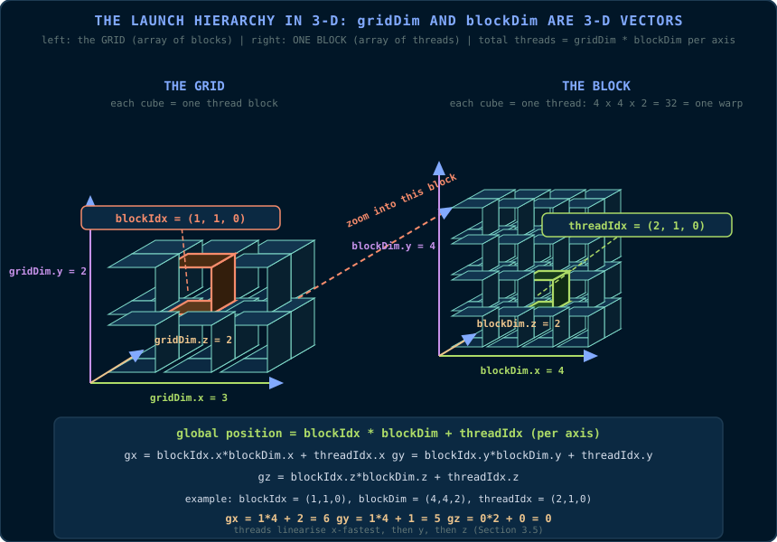
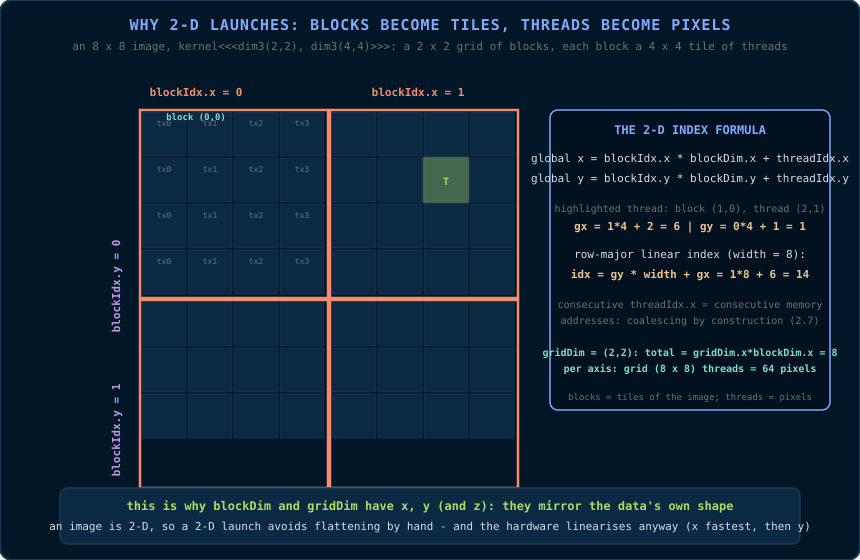
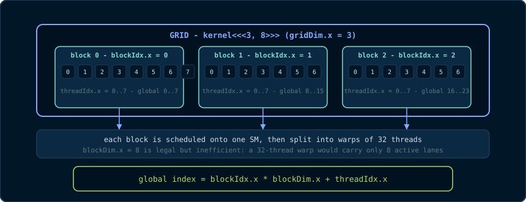

# Chapter 3: The CUDA Programming Model

> *"A kernel is a function that the hardware multiplies."*
> 📦 **Code companion:** the complete, buildable code for this chapter lives in [`code/ch03_vector_add/`](https://github.com/arpanpathak/gpu-parallel-book/tree/main/code/ch03_vector_add) in the repository.

This chapter introduces the CUDA programming model: how a function becomes a
kernel, how a launch describes a grid of work, and how data moves between the
CPU (the *host*) and the GPU (the *device*). Every concept is introduced from
first principles, and the first complete program - a vector addition - is
presented with line-by-line commentary.

## 3.1 Host and Device

CUDA programs are divided into two worlds:

- **Host** - the CPU and its memory. The host *launches* kernels and moves
  data.
- **Device** - the GPU and its memory (global memory, §2.5). The device
  *executes* kernels.

The two worlds do not share an address space. A pointer obtained from
`cudaMalloc` is a *device* pointer: dereferencing it on the host is undefined
behaviour and, in practice, a crash. Data must cross the boundary explicitly
with `cudaMemcpy`. This separation is the single most common source of
confusion for new CUDA programmers, and it is permanent: Chapter 4 introduces
the escape hatches (pinned memory, unified memory), but the separation remains
the mental model.

> **Primitive - host.** The CPU side of a CUDA program.
> **Primitive - device.** The GPU side of a CUDA program.
> **Primitive - kernel.** A function that runs on the device, launched by the
> host, executed by many threads.

**The physical picture (from Chapter 2).** The host is a CPU sitting across a
bus; the device is the whole GPU die - GPCs of SMs above a chip-wide L2 above
DRAM. Every `cudaMemcpy` is a shipment across that bus; every kernel launch is
a work order delivered to the SMs. The two address spaces are separate
*because the hardware is physically separate*: different DRAM, different
caches, different execution units. The programming model is simply refusing to
pretend otherwise - and that refusal is the source of most of the API's
apparent ceremony (Chapter 4 explains the escape hatches). Keep the die
diagram of §2.1 in mind and none of the rules in this chapter will feel
arbitrary.

## 3.2 The Function Qualifiers

CUDA extends C++ with three function qualifiers:

- `__global__` - the kernel qualifier. The function runs **on the device** and
  is **called from the host** (or from the device in some later CUDA
  generations, via cooperative launch). A `__global__` function must return
  `void`. Its arguments are copied from host memory to the device before
  launch.
- `__device__` - the function runs on the device and is called *only from
  device code* (from a kernel, or from another `__device__` function).
- `__host__` - the default: a normal host function. It can be combined as
  `__host__ __device__` to produce one function compiled for both sides - a
  workhorse of modern CUDA (Chapter 10).

A `__device__` function cannot call a `__host__` function; the device has no
host runtime. A `__global__` function cannot be called recursively (on most
architectures) and cannot take a variable number of arguments.

## 3.3 The Launch Configuration: Grids and Blocks

A kernel launch looks like this:

```cpp
myKernel<<<gridDim, blockDim>>>(args...);
```

The double-angle-bracket expression is the **execution configuration**: it
describes the *shape* of the work. Both arguments are of type `dim3` - a
three-component vector type with fields `x`, `y`, `z`, each an unsigned
integer (`unsigned int`).

- **blockDim** - the number of threads per block, one to three dimensions.
  Total threads per block = `blockDim.x * blockDim.y * blockDim.z`, and must
  not exceed 1,024 on modern hardware.
- **gridDim** - the number of blocks in the grid, one to three dimensions.
  Total threads in the kernel = `gridDim * blockDim` across all dimensions.

**Two 3-D vectors describe the whole launch.** The key to not getting lost in
`<<<grid, block>>>` is to see both arguments as what they literally are:
vectors. `gridDim` is a 3-D vector that says *how many blocks exist along each
axis*; `blockDim` is a 3-D vector that says *how many threads exist along each
axis inside every block*. Together they describe a 3-D grid of 3-D blocks - a
box of boxes:



Read the diagram in three steps:

1. **The grid** (left) is a 3-D array of blocks. `gridDim = (3, 2, 2)` means
   3 blocks along x, 2 along y, 2 along z - 12 blocks. Each little cube is a
   block, and its coordinates are `blockIdx = (x, y, z)`.
2. **Each block** (right, zoomed in) is itself a 3-D array of threads.
   `blockDim = (4, 4, 2)` means 4 threads along x, 4 along y, 2 along z -
   4 × 4 × 2 = 32 threads, which is exactly one warp (§2.3). Each thread's
   coordinates inside its block are `threadIdx = (x, y, z)`.
3. **The position of any thread in the whole grid** is the block's position
   times the block's size, plus the thread's position inside the block - the
   component-wise formula at the bottom of the diagram:

\\[ \text{gx} = \text{blockIdx.x} \times \text{blockDim.x} + \text{threadIdx.x} \\]
\\[ \text{gy} = \text{blockIdx.y} \times \text{blockDim.y} + \text{threadIdx.y} \\]
\\[ \text{gz} = \text{blockIdx.z} \times \text{blockDim.z} + \text{threadIdx.z} \\]

This is why the 1-D formula `blockIdx.x * blockDim.x + threadIdx.x` of §3.5 is
not a special case - it is the x-component of a vector identity that works in
all three dimensions. The grid and block sizes *multiply*: the total number of
threads is

\\[ \text{gridDim.x} \cdot \text{gridDim.y} \cdot \text{gridDim.z} \cdot
\text{blockDim.x} \cdot \text{blockDim.y} \cdot \text{blockDim.z} \\]

**Why three dimensions?** Because real data is often two- or three-dimensional
(images, volumes, grids). A 2-D launch lets the kernel index an image as
`(x, y)` instead of flattening it by hand - the grid and block become *tiles*
and *pixels*:



The image example above is the single most useful mental model in this
chapter: **blocks tile the data, threads fill each tile.** A 2-D launch means
you never flatten coordinates yourself - the hardware linearises anyway
(x fastest, then y, then z), but you think in the data's own shape.

The hardware view of this (from Chapter 2): blocks are assigned to SMs; each
block is chopped into warps of 32 consecutive threads; warps execute in
lockstep.

**Read `<<<grid, block>>>` as a declaration, not a loop.** You are not writing
a `for` that the machine walks through; you are telling the hardware *how much
work exists and how it is shaped*, and the hardware - not you - decides which
SM runs which block, and when. The launch is a contract with the machine:
enough blocks to fill every SM, blocks small enough to fit the SM's resources
(registers, shared memory, the 1,024-thread cap), and a shape that maps your
data's natural dimensions. Get the declaration right and the hardware's own
scheduler does the rest; get it wrong and the hardware cannot compensate
(Chapter 2, §2.9).

Here is the whole hierarchy for a small launch, `kernel<<<3, 8>>>` (3 blocks
of 8 threads - smaller than reality, exactly right for a picture):



## 3.4 The Built-in Variables

Inside a kernel, four read-only built-in variables describe the launch:

| Variable | Type | Meaning |
|---|---|---|
| `threadIdx` | `dim3` | The thread's position *within its block*: `threadIdx.x`, `.y`, `.z` |
| `blockIdx` | `dim3` | The block's position *within the grid*: `blockIdx.x`, `.y`, `.z` |
| `blockDim` | `dim3` | Threads per block (the `blockDim` you passed) |
| `gridDim` | `dim3` | Blocks per grid (the `gridDim` you passed) |

These are **primitives provided by the hardware**, not variables you create.
They are how a thread knows *who it is*. In the language of the 3-D picture in
§3.3: `blockIdx` is the *address of your block* (which cube of the grid you
live in), `threadIdx` is the *address of you inside that cube*, and
`blockDim` / `gridDim` are the *sizes* of the two containers. The global
formula `blockIdx * blockDim + threadIdx` is the address translator between
them.

## 3.5 The Global Index Formula

The most important one-liner in CUDA, for a 1-D problem:

```cpp
// Global linear index of this thread, assuming a 1-D grid and 1-D blocks.
unsigned int i = blockIdx.x * blockDim.x + threadIdx.x;
```

The reasoning: thread `threadIdx.x` lives in block `blockIdx.x`. Each block
contains `blockDim.x` threads, so block number `blockIdx.x` starts at
`blockIdx.x * blockDim.x`. Add the position within the block to get the global
position. If you saw the 3-D picture in §3.3, this is the same formula with
only the x-components left - a 1-D launch is just a 3-D launch where the
y and z components are all 1. For a 2-D problem, the formula composes:

```cpp
// 2-D indexing: x and y are independent linear indices in their dimension.
unsigned int ix = blockIdx.x * blockDim.x + threadIdx.x;  // column
unsigned int iy = blockIdx.y * blockDim.y + threadIdx.y;  // row
// Row-major flattening of a width x height image:
unsigned int idx = iy * width + ix;                        // linear memory index
```

Note the ordering: in row-major layout, consecutive `ix` values are
consecutive in memory - and, by construction, consecutive threads have
consecutive `ix`. This is *coalescing by construction* (§2.7), which is why
the formula exists.

**A worked example, with real numbers.** Launch `kernel<<<4, 256>>>` (4 blocks
of 256 threads, covering 1,024 global indices). Consider the thread with
`blockIdx.x = 2` and `threadIdx.x = 137`:

```
global index = blockIdx.x * blockDim.x + threadIdx.x
             = 2 * 256 + 137
             = 512 + 137
             = 649
```

That thread therefore owns element 649 of the array - no ambiguity, no shared
state, and 1,023 other threads own the other 1,023 elements. Now the warp
view: `blockIdx.x = 2` covers global indices 512..767. Its warp 0 is
threads 0..31, i.e., global indices 512..543: 32 consecutive addresses -
coalesced by construction, exactly as §3.5 promised. If the array had only
900 elements (not a multiple of 1,024), the threads owning indices 900..1,023
would be masked by the `if (i < n)` guard in the kernel.

## 3.6 The First Kernel: Vector Addition

We will now write a complete program: `c = a + b`, element-wise, for `float`
arrays of length `n`. This is the "Hello, world" of GPU programming, and every
line is worth understanding.

### 3.6.1 The kernel

```cpp
// kernel.cu
// ---------------------------------------------------------------------------
// __global__ : this function runs on the DEVICE, launched from the host.
// Return type must be void. The argument is a device pointer to n floats.
// ---------------------------------------------------------------------------
__global__ void addVectors(const float* a, const float* b, float* c, int n)
{
    // --- Who am I? -----------------------------------------------------
    // blockIdx.x : index of my block within the grid (0-based).
    // blockDim.x : number of threads in my block (set at launch).
    // threadIdx.x: index of my thread within my block (0-based).
    // The product blockIdx.x * blockDim.x is the first global thread index
    // covered by my block; adding threadIdx.x gives my global index.
    const int i = blockIdx.x * blockDim.x + threadIdx.x;

    // --- Boundary guard -------------------------------------------------
    // The grid may cover more threads than n (we launch a rounded-up grid,
    // see the host code). Threads whose index is >= n must do nothing.
    // Without this guard we would read and write past the end of the arrays
    // - an out-of-bounds memory error on the device.
    if (i < n)
    {
        // Element-wise add. Each thread owns exactly one output element,
        // so no two threads ever write the same address: no races here.
        c[i] = a[i] + b[i];
    }
}
```

The comments above are not decoration; they are the *reasoning audit trail*
required by this book's coding standards. A reviewer must be able to verify,
from the comments alone, that the index arithmetic is correct and that no race
is possible.

### 3.6.2 The host code

```cpp
#include <cstdio>
#include <cuda_runtime.h>   // All CUDA runtime API declarations live here.

// ---------------------------------------------------------------------------
// Error-checking helper (see 3.8). Every CUDA call that can fail is routed
// through CHECK, which prints the file and line on failure and aborts.
// ---------------------------------------------------------------------------
#define CHECK(call)                                                       \
    do {                                                                  \
        const cudaError_t err = (call);                                   \
        if (err != cudaSuccess) {                                         \
            std::fprintf(stderr, "CUDA error at %s:%d: %s\n",             \
                         __FILE__, __LINE__, cudaGetErrorString(err));    \
            std::exit(EXIT_FAILURE);                                      \
        }                                                                 \
    } while (0)

int main()
{
    // --- Problem size -----------------------------------------------------
    // n is the number of elements; nBytes is the byte size of each array.
    // We use size_t because array sizes can exceed the range of int.
    const int    n      = 1 << 20;      // 1,048,576 elements (a power of two)
    const size_t nBytes = n * sizeof(float);

    // --- Host allocations (pageable memory, see Chapter 4) ---------------
    float* h_a = new float[n];   // host input A
    float* h_b = new float[n];   // host input B
    float* h_c = new float[n];   // host output C

    // Fill the inputs with a deterministic pattern so we can verify results.
    for (int i = 0; i < n; ++i) { h_a[i] = 1.0f * i;  h_b[i] = 2.0f * i; }

    // --- Device allocations ----------------------------------------------
    // cudaMalloc allocates in GLOBAL MEMORY on the device. The returned
    // pointers are valid only on the device (see 3.1).
    float* d_a = nullptr;   // device input A
    float* d_b = nullptr;   // device input B
    float* d_c = nullptr;   // device output C
    CHECK(cudaMalloc((void**)&d_a, nBytes));
    CHECK(cudaMalloc((void**)&d_b, nBytes));
    CHECK(cudaMalloc((void**)&d_c, nBytes));

    // --- Host -> device copy ----------------------------------------------
    // cudaMemcpy(dst, src, bytes, kind). The kind cudaMemcpyHostToDevice
    // tells the runtime the direction of the copy (see 3.7).
    CHECK(cudaMemcpy(d_a, h_a, nBytes, cudaMemcpyHostToDevice));
    CHECK(cudaMemcpy(d_b, h_b, nBytes, cudaMemcpyHostToDevice));

    // --- Launch configuration --------------------------------------------
    // Block size: 256 threads per block. Why 256? A multiple of the warp
    // size (32) so every warp is full, and small enough that many blocks
    // fit per SM (see occupancy, 2.9). Values of 128-512 are typical.
    const int threadsPerBlock = 256;
    // Grid size: ceil(n / threadsPerBlock). The + (threadsPerBlock - 1)
    // trick rounds UP so that the grid covers every element. Some threads
    // will therefore exceed n and hit the boundary guard in the kernel.
    const int blocksPerGrid  = (n + threadsPerBlock - 1) / threadsPerBlock;

    // --- Launch ------------------------------------------------------------
    // The launch is asynchronous: the host does NOT wait for the kernel;
    // control returns to the host immediately (see Chapter 6).
    addVectors<<<blocksPerGrid, threadsPerBlock>>>(d_a, d_b, d_c, n);

    // Kernel launches do not report errors synchronously. Check the last
    // error now; if the launch itself failed (bad config, bad pointer),
    // this catches it.
    CHECK(cudaGetLastError());

    // --- Synchronise --------------------------------------------------------
    // cudaDeviceSynchronize blocks the host until ALL device work issued
    // so far has completed. Required before we copy the results back.
    CHECK(cudaDeviceSynchronize());

    // --- Device -> host copy ------------------------------------------------
    CHECK(cudaMemcpy(h_c, d_c, nBytes, cudaMemcpyDeviceToHost));

    // --- Verify -------------------------------------------------------------
    // We know the correct answer: h_c[i] should equal 3*i. Verify a few
    // samples and report the worst error.
    double maxErr = 0.0;
    for (int i = 0; i < n; ++i)
    {
        const double err = std::abs(static_cast<double>(h_c[i]) - 3.0 * i);
        if (err > maxErr) maxErr = err;
    }
    std::printf("max error = %g\n", maxErr);

    // --- Cleanup ------------------------------------------------------------
    delete[] h_a;  delete[] h_b;  delete[] h_c;
    CHECK(cudaFree(d_a));  CHECK(cudaFree(d_b));  CHECK(cudaFree(d_c));
    return 0;
}
```

### 3.6.3 Why this design?

- **One thread per element.** The simplest possible decomposition: the work is
  perfectly partitioned, no thread depends on another, and coalescing is
  automatic because `i` increases with `threadIdx.x`.
- **Boundary guard instead of exact grid.** Rounding the grid up to a multiple
  of the block size means the guard `if (i < n)` is required, but it also
  means we never compute a tricky, non-multiple grid. The guard is one
  instruction; a mis-sized grid is a crash.
- **Power-of-two sizes.** `n = 1 << 20` is pedagogical; in production the size
  is arbitrary and the guard earns its keep.

## 3.7 The Memory API Primitives

The runtime API functions used above are primitives you will use daily:

| Function | Behaviour |
|---|---|
| `cudaMalloc(void** p, size_t bytes)` | Allocate `bytes` in device global memory; store the device pointer in `*p`. Returns `cudaSuccess` or an error code. |
| `cudaFree(void* p)` | Free a device allocation made by `cudaMalloc`. |
| `cudaMemcpy(dst, src, bytes, kind)` | Copy `bytes` between host and device. `kind` is one of `cudaMemcpyHostToDevice`, `cudaMemcpyDeviceToHost`, `cudaMemcpyDeviceToDevice`, or `cudaMemcpyHostToHost`. **Synchronous**: the copy completes before the call returns. |
| `cudaGetLastError()` | Return and clear the last asynchronous error recorded for the calling thread. |
| `cudaGetErrorString(err)` | Human-readable text for a `cudaError_t`. |
| `cudaDeviceSynchronize()` | Block the host until all preceding device work completes. |

**Why `cudaMalloc` takes `void**`?** It is C-style output-parameter
convention: the function needs to *write a pointer* into your variable, so it
takes the address of your pointer variable. C++ would return a pointer;
CUDA's C heritage writes through a pointer-to-pointer. And why the explicit
`(void**)` cast, which every allocation above carries? Because C++ - unlike C  - 
does not allow an implicit conversion from `float**` to `void**` (only `T*` to
`void*` is implicit). The cast is *required* for the code to compile, not
optional decoration. This is one of the few places where the API's C heritage
leaks into C++ code, and the cast is the price of admission.

**Why does `cudaMemcpy` need a direction argument?** Because host and device
pointers are not distinguishable by address alone (a host pointer and a device
pointer can have numerically similar values on some platforms). The direction
flag removes the ambiguity.

## 3.8 Error Handling: The Contract

CUDA functions return a `cudaError_t` - an enum, where `cudaSuccess` is 0 and
every other value is an error code. There are two failure modes:

1. **Synchronous errors** - detected immediately by the call (e.g., an invalid
   argument, an illegal `cudaMemcpy` kind). The call returns the error code.
2. **Asynchronous errors** - detected *after* the call (e.g., an invalid
   kernel launch, an illegal memory access inside the kernel). The launch
   itself returns `cudaSuccess`; the error surfaces on the *next* CUDA API
   call from the same thread, which is why we call `cudaGetLastError()`
   immediately after the launch.

The `CHECK` macro routes every call through `cudaGetErrorString`, so a failure
reports the offending source line. Production code should do something more
graceful than `std::exit`, but the *discipline* - check every call - is not
optional. An unchecked error is a silent wrong answer or a corrupt image.

## 3.9 Compilation and the Build Pipeline

CUDA source files use the `.cu` extension and are compiled by `nvcc`, NVIDIA's
compiler driver. The pipeline has two phases:

1. **Host pass.** `nvcc` extracts the host code, compiles it with the host C++
   compiler (`g++` or `clang++`), and replaces each kernel launch
   (`kernel<<<...>>>`) with runtime-API calls that package the arguments and
   launch the kernel.
2. **Device pass.** `nvcc` compiles the `__global__` and `__device__`
   functions to **PTX** (Parallel Thread Execution) - NVIDIA's portable
   virtual instruction set - and then to **SASS** (the actual machine code of
   the target GPU) via `ptxas`.

```bash
# Compile for a specific architecture. This book's default is compute_60
# (Pascal-class PTX): the driver JIT-compiles it to any CUDA 12.x GPU, from
# T4 and P100 to A100, Jetson Orin and H100.
nvcc -arch=compute_60 kernel.cu -o kernel
# Native SASS alternatives (faster startup, less portable):
#   Jetson Orin : nvcc -arch=sm_87 kernel.cu -o kernel
#   A100        : nvcc -arch=sm_80 kernel.cu -o kernel
#   H100        : nvcc -arch=sm_90 kernel.cu -o kernel
```

> **Primitive - PTX.** The intermediate virtual ISA (Chapter 12 shows it in
> detail). Portable across GPU generations; translated to SASS by the driver
> at load time if no SASS is embedded.
> **Primitive - SASS.** The GPU's real machine code, tied to a specific
> compute capability.

If you have no NVIDIA GPU on your machine, `nvcc` still compiles `.cu` files;
the resulting binary simply will not run. Every `.cu` file in this book can be
compiled with `nvcc -arch=compute_60 -o bin src.cu` and run on any CUDA 12.x
GPU (Pascal or newer) through the driver's JIT.

## 3.10 What You Should Remember

- The launch configuration is a *declaration of parallelism*, not a loop: the
  hardware schedules the grid onto SMs, the blocks onto warp slots.
- `threadIdx`, `blockIdx`, `blockDim`, `gridDim` are hardware-provided
  primitives; the global index formula `blockIdx.x * blockDim.x + threadIdx.x`
  is the universal translator from thread identity to data address.
- Host and device have separate address spaces; every transfer is explicit
  (`cudaMemcpy`), every allocation explicit (`cudaMalloc`/`cudaFree`).
- Check every CUDA call. The kernel launch itself is asynchronous and errors
  surface later; `cudaGetLastError()` after the launch and
  `cudaDeviceSynchronize()` before copying results are the two mandatory
  checkpoints.

## Deeper Explanation: Why `<<<grid, block>>>` Is a Declaration, Not a Loop

The single most important mindset shift in CUDA is seeing the launch
configuration as a *contract with the scheduler*. You are not writing a loop
that the CPU walks through; you are describing how much work exists and how
it is shaped. The hardware decides which SM gets which block, when warps are
scheduled, and how the grid is drained. This is why the same kernel can run
on a tiny GPU and a huge GPU without changing the source: the launch
configuration says "there are this many blocks of this size", and the
hardware maps them onto whatever SMs exist. If you write code that assumes a
specific SM count, block order, or execution timing, you are violating the
contract - and your kernel will break on a different GPU even though it
"worked" on yours.

## Common Pitfalls

- Using `int` for sizes that can exceed 2 billion bytes/indices. `nBytes`
  should be `size_t`; grid/block dims are unsigned and have hardware limits.
- Launching with a grid that does not cover all elements and omitting the
  boundary guard. Rounding up + `if (i < n)` is the safe pattern.
- Forgetting that the launch is asynchronous. Checking errors immediately
  after launch is necessary but not sufficient; you must synchronize before
  reading results.
- Assuming blocks execute in order. They do not. Never rely on block
  scheduling order for correctness.

## Check Your Understanding

<details>
<summary>Why must a __global__ function return void?</summary>

A kernel is launched for thousands of threads; there is no single caller to
receive a return value. The kernel's "return" is the side effects it writes to
memory (output arrays, atomics). Return values are expressed through output
buffers instead.
</details>

<details>
<summary>For n = 1,000,000 and 256 threads per block, how many blocks are launched and how many threads are masked?</summary>

blocks = ceil(1,000,000 / 256) = 3,907. Total threads = 3,907 × 256 =
1,000,192, so 192 threads in the last block are masked by `if (i < n)`.
</details>

<details>
<summary>What does cudaGetLastError() catch that cudaDeviceSynchronize() does not?</summary>

`cudaGetLastError()` catches launch-configuration errors that are recorded
asynchronously (e.g., invalid block size, bad kernel pointer) before you
synchronize. `cudaDeviceSynchronize()` waits for completion and surfaces
execution errors (e.g., illegal memory access). Both are needed.
</details>

## Key Takeaways

- Host and device have separate address spaces; every transfer is an explicit cudaMemcpy.
- Function qualifiers: __global__ (kernel, called from host), __device__ (device only), __host__ (host).
- The launch configuration `<<<grid, block>>>` is a declaration of parallelism, not a loop.
- threadIdx, blockIdx, blockDim and gridDim are hardware-provided primitives; the global index is blockIdx.x * blockDim.x + threadIdx.x.
- Boundary guards make rounded-up grids safe; they diverge only in the last (partial) block.
- Check every CUDA call: cudaGetLastError() after the launch, cudaDeviceSynchronize() before copying results back.

## 3.11 Exercises

1. Write the 2-D global index formula for a `width × height` image, and show
   that consecutive threads in a warp read consecutive memory addresses when
   the block covers a contiguous row segment.
2. Why must a `__global__` function return `void`? What would a return value
   even mean for 1,000,000 threads?
3. Compute `blocksPerGrid` for `n = 1,000,000` and `threadsPerBlock = 256`.
   How many threads in the last block are masked by the boundary guard?
4. What happens if you call `cudaMemcpy` with `cudaMemcpyHostToDevice` but
   pass a *device* pointer as the source? (Do not try it on a machine you
   care about.)
