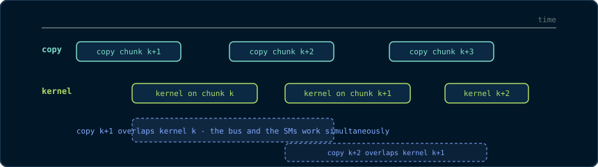

# Chapter 4: Memory Management & Data Movement

> *"A kernel that runs at 100% efficiency but waits for a slow copy is a slow
> kernel. Data movement is computation."*

Chapter 3 moved data with `cudaMalloc`/`cudaMemcpy` and said nothing about
*how* it moves. This chapter is about that how. The GPU's memory system is a
pipeline with three distinct actors - the host DRAM, the transfer bus (PCIe or
NVLink), and the device DRAM - and the performance of any real application is
dominated by the slowest stage. We cover the memory *kinds* you can allocate,
the *copy primitives* that move data, and the *unified memory* model that
pretends the separation does not exist. Every term is defined from first
principles.

## 4.1 The Transfer Pipeline

A `cudaMemcpy` from host to device executes in stages:

1. The CPU reads the data from **pageable host memory** (the ordinary
   `malloc`/`new` kind from Chapter 3).
2. The runtime must copy it through a staging area: the PCIe/NVLink controller
   cannot DMA directly from a pageable page, because the OS may swap that page
   out at any moment. The runtime therefore copies host → a **pinned staging
   buffer** → device. That extra hop costs time and a full extra copy.
3. The device writes the data into device global memory via the transfer bus.

Every stage has a bandwidth. The total transfer time is bounded by the
slowest stage, and the *reasoning* about which stage is slowest is the subject
of this chapter.

## 4.2 Pageable vs Pinned Host Memory

> **Primitive - pageable memory.** Ordinary host memory allocated with
> `malloc`/`new`. The OS may move or swap the underlying pages at any time;
> therefore the GPU's DMA engine cannot touch them directly.
> **Primitive - pinned (page-locked) memory.** Host memory whose pages the OS
> has agreed *not* to swap. The DMA engine can access it directly. Pinned
> memory is allocated with `cudaMallocHost` or `cudaHostAlloc`.

Pinned memory buys two things:

1. **Direct DMA.** The runtime skips the staging copy, so a host↔device copy
   is one transfer, not two.
2. **Asynchronous transfers.** `cudaMemcpyAsync` (Chapter 6) requires pinned
   host memory; a pageable pointer cannot be used because the DMA engine would
   need to chase the OS's page tables.

The cost: pinned memory is **not swappable**, so a large pinned allocation
reduces the OS's freedom and can degrade system performance. Pin what you
transfer frequently; leave the rest alone. The canonical policy is: *pinned
buffers for the streaming path, pageable for everything else*.

```cpp
// ---------------------------------------------------------------------------
// Pinned allocation. cudaMallocHost allocates host memory that the CUDA
// runtime has pinned. It must be freed with cudaFreeHost, not free/delete.
// ---------------------------------------------------------------------------
float* h_pinned = nullptr;
CHECK(cudaMallocHost((void**)&h_pinned, nBytes));   // pinned, DMA-able, non-swappable

float* h_pageable = new float[n];           // ordinary heap memory, swappable

// ... use ...

CHECK(cudaFreeHost(h_pinned));              // correct deallocation for pinned
delete[] h_pageable;                        // correct deallocation for heap
```

**Why `cudaFreeHost`?** The pinned pages carry bookkeeping in the CUDA
runtime; freeing them with `free()` would leak that bookkeeping and corrupt
the runtime's view of the allocation. Matched allocate/free pairs are a
lifelong habit here.

## 4.3 Transfer Bandwidth: The Numbers

As teaching figures for a PCIe Gen4 x16 link (≈ 25-32 GB/s effective) and a
modern GPU (≈ 1 TB/s HBM for the RTX family, 3.35 TB/s for H100):

| Copy | Approximate effective bandwidth |
|---|---|
| Host pageable → device | 6-8 GB/s (staging hop dominates) |
| Host pinned → device | 20-25 GB/s (PCIe-limited) |
| Device → host pinned | 20-25 GB/s |
| Device → device | 1-3 TB/s (HBM) |

The lesson is arithmetic: copying 1 GB host→device costs ~40 ms pinned,
~140 ms pageable, and the kernel that *uses* that 1 GB might run for 1 ms.
**The transfer can be 100× more expensive than the computation.** This is why
the entire discipline of *streaming* (Chapter 6) exists: overlap the transfers
with computation instead of serialising them.

## 4.4 Measuring Your Own Transfer Time

The right way to measure a transfer is a loop: repeat the copy several times
and divide, so that one-time overheads amortise away. The following host-only
snippet (no CUDA kernel required) times a pinned vs pageable copy. It uses
`std::chrono` because we have not yet met CUDA events (Chapter 6).

```cpp
#include <chrono>
#include <cstdio>
#include <cuda_runtime.h>

// Time (in milliseconds) one cudaMemcpy of 'bytes' bytes from host to device.
double timeHostToDeviceCopy(void* dst, const void* src, size_t bytes)
{
    const int reps = 100;   // repeat to amortise launch overhead
    // Warm up once so page tables and caches are not part of the timing.
    cudaMemcpy(dst, src, bytes, cudaMemcpyHostToDevice);

    const auto t0 = std::chrono::steady_clock::now();
    for (int r = 0; r < reps; ++r)
        cudaMemcpy(dst, src, bytes, cudaMemcpyHostToDevice);
    cudaDeviceSynchronize();          // ensure the last copy actually finished
    const auto t1 = std::chrono::steady_clock::now();

    const double ms = std::chrono::duration<double, std::milli>(t1 - t0).count();
    return ms / reps;                 // average per-copy time
}
```

**Why the warm-up?** The first copy touches the pages, populates TLB entries
and (for pageable memory) performs the pin-on-demand work. Excluding it gives a
steady-state number, which is the number that describes sustained behaviour.

**Why `cudaDeviceSynchronize()` at the end?** `cudaMemcpy` is synchronous in
the sense that it *copies the data* before returning, so the last copy has
already completed. The synchronise is defensive: it also waits for any
asynchronous kernel work issued earlier, keeping the measurement clean.

## 4.5 Unified Memory: `cudaMallocManaged`

> **Primitive - unified memory (UM).** A single virtual address space shared
> by host and device. A pointer allocated with `cudaMallocManaged` can be
> dereferenced *on the host and in kernels* without explicit copies. The
> driver migrates pages on demand.

Unified memory is the third memory kind, and it changes the programming model
fundamentally: the `cudaMemcpy` calls disappear from the code. The price is
that the *driver* decides when data moves, and the driver's decisions are
sometimes wrong.

```cpp
// One allocation, usable on both sides:
float* m = nullptr;
CHECK(cudaMallocManaged((void**)&m, nBytes));

// Host fills it like an ordinary array:
for (int i = 0; i < n; ++i) m[i] = static_cast<float>(i);

// Kernel reads it directly - no copy issued:
addVectors<<<blocksPerGrid, threadsPerBlock>>>(m, m, m, n);  // m = m + m
CHECK(cudaDeviceSynchronize());   // page faults migrate data on demand
```

**How it works (simplified).** The driver splits the allocation into pages.
When the host touches a page, the page lives in host memory; when a kernel
touches it, the driver migrates it to device memory (a *page fault* on the
device, serviced over the bus). The first touch of each page pays a migration
cost; subsequent accesses are local.

**The two performance tools:**

```cpp
// Hint the driver to migrate the range [m, m + nBytes) to the device now,
// so the kernel does not pay page faults during execution:
CHECK(cudaMemPrefetchAsync(m, nBytes, 0 /* device 0 */));

// When the host needs the results back, prefetch to the host (cudaCpuDeviceId):
CHECK(cudaMemPrefetchAsync(m, nBytes, cudaCpuDeviceId));
```

`cudaMemPrefetchAsync` is the *explicit* version of what the driver does
lazily. Use it: a kernel that page-faults through 1 GB of unified memory pays
a fault per page - milliseconds of hidden stalls.

**Why choose unified memory at all?** For productivity (no copy code), for
data structures with complex pointer graphs (linked structures migrate
whole), and for oversubscription (an allocation larger than device memory can
be streamed through with `cudaMemAdvise`). The cost is loss of deterministic
control over data movement. This book's position: **understand `cudaMemcpy`
first, use UM where it earns its keep, and always measure.**

## 4.6 Zero-Copy Host Memory

> **Primitive - zero-copy.** Host memory mapped into the device address space.
> Kernels access it directly over the bus; no explicit copy ever happens. Each
> access pays the bus latency, so zero-copy is fast only for small, rarely
> re-read data.

```cpp
float* h_mapped = nullptr;
// cudaHostAllocMapped: allocate pinned host memory AND map it into device
// address space (zero-copy).
CHECK(cudaHostAlloc((void**)&h_mapped, nBytes, cudaHostAllocMapped));

// Obtain the device-side pointer for the same memory:
float* d_mapped = nullptr;
CHECK(cudaHostGetDevicePointer((void**)&d_mapped, h_mapped, 0 /* flags, must be 0 */));

// Now d_mapped can be passed to kernels; the kernel's reads/writes go
// directly over PCIe to host memory.
```

Zero-copy shines in two cases: data so small that a copy costs more than the
kernel, and data produced *by* the kernel that the host must see immediately
(asynchronous writes without a copy-back). It fails for anything large that is
re-read: every access pays full bus latency, which can be 50× worse than
device DRAM.

## 4.7 The Copy Matrix: Which Tool When

| Need | Tool | Why |
|---|---|---|
| One-time setup copy | `cudaMemcpy` (pageable) | Simplicity; the staging hop is once. |
| Streaming / repeated copies | `cudaMallocHost` pinned + `cudaMemcpy` (or async, Ch. 6) | Direct DMA, no staging hop. |
| Pointer-heavy structures | `cudaMallocManaged` + `cudaMemPrefetchAsync` | Driver migrates whole graphs. |
| Tiny, frequently-read host data | Zero-copy `cudaHostAllocMapped` | No copy at all; bus latency is cheap for small data. |
| Same-GPU scratch space | `cudaMalloc` device memory | Full HBM bandwidth, no bus. |

The common failure mode is using `cudaMallocManaged` for *everything* because
it is convenient, then wondering why a bandwidth-bound kernel runs at 30% of
peak: the driver's lazy migration turned a streaming copy into per-page
faults. **The memory kind is part of the algorithm design**, not a detail.

## 4.8 Transfer Overlap: A Preview

The next chapter introduces streams; here, one idea is worth previewing
because it changes how you think about transfers:

A transfer and a kernel *on different data* can run concurrently if the
runtime can see that they are independent. The canonical shape is **double
buffering**:



With two buffers, the copy for the *next* chunk overlaps the compute on the
*current* chunk, and the transfer cost disappears from the critical path  - 
provided the transfers are pinned and asynchronous. Chapter 6 builds this
pipeline in full; the capstone (Chapter 15) uses it for images.

## Deeper Explanation: The Memory Kind Is Part of the Algorithm

Beginners treat memory allocation as plumbing: pick `cudaMalloc`, copy, done.
The deeper truth is that the memory kind determines the *cost model* of every
access. Pinned memory is fast for streaming because the DMA engine can touch
it directly; pageable memory pays a staging copy; unified memory pays page
faults and migrations; zero-copy pays bus latency on every access. Each kind
optimises a different pattern, and choosing the wrong one converts a
bandwidth-bound kernel into a latency-bound one. This is why Chapter 4 is not
"API reference" but *algorithm design*: the memory kind is a decision as
important as the kernel's index arithmetic.

## Common Pitfalls

- Using pageable memory for every transfer and wondering why copies are slow.
  Pin what you stream.
- Using unified memory for everything "because it is easy". Lazy migration
  turns a streaming copy into per-page faults; prefetch explicitly.
- Forgetting the paired free: `cudaMalloc` → `cudaFree`, `cudaMallocHost` →
  `cudaFreeHost`, `cudaHostAlloc` → `cudaFreeHost`. Mismatched frees corrupt
  the runtime's bookkeeping.
- Using zero-copy for large, repeatedly-read data. Every access crosses the
  bus; it is only fast for small, rarely re-read data.

## Check Your Understanding

<details>
<summary>Why can't cudaMemcpyAsync use pageable memory?</summary>

Asynchronous copies are performed by the DMA engine, which needs physical
pages that will not move. Pageable pages can be swapped; the runtime would
have to stage through a pinned buffer synchronously, destroying the
asynchrony. Pinned memory guarantees stable physical pages.
</details>

<details>
<summary>What is the cost of unified memory that the API hides?</summary>

Page faults and migrations. When the GPU touches a page resident on the host
(or vice versa), the driver migrates it over the bus; the first touch of each
page pays this cost. `cudaMemPrefetchAsync` makes those migrations explicit
and removes them from kernel time.
</details>

<details>
<summary>When is zero-copy the right choice?</summary>

When the data is small enough that a copy would cost more than the bus
latency of direct access, or when the kernel produces data the host must see
immediately. It fails for large or repeatedly-read data because every access
crosses the bus at full latency.
</details>

## Key Takeaways

- Transfers can cost 100x more than the kernel that uses the data - data movement is computation.
- Pinned memory (cudaMallocHost) enables direct DMA and asynchronous transfers; pageable memory goes through a staging copy.
- Unified memory (cudaMallocManaged) hides the copy but migrates pages lazily; prefetch explicitly with cudaMemPrefetchAsync.
- Zero-copy (cudaHostAllocMapped) suits small, rarely re-read data; device memory suits hot data.
- Match every allocation with its paired free (cudaFree, cudaFreeHost) and measure bandwidth before optimising.

## 4.9 Exercises

1. A 4 GB dataset is copied host→device: pageable vs pinned. Using the
   bandwidths in §4.3, by how many milliseconds is the pinned copy faster?
2. Why can `cudaMemcpyAsync` not be used with pageable host memory? Trace the
   sequence of events the DMA engine would need.
3. You have a kernel that reads each element of a 1 GB unified-memory array
   exactly once. Where would you place `cudaMemPrefetchAsync`, and why?
4. Zero-copy memory is described as "fast for small, rarely re-read data".
   Using the latency numbers of Chapter 2, explain what happens if a kernel
   re-reads the same 1 MB zero-copy region 1,000 times.
