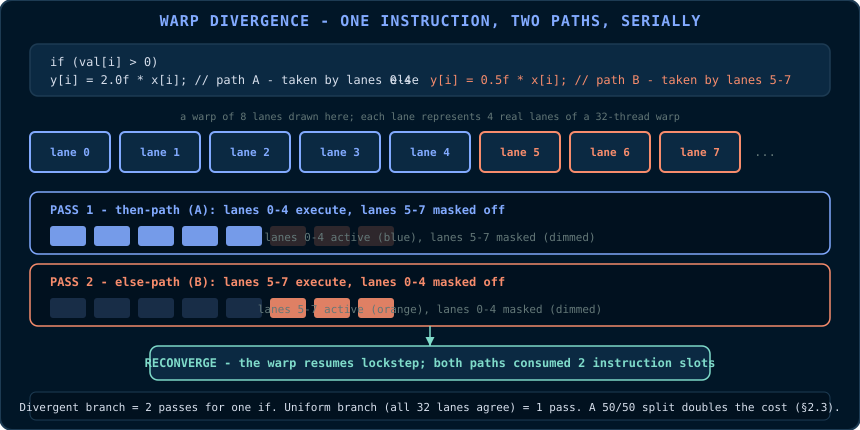

# Chapter 5: Synchronisation, Atomics & Race Conditions

> **Code companion:** the complete, buildable code for this chapter lives in
> [`code/ch05_histogram/`](https://github.com/arpanpathak/gpu-parallel-book/tree/main/code/ch05_histogram)
> in the repository.

Chapters 3 and 4 built kernels whose threads never communicated. Real kernels
share data, and sharing data in parallel is where correctness is decided. This
chapter covers three mechanisms provided by CUDA: **warp divergence** (the cost
of independent control flow), **barriers** (`__syncthreads`), and **atomics**
(hardware-arbitrated read-modify-write operations). It also defines the failure
mode they address: the **race condition**.

## 5.1 The Race Condition

> **Primitive - race condition.** Two or more threads access the same memory
> location, at least one access is a write, and the accesses are not ordered by
> any synchronisation mechanism. The result depends on the execution order
> chosen by the hardware, which the programmer cannot predict.

Races in CUDA are more severe than races on a CPU for two reasons:

1. **Scale.** A kernel has thousands to millions of threads. A race between any
   two of them can corrupt the result, and the corrupted result may appear only
   for one input in a thousand.
2. **Silent failure.** The kernel reports success while the corrupted value is
   stored. There is no exception, only a wrong answer.

The tools in this chapter order accesses. Every race fix installs an ordering
between conflicting accesses.

Formally, two accesses *conflict* when they touch the same location and at
least one is a write. The CUDA memory model defines a program's result only
when conflicting accesses are ordered by a *happens-before* edge: a barrier, an
atomic operation, a fence, a stream order, or an explicit device-wide
synchronisation. Without such an edge, the hardware may execute the accesses in
any order and different executions may produce different values. A race is
therefore not a probabilistic glitch; it is an absence of ordering in the model.

## 5.2 Warp Divergence: Control Flow in SIMT

From Chapter 2, a warp executes one instruction at a time for all 32 lanes.
Consider:

```cpp
__global__ void conditionalAdd(const float* a, float* out, int n)
{
    const int i = blockIdx.x * blockDim.x + threadIdx.x;
    if (i < n)
    {
        // Some threads take this path, others do not.
        out[i] = a[i] + 1.0f;
    }
}
```

If every thread in a warp has `i < n`, the warp takes the branch unanimously
and there is no cost. If some threads have `i >= n` and others do not, the
hardware must:

1. Execute the `then` path with the `i < n` lanes active and the other lanes
   masked;
2. Execute the `else` path with the remaining lanes active;
3. Rejoin the warp.



The two paths run serially. This is **warp divergence**, the price SIMT pays
for per-thread control flow.

Divergence is a per-warp phenomenon. If a branch depends on `threadIdx.x % 2`,
every warp in the grid has alternating lanes and pays the cost of both paths.
If a branch depends on `blockIdx.x % 2`, whole warps agree and there is no
cost. Data-dependent branches should be structured so that contiguous ranges of
threads take the same path where possible.

The boundary guard `if (i < n)` from Chapter 3 diverges only in the last
partial block of the grid, at most one warp per grid. Its cost is negligible.

## 5.3 `__syncthreads()`: The Block Barrier

> **Primitive - barrier.** A point at which every thread in a group must arrive
> before any thread may proceed. `__syncthreads()` is a barrier over one thread
> block, provided by the hardware.

When a thread executes `__syncthreads()`, it waits until all threads of its
block have reached that same call. The barrier orders memory within the block:
a write by one thread before the barrier is visible to another thread after
the barrier. Shared-memory algorithms (Chapter 7) rely on exactly this
property.

```cpp
__global__ void blockReduceDemo(const float* in, float* out, int n)
{
    __shared__ float s_partial[256];   // shared array, one slot per thread

    const int i = blockIdx.x * blockDim.x + threadIdx.x;

    // Phase 1: every thread reads its element and stashes it in shared memory.
    // No ordering is needed yet because each thread writes its own slot.
    s_partial[threadIdx.x] = (i < n) ? in[i] : 0.0f;

    // Phase 2: before any thread reads another thread's slot, all writes must
    // be complete and visible. The barrier provides both the arrival condition
    // and the visibility guarantee.
    __syncthreads();                    // required, see below

    // Phase 3: thread 0 can now safely read every slot.
    if (threadIdx.x == 0)
    {
        float sum = 0.0f;
        for (int k = 0; k < blockDim.x; ++k) sum += s_partial[k];
        out[blockIdx.x] = sum;
    }
}
```

Without the barrier, thread 0 could read `s_partial[5]` before thread 5 has
written it. Thread 5's write may still be in the memory pipeline, and the read
could return an undefined value. The barrier makes the phase structure valid.

`__syncthreads()` has two failure modes:

1. **Divergent barriers.** If some threads of a block reach a
   `__syncthreads()` while others do not, because they took a different branch,
   the barrier waits for threads that will never arrive. The block deadlocks.
   The hardware does not detect this; the kernel hangs until a watchdog timeout
   or `cudaDeviceReset`.
2. **Barriers in loops with variable trip counts.** The same deadlock occurs
   when threads execute the barrier different numbers of times. The barrier
   must be uniformly reachable: every thread executes it the same number of
   times.

```cpp
// DEADLOCK: threads with even index skip the barrier, odd ones wait forever.
if (threadIdx.x % 2 == 0) { /* no barrier here */ }
__syncthreads();            // threads with even index never arrive
```

There is no cheap grid-wide barrier. Blocks on different SMs may not be
resident at the same time, so the hardware cannot synchronise them without
additional constraints. A grid-wide barrier exists through cooperative groups,
but it requires a cooperative launch in which every block is resident
simultaneously, which caps the grid size. For cross-block communication, use
atomics (§5.5) or split the work into two kernel launches.

## 5.4 Visibility: Caches, `volatile`, and Fences

A barrier orders block-internal accesses. Cross-block and host-device
visibility follow different rules because modern GPUs have caches.

- L1 caches are per-SM and are not coherent between SMs. A thread on SM 0 may
  read a stale value of a location written by SM 1 unless the access is ordered
  through L2, the chip-wide coherence point.
- The compiler may reorder or cache loads and stores in registers unless told
  otherwise.

Two tools address these rules:

> **Primitive - `volatile`.** Tells the compiler that memory may change outside
> its knowledge. The compiler must not cache the value in a register and must
> emit the access each time it appears in the source.

> **Primitive - memory fence.** An instruction that orders memory operations at
> a given scope. `__threadfence()` orders global-memory accesses for the
> device; `__threadfence_block()` for the block; `__threadfence_system()` for
> host and device. A fence does not make other threads wait; it forces this
> thread's earlier writes to become visible before its later writes.

The following example shows a device-scope flag protected by a fence and
volatile access:

```cpp
// Shared state: a buffer and a "ready" flag, both in global memory.
__device__ float  g_buffer[1024];
__device__ int    g_ready = 0;

// Producer kernel: writes data, then sets the flag.
__global__ void producer()
{
    for (int i = threadIdx.x; i < 1024; i += blockDim.x)
        g_buffer[i] = static_cast<float>(i);

    // Make all preceding writes visible device-wide before the flag write.
    // Without the fence, another SM could observe g_ready == 1 while some
    // g_buffer writes are still pending in L1.
    __threadfence();

    if (threadIdx.x == 0)
        g_ready = 1;            // must be volatile; compiler cannot cache it
}

// Consumer kernel: polls the flag.
__global__ void consumer()
{
    while (volatileLoad(&g_ready) == 0) { /* spin */ }
    // The buffer writes are now guaranteed visible.
    float x = g_buffer[threadIdx.x];
}
```

`volatileLoad` denotes a read through a `volatile int*`. In production code,
prefer the higher-level abstractions: atomics (§5.5) and cooperative groups.
Hand-written fences are useful for understanding what those abstractions do and
for rare low-level cases.

## 5.5 Atomics: Hardware-Arbitrated Read-Modify-Write

> **Primitive - atomic operation.** A read-modify-write, such as read, add, and
> write, that the hardware guarantees to execute indivisibly with respect to
> other threads. Two `atomicAdd` calls on the same location cannot interleave;
> the result is exactly as if the two additions occurred in some serial order.
> The hardware chooses the order; no thread ever observes a torn value.

CUDA provides atomic functions for `int`, `unsigned int`, `unsigned long
long`, `float` (for addition), and, on modern GPUs, `double`:

| Function | Operation | Returns |
|---|---|---|
| `atomicAdd(addr, v)` | `*addr += v` | the *old* value |
| `atomicSub(addr, v)` | `*addr -= v` | the old value |
| `atomicExch(addr, v)` | `*addr = v` | the old value |
| `atomicCAS(addr, cmp, v)` | if `*addr == cmp` then `*addr = v` | the old value |
| `atomicMin(addr, v)` | `*addr = min(*addr, v)` | the old value |
| `atomicMax(addr, v)` | `*addr = max(*addr, v)` | the old value |
| `atomicAnd(addr, v)` | `*addr &= v` | the old value |
| `atomicOr(addr, v)` | `*addr \|= v` | the old value |
| `atomicXor(addr, v)` | `*addr ^= v` | the old value |

Atomics operate on global and shared memory. The returned old value is central
to lock-free algorithms: `atomicCAS` (compare-and-swap) is the primitive from
which other synchronisation structures can be built.

### 5.5.1 Worked Example: Histogram

A histogram counts occurrences of values. If every thread increments counters in
the same array, the increments must be atomic:

```cpp
// Count how many elements fall into each of 256 bins.
// data : device array of unsigned char (0..255), n elements
// hist : device array of 256 ints, zero-initialised on the host
// bins : the bin count, 256
__global__ void histogram(const unsigned char* data, int* hist, int n)
{
    const int i = blockIdx.x * blockDim.x + threadIdx.x;
    if (i < n)
    {
        const int bin = data[i];               // value is the bin index
        // The atomic serialises concurrent increments to the same bin.
        // Without it, two threads could read the same old value, add 1, and
        // both write old+1, losing one count.
        atomicAdd(&hist[bin], 1);
    }
}
```

Atomics on the same address from many threads serialise because hardware
arbitration is a bottleneck. The standard fix is **privatisation** (Chapter 8):
give each block its own histogram in shared memory, accumulate with shared
atomics, and fold the private histograms into global memory at the end.

### 5.5.2 Worked Example: A Spinlock Built from `atomicCAS`

`atomicCAS` implements test-and-set, and test-and-set can implement a lock. The
following example uses a lock in shared memory to protect a critical section
within one block:

```cpp
// A simple lock in shared memory. One mutex per block.
__global__ void lockedCriticalSection(float* g_data, int n)
{
    __shared__ int s_lock;    // 0 = unlocked, 1 = locked

    // Thread 0 initialises the lock.
    if (threadIdx.x == 0) s_lock = 0;
    __syncthreads();          // everyone must see the lock before using it

    // Each thread processes its own element. The lock protects the block-wide
    // critical section in this pedagogical example; it does not coordinate
    // between blocks. A lock that must span blocks belongs in global memory.
    for (int i = blockIdx.x * blockDim.x + threadIdx.x;
         i < n; i += gridDim.x * blockDim.x)
    {
        // Acquire: atomically swap 1 into the lock. If the old value was 0,
        // this thread acquired the lock. If it was 1, another thread holds it.
        while (atomicCAS(&s_lock, 0, 1) != 0) { /* spin */ }

        // Critical section.
        g_data[i] = g_data[i] * 2.0f + 1.0f;

        // Release: order the critical-section writes before clearing the lock.
        __threadfence_block();
        s_lock = 0;
    }
}
```

`atomicCAS(&s_lock, 0, 1)` means: if the lock is currently 0 (unlocked), set it
to 1 and return the old value. If the returned value is 0, this thread acquired
the lock; otherwise it retries. The spin loop is the cost of contention.

The fence before release is required so that the release store is not observed
before the critical-section writes become visible.

Locks in GPU kernels are usually a poor choice because they serialise work on a
machine designed for parallelism. The patterns that avoid locks
(privatisation, partitioning, and lock-free atomics) are typically faster. This
example exists to show how atomics can implement synchronisation, not as a
recommended pattern.

## 5.6 Floating-Point Non-Determinism

There is a race that passes functional tests and still changes the answer:
floating-point addition is not associative.

```cpp
// (a + b) + c  may differ from  a + (b + c)  in the last bits.
```

If a reduction accumulates partial sums in different orders across runs
(because atomics or scheduling choose different orders), the results can differ
in the last bits. For most applications this is acceptable. Applications that
require bit-exact reproducibility, such as scientific publishing or distributed
training checkpoints, need a **fixed reduction order**. The tree reduction in
Chapter 8 is deterministic because its order is fixed; an `atomicAdd`-based
reduction is not.

## 5.7 A Decision Procedure

When a kernel writes shared state, check the following:

1. **Who writes?** If more than one thread writes the same location, use
   atomics or restructure so each thread owns its locations.
2. **Who reads after whom?** If a thread reads another thread's write, place a
   barrier (`__syncthreads()`) between write and read, uniformly reachable by
   all threads of the block.
3. **Across blocks?** There is no block-wide barrier in a normal launch. Use
   atomics, separate kernels, or cooperative groups. Never spin on a
   non-atomic, non-volatile flag.
4. **Is the order deterministic?** If reproducibility matters, prefer fixed
   tree orders over atomic accumulation.

## Race Fixes as Ordering

A data race can seem mysterious when it appears only on rare inputs or after a
compiler update. The definition is mechanical, and so is the cure. Every
synchronisation tool in this chapter orders a specific kind of access:

- `__syncthreads()` orders the memory accesses of a block relative to a
  barrier. Threads that write before the barrier are guaranteed to have their
  writes visible to threads that read after it.
- Atomics order read-modify-write cycles at one memory location. When two
  threads execute `atomicAdd` on the same address, the hardware chooses a
  serial order and applies both updates; no torn value is observed.
- Fences order one thread's own memory operations with respect to what other
  threads can observe. A fence does not make anyone wait; it guarantees that
  this thread's earlier writes become visible before its later writes.
- `volatile` prevents the compiler from caching a value in a register so that
  every access reaches memory. It does not make an operation atomic, but it is
  often necessary for flags polled by other threads.

Debugging a race then becomes a systematic procedure: identify the shared
location, identify writers and readers, and ask what orders them. If the answer
is nothing, the program contains a race even if it produces the right answer on
the test inputs tried.

GPU races are worse than CPU races because of scale and silence. A race may
involve any two of millions of threads, so the exposing interleaving may occur
once in billions of executions. The GPU reports success while the corrupted
value is stored, so the failure may pass unit tests. Compute Sanitizer's
`racecheck` (Chapter 16) instruments memory accesses and reports
unsynchronised read/write pairs directly.

## Common Pitfalls

- Placing a `__syncthreads()` inside a divergent branch. The barrier is safe
  only if every thread in the block reaches it the same number of times.
- Using atomics on a contended hot path. Atomics serialise; privatise first
  (Chapter 8) and fold atomically at the end.
- Releasing a spinlock without a fence. The lock owner's critical-section
  writes may not be visible to the next acquirer.
- Assuming `volatile` makes an access atomic. It prevents compiler caching; it
  does not make a read-modify-write atomic.

## Check Your Understanding

<details>
<summary>Why is a race on a GPU worse than on a CPU?</summary>

Scale and silence. A race may involve any two of millions of threads, so it can
appear only on rare inputs, and the GPU reports success while the corrupted
value is stored. There is no exception, only a wrong answer that may take hours
to reproduce.
</details>

<details>
<summary>Does divergent control flow cost performance or correctness?</summary>

It costs performance, not correctness. Divergent branches in a warp execute
serially: the hardware runs the then-path with some lanes masked and then the
else-path with the others. The result is correct, but the warp consumes more
instruction slots than a uniform branch would.
</details>

<details>
<summary>What is the difference between a barrier and a fence?</summary>

A barrier makes all threads in a group wait at a point and orders their memory
accesses with respect to each other. A fence orders one thread's memory
accesses with respect to what other threads can observe but does not make
anyone wait. Barriers are for block-scoped phases; fences are for
device-scoped flags and lock release.
</details>

## Key Takeaways

- A race is two threads accessing one location with a write and no ordering; on a GPU it fails silently.
- Warp divergence serialises divergent paths; branches uniform across a warp are free.
- `__syncthreads()` is a block barrier; it must be uniformly reachable or the block deadlocks.
- Atomics are indivisible read-modify-write operations; contention is the cost and privatisation the fix.
- Floating-point addition is not associative; fixed tree orders give bit-reproducible results.

## 5.8 Exercises

1. Explain why the `if (i < n)` boundary guard diverges in at most one warp
   per grid and why that is negligible.
2. The divergent-barrier example deadlocks. Rewrite the pattern so every thread
   reaches the barrier exactly once.
3. A histogram kernel with 256 global bins suffers heavy contention. Sketch the
   privatised version: per-block shared histograms, block-level atomic
   accumulation, and a final fold. Chapter 8 gives the full recipe.
4. `atomicAdd` on `float` returns the old value. Describe an algorithm for a
   global running maximum that does not need a lock, using `atomicMax`.
