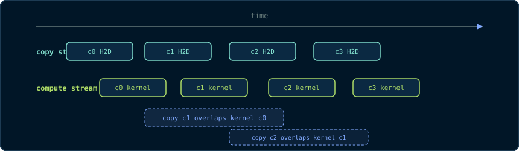

# Chapter 6: Streams, Events & Asynchronous Execution

> *"The GPU is a pipeline. Streams are how you decide what goes in it when."*

Chapter 3 noted that a kernel launch is asynchronous: the host does not wait.
This chapter makes that asynchrony *useful*. The tools are **streams** (the
ordered queues in which device work executes), **events** (the markers that
let you measure and order work), and the **double-buffered pipeline** that
overlaps transfers with computation. We close with **CUDA Graphs**, the modern
replacement for hand-rolled launch pipelines.

## 6.1 The Problem: Serial Execution

Consider the naive vector-add pipeline from Chapter 3, repeated for `k`
chunks:

```cpp
for (int c = 0; c < k; ++c)
{
    cudaMemcpy(d_in, h_in + c * chunk, chunkBytes, cudaMemcpyHostToDevice);
    kernel<<<grid, block>>>(d_in, d_out, chunkElems);   // wait: which stream?
    cudaMemcpy(h_out + c * chunk, d_out, chunkBytes, cudaMemcpyDeviceToHost);
}
```

On a machine with the default (legacy) stream, each `cudaMemcpy` is
synchronous and each kernel launch waits for the previous work. The timeline
is serial: transfer → kernel → transfer → kernel, with the bus idle during
kernels and the GPU idle during transfers. We are using a machine designed to
overlap, serially.

## 6.2 Streams: Ordered Queues of Work

> **Primitive - stream.** An ordered sequence of device operations (copies,
> kernel launches, events) that executes in FIFO order on the device. Work in
> *different* streams is unordered and may overlap. A stream is created with
> `cudaStreamCreate` and destroyed with `cudaStreamDestroy`.

The key properties:

1. **Order within a stream is guaranteed.** Operations in stream A execute in
   the order issued, never reordered.
2. **Order across streams is not guaranteed.** Operations in streams A and B
   may execute in any order - or concurrently, if resources permit.
3. **Asynchronous by construction.** `cudaMemcpyAsync` (with pinned memory,
   Chapter 4) returns immediately; the copy is queued in the stream.

```cpp
// Two streams, each an independent queue.
cudaStream_t s1, s2;
CHECK(cudaStreamCreate(&s1));
CHECK(cudaStreamCreate(&s2));

// Pinned host memory is REQUIRED for async copies (see 4.2).
float *h_pinnedA, *h_pinnedB, *d_A, *d_B, *d_out;
CHECK(cudaMallocHost((void**)&h_pinnedA, chunkBytes));
CHECK(cudaMallocHost((void**)&h_pinnedB, chunkBytes));
CHECK(cudaMalloc((void**)&d_A, chunkBytes));
CHECK(cudaMalloc((void**)&d_B, chunkBytes));
CHECK(cudaMalloc((void**)&d_out, chunkBytes));

// Queue: copy chunk A to device in stream 1, chunk B in stream 2.
// Both copies may run concurrently because they are in different streams.
CHECK(cudaMemcpyAsync(d_A, h_pinnedA, chunkBytes,
                      cudaMemcpyHostToDevice, s1));
CHECK(cudaMemcpyAsync(d_B, h_pinnedB, chunkBytes,
                      cudaMemcpyHostToDevice, s2));

// Queue kernels after their own copies in their own streams.
kernel<<<grid, block, 0, s1>>>(d_A, d_out, chunkElems);
kernel<<<grid, block, 0, s2>>>(d_B, d_out, chunkElems);
```

The launch syntax gains a fourth argument: `kernel<<<grid, block, sharedBytes,
stream>>>`. `sharedBytes` is the dynamic shared memory (Chapter 7); `stream`
selects the queue. Both default to sensible values (`0`), which is why they
were invisible in earlier chapters.

**Why pinned memory for async copies?** The DMA engine reads directly from
the pinned pages (Chapter 4). A pageable pointer would force the runtime into
a synchronous staging copy, silently destroying the asynchrony.

## 6.3 The Default Stream: A Warning

If you launch without naming a stream, you use the **legacy default stream**
(stream 0). Its special property: **it synchronises with all other streams**.
Any operation in the default stream waits for *all* previously issued work in
*every* stream to complete, and blocks other streams from starting. One
forgotten `<<<...>>>` without a stream argument serialises your entire
pipeline.

The fix is either the **per-thread default stream** (compile with
`--default-stream per-thread`, giving each host thread its own non-blocking
default stream) or the discipline of always naming your streams. Both are
legitimate; the discipline is safer.

## 6.4 Events: Markers and Stopwatches

> **Primitive - event.** A marker queued into a stream. It has no payload; it
> records *when the stream reaches it*. Events measure time, order
> cross-stream dependencies, and let the host wait for specific milestones.

```cpp
cudaEvent_t start, stop;
CHECK(cudaEventCreate(&start));
CHECK(cudaEventCreate(&stop));

// Record "start" into stream s1.
CHECK(cudaEventRecord(start, s1));
kernel<<<grid, block, 0, s1>>>(d_A, d_out, chunkElems);
// Record "stop" into stream s1, AFTER the kernel.
CHECK(cudaEventRecord(stop, s1));

// Block the host until the event is reached (i.e., the kernel finished).
CHECK(cudaEventSynchronize(stop));

// Elapsed time in milliseconds between the two events:
float ms = 0.0f;
CHECK(cudaEventElapsedTime(&ms, start, stop));
std::printf("kernel took %.3f ms\n", ms);
```

**Why events and not `std::chrono`?** Events measure *device* time: they are
recorded by the device when the stream passes them, so they exclude host-side
launch overhead and queueing delay. `std::chrono` around a launch measures the
host's wall clock, which includes whatever the host was doing. For kernel
timing, events are the honest instrument (Chapter 16 uses them for every
benchmark).

**Events also order work across streams.** `cudaStreamWaitEvent(stream, event)`
makes a stream wait for an event recorded in *another* stream - a
cross-stream dependency. This is the primitive behind producer/consumer
patterns.

## 6.5 The Double-Buffered Pipeline

The canonical overlap pattern, in full. Two host buffers; while the GPU
computes on chunk `c`, the DMA engine copies chunk `c+1` into the other
buffer. The transfer cost disappears from the critical path:



Without double buffering the timeline is serial - copy, kernel, copy, kernel
- with the bus idle during kernels and the SMs idle during copies. With it,
the only serial residue is the first copy (the pipeline prime) and the last
kernel (the pipeline drain).

```cpp
// ---------------------------------------------------------------------------
// Streamed processing of k chunks with double buffering.
// Assumes h_pinned[0] and h_pinned[1] are pinned host buffers, each of
// chunkElems floats, and d_buf[0], d_buf[1] are matching device buffers.
// ---------------------------------------------------------------------------
void runPipelined(int k, int chunkElems, cudaStream_t computeStream,
                  cudaStream_t copyStream)
{
    const size_t chunkBytes = chunkElems * sizeof(float);
    float* h_pinned[2];  float* d_buf[2];  float* d_out;
    // ... (allocations omitted for brevity; see 6.2) ...

    // Prime the pipeline: copy chunk 0 into device buffer 0.
    CHECK(cudaMemcpyAsync(d_buf[0], h_pinned[0], chunkBytes,
                          cudaMemcpyHostToDevice, copyStream));

    for (int c = 0; c < k; ++c)
    {
        const int cur = c % 2;        // buffer used for THIS chunk
        const int nxt = (c + 1) % 2;  // buffer used for the NEXT chunk

        // If there is a next chunk, its copy goes into the OTHER buffer,
        // in the COPY stream, while the kernel runs in the COMPUTE stream.
        if (c + 1 < k)
            CHECK(cudaMemcpyAsync(d_buf[nxt], h_pinned[nxt], chunkBytes,
                                  cudaMemcpyHostToDevice, copyStream));

        // The kernel must wait for ITS copy (stream dependency).
        // cudaStreamWaitEvent makes computeStream wait for the copyStream
        // event that marks the copy completion.
        if (c == 0 || true)   // first iteration: copy already queued
        {
            // Correct dependency: make computeStream wait for the event
            // recorded after the copy in copyStream. (Shown simplified;
            // a full implementation records events per iteration.)
        }
        kernel<<<grid, block, 0, computeStream>>>(d_buf[cur], d_out,
                                                  chunkElems);
    }
    CHECK(cudaStreamSynchronize(computeStream));
}
```

The essence is the alternation: copy `c+1` into the idle buffer while kernel
`c` runs. The two streams provide the *queues*; events provide the
*dependencies*; pinned memory provides the *direct DMA*. Chapter 15's capstone
uses exactly this shape for image frames.

**Why two buffers and not one?** One buffer would force copy `c+1` to wait
for kernel `c` (data hazard), serialising the pipeline. Two buffers let copy
and kernel proceed simultaneously - the DMA engine and the SMs work on
different memory simultaneously.

## 6.6 Stream Priorities and Concurrency Limits

Not every pair of operations can overlap. The hardware limits:

- **One copy engine per direction** (H2D and D2H) on most GPUs - two
  simultaneous host↔device copies, one each way. Device↔device copies use the
  SM copy path or dedicated copy engines depending on architecture.
- **Limited concurrent kernels.** Older GPUs could run 2-4 kernels
  concurrently; modern GPUs run many, but each SM time-slices.

You can hint the scheduler with priorities:

```cpp
int lo = 0, hi = 0;
CHECK(cudaDeviceGetStreamPriorityRange(&lo, &hi));   // hi = highest priority
cudaStream_t sHigh, sLow;
CHECK(cudaStreamCreateWithPriority(&sHigh, cudaStreamNonBlocking, hi));
CHECK(cudaStreamCreateWithPriority(&sLow,  cudaStreamNonBlocking, lo));
```

Priorities matter when compute and copies compete for the same SMs: give the
latency-critical work the high priority, the bulk work the low. The
`cudaStreamNonBlocking` flag makes the stream ignore the default-stream
synchronisation rule (§6.3).

## 6.7 CUDA Graphs: The Pipeline Without Launch Overhead

Every `kernel<<<>>>` and `cudaMemcpyAsync` call has host-side overhead
(argument marshalling, queueing) - roughly 3-10 microseconds per operation.
A pipeline of hundreds of operations pays that per operation. **CUDA Graphs**
capture the whole dependency structure once and replay it with one launch:

> **Primitive - CUDA graph.** A captured, reusable description of device work
> (kernel launches, copies, events) and their dependencies. Captured once,
> replayed many times, with launch overhead amortised away.

```cpp
// Capture phase: record the operations into a graph.
cudaGraph_t graph;
cudaStream_t captureStream;
CHECK(cudaStreamCreateWithFlags(&captureStream, cudaStreamNonBlocking));
CHECK(cudaStreamBeginCapture(captureStream, cudaStreamCaptureModeThreadLocal));

// Issue work exactly as you would normally, into the capture stream.
kernel<<<grid, block, 0, captureStream>>>(d_A, d_out, chunkElems);
cudaMemcpyAsync(h_out, d_out, chunkBytes, cudaMemcpyDeviceToHost,
                captureStream);

// End capture and instantiate an executable graph.
cudaGraphExec_t exec;
CHECK(cudaStreamEndCapture(captureStream, &graph));
CHECK(cudaGraphInstantiate(&exec, graph, nullptr, nullptr, 0));

// Replay phase: one call replaces the whole sequence.
for (int frame = 0; frame < 10000; ++frame)
    CHECK(cudaGraphLaunch(exec, /* any stream */ 0));

CHECK(cudaGraphExecDestroy(exec));
CHECK(cudaGraphDestroy(graph));
```

**When graphs pay off.** When the launch overhead is a significant fraction of
the kernel time - many small kernels, or a fixed pipeline replayed thousands
of times (inference loops, render pipelines). For large kernels, the overhead
is negligible and graphs add complexity for no gain. The capstone (Chapter 15)
measures both regimes.

## 6.8 Synchronisation Cheat Sheet

| Call | What it waits for |
|---|---|
| `cudaDeviceSynchronize()` | ALL device work (every stream) issued by this host thread |
| `cudaStreamSynchronize(s)` | All work queued in stream `s` |
| `cudaEventSynchronize(e)` | The device reaching event `e` |
| `cudaStreamWaitEvent(s, e)` | No waiting - installs a dependency: stream `s` waits for event `e` |
| `cudaMemcpy` (sync) | The copy itself (in the legacy default stream) |
| `cudaMemcpyAsync(..., stream)` | Nothing - returns immediately, copy queued in `stream` |

## Key Takeaways

- A stream is an ordered FIFO queue of device work; work in different streams may overlap.
- The legacy default stream synchronises with all other streams - name your streams or use cudaStreamNonBlocking.
- Events measure device time (not host time) and install cross-stream dependencies via cudaStreamWaitEvent.
- Double buffering overlaps the next copy with the current kernel, hiding transfer cost.
- CUDA Graphs capture and replay fixed pipelines, amortising launch overhead.

## 6.9 Exercises

1. Explain why `cudaMemcpyAsync` with pageable memory silently becomes
   synchronous. What does that do to the double-buffered pipeline?
2. The legacy default stream "synchronises with all other streams". Draw the
   timeline if a pipeline alternates `cudaMemcpyAsync(..., s1)` and
   `kernel<<<...>>>` (no stream argument).
3. Rewrite the double-buffered loop using explicit `cudaEventRecord` /
   `cudaStreamWaitEvent` calls so the dependency between copy and kernel is
   correct on every iteration, including the first.
4. A graph captures a sequence of 500 kernel launches of 2 microseconds each.
   Host launch overhead is 5 microseconds per launch. How much time does one
   replay save compared with 500 individual launches?
