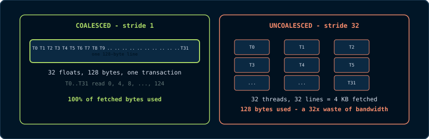
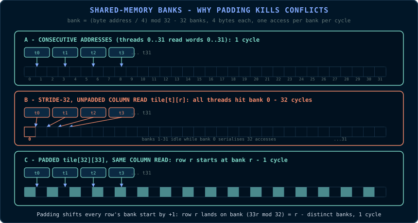

# Chapter 7: Memory Optimisation Deep Dive

This chapter examines the three tools that dominate GPU memory performance:
**coalescing and the grid-stride loop**, **shared memory and bank conflicts**,
and **vectorised and specialised memory paths**. It ends with an optimised
matrix transpose, the standard exercise in memory optimisation.

## 7.1 Where Memory Time Goes

From the latency table in Chapter 2, a global load costs roughly 400-800
cycles and a shared-memory access 20-30 cycles. A warp of 32 threads performing
one global load each spends about 500 cycles waiting; in that time the SM could
have executed roughly 16 shared-memory accesses per lane. Memory-bound kernels
(the roofline test of Chapter 1) spend most of their time in this wait.

Two levers reduce it:

1. **Fewer transactions** - coalescing, so that every fetched byte is used.
2. **Fewer round trips** - reusing fetched data in shared memory or registers.

Everything in this chapter is one of these two levers.

## 7.2 Coalescing, Quantified

The hardware fetches global memory in **128-byte cache lines** and services
requests at **32-byte sector** granularity. A warp's load is coalesced when its
32 addresses fall in as few lines as possible.

- 32 consecutive `float`s (128 bytes) - one line, one transaction.
- 32 `float`s with stride 1 but a misaligned start - two lines.
- 32 `float`s with stride 32 - 32 lines, or 32x the necessary traffic.



The left panel is why the global-index formula exists (Chapter 3, §3.5): it
assigns consecutive threads consecutive addresses by construction. The right
panel is the result of inverting that mapping, the classic column-access bug in
row-major data.

The rule follows from the sector model (§2.7): consecutive thread IDs should
map to consecutive addresses. The global-index formula satisfies this for 1-D
arrays and row-major 2-D data.

```cpp
// GOOD (coalesced): thread t reads element t of each row.
// For a row-major matrix in[row][col], col varies fastest:
float v = in[row * width + col];        // col == threadIdx.x mapped to col

// BAD (uncoalesced): thread t reads element t*width - a stride of width floats.
// 32 threads span 32 different cache lines for a large width:
float v = in[col * width + row];        // col varies slowest
```

## 7.3 The Grid-Stride Loop

A kernel launched with fewer threads than elements under-utilises the GPU; one
launched with far more threads than elements wastes launch resources. The
**grid-stride loop** decouples the launch size from the problem size:

```cpp
// One grid covers the array in "rounds": each thread strides forward by the
// total number of threads (gridDim.x * blockDim.x) each iteration.
__global__ void saxpyGridStride(float alpha, const float* x, float* y, int n)
{
    // Total threads in the grid:
    const int stride = gridDim.x * blockDim.x;

    // First element this thread owns:
    int i = blockIdx.x * blockDim.x + threadIdx.x;

    // March forward by 'stride' until past the end.
    for (; i < n; i += stride)
    {
        y[i] = alpha * x[i] + y[i];     // SAXPY: single-precision A·X + Y
    }
}
```

The launch size becomes a tuning parameter, often chosen to saturate the device,
and is independent of \\(n\\). Each thread processes multiple elements,
amortising index arithmetic and enabling per-thread data reuse. Coalescing is
preserved because consecutive threads still read consecutive addresses within
each iteration.

## 7.4 Shared Memory: The Explicit Cache

Shared memory is the programmer-managed cache of Chapter 2. Its use follows a
tile pattern:

1. Cooperatively load a tile of global data into shared memory (coalesced
   reads);
2. Call `__syncthreads()` to make the tile visible;
3. Compute from shared memory, reusing each loaded value many times;
4. Call `__syncthreads()` before the next tile overwrites this one.

The classic example is the matrix transpose. A naive transpose kernel reads
rows (coalesced) and writes columns (uncoalesced), or vice versa; one side
always pays. The shared-memory version makes both sides coalesced:

```cpp
// ---------------------------------------------------------------------------
// Shared-memory tiled transpose for a WIDTH x WIDTH matrix of floats, with
// WIDTH a multiple of the tile size TILE (32 here).
//
// Stage 1 (coalesced read):  each thread reads a[iy][ix] from global memory;
//   consecutive threads map to consecutive ix, hence consecutive addresses.
// Stage 2 (shared memory):   the tile is stored in shared as tile[ty][tx].
// Stage 3 (coalesced write): each thread writes tile[tx][ty] to a[jx][jy];
//   consecutive threads (consecutive tx) map to consecutive jx within the
//   same output row (jy), hence consecutive addresses in the output.
//   The transpose happens in shared memory, so both global accesses are
//   coalesced.
// ---------------------------------------------------------------------------
#define TILE 32

__global__ void transposeTiled(const float* in, float* out, int width)
{
    // Shared tile with a padding column (see 7.5 for why +1 exists).
    __shared__ float tile[TILE][TILE + 1];

    // Global coordinates of this thread's element:
    const int ix = blockIdx.x * TILE + threadIdx.x;   // column
    const int iy = blockIdx.y * TILE + threadIdx.y;   // row

    // Stage 1: coalesced read from global memory.
    if (ix < width && iy < width)
        tile[threadIdx.y][threadIdx.x] = in[iy * width + ix];

    __syncthreads();   // every tile element must be visible before reads

    // Transposed output coordinates:
    const int jx = blockIdx.y * TILE + threadIdx.x;   // column of output
    const int jy = blockIdx.x * TILE + threadIdx.y;   // row of output

    // Stage 3: write the transposed element. Consecutive threads (x) map to
    // consecutive jx columns within the same output row (jy), i.e.,
    // consecutive addresses in the row-major output. Coalesced.
    if (jx < width && jy < width)
        out[jy * width + jx] = tile[threadIdx.x][threadIdx.y];
}
```

A naive kernel that performs `out[j][i] = in[i][j]` has threads with
consecutive IDs reading consecutive `i` (coalesced) but writing `j`-major
addresses (uncoalesced). The tile transposes the data layout in shared memory,
so both the global read and the global write are coalesced.

## 7.5 Bank Conflicts and Column Padding

From Chapter 2, shared memory consists of 32 banks of 4 bytes. The bank of an
address is `(address / 4) mod 32`. Consider the unpadded tile
`float tile[32][32]`:

- Row \\(r\\) starts at byte \\(r \times 128\\), so every row starts on bank
  \\((r \times 32) \bmod 32 = 0\\).
- A row read `tile[threadIdx.y][threadIdx.x]` with consecutive
  `threadIdx.x` uses all 32 banks once and is conflict-free.

A column read `tile[threadIdx.x][threadIdx.y]` has consecutive threads reading
addresses 32 words apart, so all 32 threads hit the same bank. This is a 32-way
bank conflict that takes 32 cycles instead of one.

Padding the tile by one column, `float tile[32][33]`, makes row \\(r\\) start
at byte \\(r \times 132\\), hence bank \\((r \times 33) \bmod 32 = r\\). A
column read now visits banks 0..31 exactly once. One float of padding per row
converts a 32-cycle stall into a one-cycle access.



The padding works because the row stride of 33 words is coprime with the bank
count of 32. The same coprime rule keeps the SGEMM tiles in §9.4
conflict-free.

```cpp
// Padding rule:
//   float tile[TILE][TILE];        // 32-way conflicts on column access
//   float tile[TILE][TILE + 1];    // conflict-free column access
```

## 7.6 Vectorised Loads: `float4` and Alignment

A warp loading 32 `float`s fetches 128 bytes in one memory transaction, but the
load instruction moves 4 bytes per lane. A 128-bit vector load moves 16 bytes
per lane, so a warp moves 512 bytes per instruction. **Vectorised loads** reduce
instruction count and memory requests:

```cpp
// Load four floats per thread, one instruction per four floats.
__global__ void saxpyVec4(float alpha, const float4* x, float4* y, int n4)
{
    const int i = blockIdx.x * blockDim.x + threadIdx.x;
    if (i < n4)
    {
        float4 xv = x[i];             // 16-byte aligned load
        float4 yv = y[i];
        yv.x = alpha * xv.x + yv.x;   // four lanes of arithmetic per thread
        yv.y = alpha * xv.y + yv.y;
        yv.z = alpha * xv.z + yv.z;
        yv.w = alpha * xv.w + yv.w;
        y[i] = yv;                    // 16-byte aligned store
    }
}
```

`float4` requires 16-byte alignment. A buffer allocated with `cudaMalloc` is
aligned to at least 16 bytes, so converting a base pointer to `float4*` is
safe. A pointer offset by an odd number of floats is not aligned. If data does
not satisfy the alignment requirement, pad the allocation or handle tail
elements with scalar loads.

Vectorisation helps for three reasons: fewer instructions, fewer memory
requests, and more efficient use of the 128-bit memory path. On memory-bound
kernels, `float4`-style access commonly adds 20-40% throughput. The `int4`,
`double2`, and `uint4` types follow the same rules.

## 7.7 Constant Memory

> **Primitive - constant memory.** A 64 KB read-only memory space cached in a
> dedicated per-SM cache. It is optimised for broadcasts: when all threads of a
> warp read the same address, the hardware serves all 32 lanes in one access.
> When threads read different addresses, the access serialises, the inverse of
> shared memory's behaviour.

```cpp
// Declared at file scope, device-side:
__constant__ float g_coeffs[16];

// Host fills it with cudaMemcpyToSymbol (note: symbol, not pointer):
float h_coeffs[16] = { /* ... */ };
CHECK(cudaMemcpyToSymbol(g_coeffs, h_coeffs, sizeof(h_coeffs)));

// Kernel reads: all threads read the SAME coefficient per call - a broadcast,
// served in one access from the constant cache.
__global__ void applyCoeffs(const float* in, float* out, int n, int c)
{
    const int i = blockIdx.x * blockDim.x + threadIdx.x;
    if (i < n) out[i] = in[i] * g_coeffs[c];   // same address for all threads
}
```

Constant memory suits kernel parameters, coefficients, and lookup tables
indexed by a value uniform across the warp. It should be avoided when each
thread indexes different data; divergent constant accesses serialise and can be
slower than global memory.

## 7.8 Texture and Surface Memory

Texture memory is a cached read-only path with two special capabilities:
**spatial locality** for image-like data, through caches that retain
neighbouring pixels, and **hardware interpolation** such as bilinear filtering.
On modern GPUs the ordinary L1/L2 caches largely match its raw bandwidth for
linear access. The remaining reasons to use a texture object are the
interpolation hardware and the `cudaTextureObject` API for image-like data.

For a kernel that reads images with strong 2-D locality, a texture object can
be a legitimate optimisation. For linear 1-D access, coalesced global memory is
equal or better. The capstone (Chapter 15) uses plain global memory for its
image pipeline and operates near peak bandwidth, a useful baseline: coalescing
first, specialised paths second.

## 7.9 Optimisation Checklist

When a kernel is memory-bound, evaluate in order:

1. **Coalescing.** Do consecutive threads access consecutive addresses?
2. **Launch shape.** Is the kernel a grid-stride loop sized to the device, or
   one thread per element?
3. **Data reuse.** If data is reused, tile it in shared memory (§7.4) and check
   for bank conflicts (§7.5).
4. **Vectorisation.** Can accesses use `float4`/`double2` with correct
   alignment (§7.6)?
5. **Uniform values.** Are warp-uniform constants in constant memory (§7.7)?
6. **Transfer pipeline.** Is the host-device path streamed with pinned memory
   and streams (Chapters 4 and 6)? A memory-bound kernel is not faster than the
   copies that feed it.

Each step is cheap to test and easy to measure (Chapter 16). Measure after each
change.

## Mechanism: Thread Identity and Physical Layout

Coalescing is often taught as a rule: consecutive threads should read
consecutive addresses. The rule is correct, but the mechanism behind it is
worth stating precisely.

The memory system fetches 128-byte cache lines and services them in 32-byte
sectors. When a warp issues a load, the hardware examines all 32 addresses and
satisfies them with as few line fetches as possible. Thirty-two consecutive
floats span exactly 128 bytes: one line and every byte is used. Thirty-two
floats with a stride of 32 words each lie in a different 128-byte region, so
the hardware fetches 32 lines to deliver 32 floats. Useful data is identical;
traffic is not. Uncoalesced access can multiply memory traffic by 20-30x
without changing the arithmetic.

The global-index formula from Chapter 3 gives coalescing by construction:
`threadIdx.x` varies fastest, and the fastest-varying memory index of a
row-major array is the column. The grid-stride loop preserves this property
because consecutive threads still access consecutive addresses in every
iteration.

Shared memory has a different physical structure but the same lesson. A warp's
shared access completes in one cycle only when its 32 addresses hit 32
different banks. A row read of `float tile[32][32]` hits banks 0..31 once.
A column read hits one bank 32 times. Padding the row stride from 32 to 33
words makes row-start banks cycle through 0..31, so column reads also visit
every bank once. The formula `bank = (byte_address / 4) mod 32` verifies any
layout, including vectorised types and structs.

The unifying idea is that a GPU's memory system rewards aligning thread
identity with physical layout: consecutive threads to consecutive global
addresses, and distinct threads to distinct shared-memory banks. Coalescing,
tiling, padding, vectorisation, and constant-memory broadcasts are all ways to
make that alignment exact.

## Common Pitfalls

- Mapping `threadIdx.x` to the slowest-varying dimension, the classic
  column-access bug. Put the fastest-varying thread index on the
  fastest-varying memory index.
- Assuming `float4` is safe on any pointer. It requires 16-byte alignment; an
  unaligned offset may compile but fault or corrupt data.
- Padding only one tile dimension. If a tile is read both by row and by column,
  both shared tiles need `[T][T+1]` or the equivalent.
- Using constant memory for divergent per-thread lookups. Constant memory is
  fast for broadcasts and slow when a warp reads 32 different addresses.

## Check Your Understanding

<details>
<summary>When does the bank-conflict formula matter more than the "pad by one" rule?</summary>

The rule works when the row stride is coprime with 32, as with 33 words. The
formula `bank = (address / 4) mod 32` verifies any layout, including wider
tiles, vectorised types, and structs, without applying a blind +1.
</details>

<details>
<summary>A warp loads 32 floats starting at byte offset 4. How many lines?</summary>

32 floats span bytes 4..131, crossing the 0..127 and 128..255 lines: two
128-byte lines. Perfectly aligned 32 floats (bytes 0..127) touch one line.
</details>

<details>
<summary>When is constant memory slower than global memory?</summary>

When threads in a warp read different addresses. The constant cache is
optimised for broadcasts; divergent access serialises one address per cycle,
which can be slower than a coalesced global load.
</details>

## Key Takeaways

- Coalescing means touching the fewest 128-byte cache lines per warp access: consecutive threads, consecutive addresses.
- The grid-stride loop decouples launch size from problem size and preserves coalescing.
- Shared memory is the explicit cache; one column of padding removes bank conflicts.
- float4-style vectorised loads move 16 bytes per thread and require 16-byte alignment.
- Constant memory broadcasts uniform reads cheaply; divergent per-thread reads are slower than global memory.

## 7.10 Exercises

1. A warp loads 32 `float`s starting at byte offset 4 (misaligned by one
   float). How many 128-byte lines are touched? How many would be touched if
   the start were aligned to 128?
2. Explain why padding `[TILE][TILE + 1]` fixes column-access bank conflicts
   using the formula `bank = (byte_address / 4) mod 32`.
3. You are transposing a `1024 x 1024` float matrix with `TILE = 32`. Count the
   shared-memory traffic per tile for the padded and unpadded versions (assume
   one column read per thread).
4. When would you not use constant memory for a lookup table? Give a concrete
   access pattern that makes it slower than global memory.
