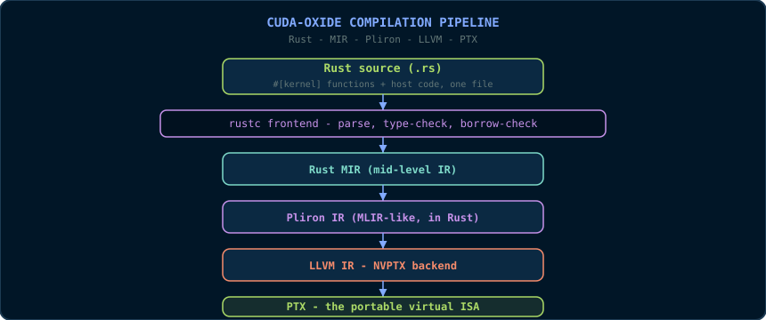

# Chapter 14: CUDA-Oxide - Kernels in Pure Rust

> *"The kernel was the last thing keeping C++ in your program. CUDA-Oxide
> removes even that."*
> 📦 **Code companion:** the complete, buildable code for this chapter lives in [`code/ch14_cuda_oxide/`](https://github.com/arpanpathak/gpu-parallel-book/tree/main/code/ch14_cuda_oxide) in the repository.

Chapter 13 secured the host with Rust, but the kernel itself remained C++  - 
compiled by `nvcc`, invoked through an `unsafe` boundary. **CUDA-Oxide** is
NVIDIA Labs' answer to the remaining gap: an experimental `rustc` codegen
backend that compiles *idiomatic Rust kernels* directly to PTX. No DSL, no
foreign-language binding, no `nvcc` - one language, one toolchain, host and
device in the same file. This chapter describes the project as it exists
today, with its documented example code, its pipeline, and an honest account
of what is experimental.

## 14.1 What CUDA-Oxide Is

CUDA-Oxide (repository `NVlabs/cuda-oxide`, announced May 2026) is described
by its authors as:

> *"An experimental Rust-to-CUDA compiler that lets you write SIMT GPU kernels
> in safe(ish), idiomatic Rust. It compiles standard Rust code directly to
> PTX - no DSLs, no foreign language bindings, just Rust."*

Its design goals, from the project documentation:

- **Single-source compilation.** Host and device code live in the same file,
  built with one command (`cargo oxide build`).
- **A rustc codegen backend** that compiles `#[kernel]` functions to PTX.
- **Device-side abstractions**: type-safe indexing, shared memory, scoped
  atomics, barriers, TMA, and warp/cluster operations.
- **Compile-time kernel policies** for separate tuned specialisations without
  runtime policy arguments.
- **A host-side runtime** (`cuda-core`, `cuda-async`) for memory management,
  pinned host transfers, and kernel launching.

The word to notice is *"safe(ish)"*: the project's own description. CUDA-Oxide
keeps Rust's type system and ownership on the device, but SIMT programming
involves operations (raw launch configuration, memory ordering) that cannot
yet be fully proven safe. The safety story is honest about this, and so is
this chapter.

## 14.2 The Compilation Pipeline

CUDA-Oxide does not translate Rust to CUDA C. It walks the *same* internal
representations rustc uses, replacing only the codegen:



**Why this pipeline matters.** Because the *front end* is real rustc, you get
the real guarantees - ownership, borrowing, pattern matching, traits - before
any GPU code is generated. A kernel that violates the borrow checker never
becomes PTX. The experimental part is the *back end*: Pliron is a young
framework, and the lowering to LLVM IR is where the project warns of bugs and
incomplete features.

## 14.3 Installation

CUDA-Oxide is currently **Linux-only** (tested on Ubuntu 24.04) and requires:

- **`cargo-oxide`** - the cargo subcommand that drives the build (`cargo
  oxide build/run/inspect/...`);
- **Rust nightly** with the `rust-src`, `rustc-dev` and `llvm-tools`
  components (pinned in the project's `rust-toolchain.toml`);
- **CUDA Toolkit 12.x+**;
- **Clang + libclang** dev headers (needed by `bindgen` when building the
  host `cuda-bindings` crate).

```bash
# Install the cargo subcommand with the pinned nightly toolchain:
cargo +nightly-2026-04-03 install --git https://github.com/NVlabs/cuda-oxide.git cargo-oxide

# On first run, cargo-oxide fetches and builds the codegen backend.
# Verify CUDA is on the path:
export PATH="/usr/local/cuda/bin:$PATH"
nvcc --version
```

The workflow is cargo-shaped:

```bash
cargo oxide run    host_closure      # build and run an example
cargo oxide inspect vecadd           # build and print the generated PTX
cargo oxide pipeline vecadd          # show the full pipeline (MIR → Pliron → LLVM → PTX)
cargo oxide sanitize vecadd --tool memcheck   # CUDA correctness checks
cargo oxide debug vecadd --tui       # debug with cuda-gdb
```

## 14.4 A First Kernel: The Generic `map`

The project's documented example is a generic elementwise `map` - the Rust
equivalent of Chapter 10's `transformKernel`, but with the kernel *written in
Rust*:

```rust
// Single source file: device AND host code together.
use cuda_device::{kernel, thread, DisjointSlice};
use cuda_host::{cuda_module, load_kernel_module};
use cuda_core::{CudaContext, DeviceBuffer, LaunchConfig};

// ---------------------------------------------------------------------------
// Device side: a generic kernel that applies any function to each element.
// F can be a closure with captures - rustc monomorphises it to a concrete
// type at compile time, exactly like a C++ template instantiation.
// ---------------------------------------------------------------------------
#[cuda_module]
mod kernels {
    use super::*;

    // The #[kernel] attribute tells the backend to compile this function
    // to PTX. It is the Rust equivalent of __global__.
    #[kernel]
    pub fn map<T: Copy, F: Fn(T) -> T + Copy>(f: F, input: &[T],
                                              mut out: DisjointSlice<T>) {
        let idx = thread::index_1d();        // threadIdx/blockIdx, fused
        let i = idx.get();                    // the global linear index
        // DisjointSlice guarantees this thread's slot is exclusive:
        // two threads can never get_mut the same element.
        if let Some(out_elem) = out.get_mut(idx) {
            *out_elem = f(input[i]);
        }
    }
}

// ---------------------------------------------------------------------------
// Host side: allocate, load the module, launch.
// ---------------------------------------------------------------------------
fn main() -> Result<(), Box<dyn std::error::Error>> {
    let ctx = CudaContext::new(0)?;           // open GPU 0
    let stream = ctx.default_stream();

    let data: Vec<f32> = (0..1024).map(|i| i as f32).collect();
    let input  = DeviceBuffer::from_host(&stream, &data)?;
    let mut output = DeviceBuffer::<f32>::zeroed(&stream, 1024)?;

    // Load the module: the codegen backend writes host_closure.ptx next to
    // Cargo.toml; load_kernel_module reads that file and returns a CUDA
    // module. from_module binds it to the typed launch API generated by
    // #[cuda_module].
    let module = load_kernel_module(&ctx, "host_closure")?;
    let typed = kernels::from_module(module)?;

    // Launch with a closure. `factor` is captured and passed to the GPU
    // automatically (scalarised into a kernel parameter).
    let factor = 2.5f32;
    // SAFETY: this raw configuration is fully 1-D, matches index_1d(), and
    // launches one thread per output element. A launch contract can move
    // this proof into the generated safe API.
    unsafe {
        typed.map::<f32, _>(
            stream.as_ref(),
            LaunchConfig::for_num_elems(1024),
            move |x: f32| x * factor,
            &input,
            &mut output,
        )
    }?;

    let result = output.to_host_vec(&stream)?;
    assert!((result[1] - 2.5).abs() < 1e-5);
    println!("PASSED: CUDA-Oxide map closure produced expected results");
    Ok(())
}
```

**Reading the device code, line by line:**

- `#[cuda_module] mod kernels { ... }` - the attribute on the module makes
  the backend compile its `#[kernel]` functions to PTX and generate the host
  `load`/launch glue. It is the single-source mechanism: this one file
  produces both the device artifact and the host code.
- `#[kernel] pub fn map<T: Copy, F: Fn(T) -> T + Copy>(...)` - the kernel
  signature. Unlike `__global__` C++ kernels, Rust kernels are *generic*:
  `T` is the element type, `F` the operation. The compiler instantiates one
  PTX function per `(T, F)` combination used - monomorphisation, the same
  trick Chapter 10 used with C++ templates, but now on the device.
- `thread::index_1d()` - the fused equivalent of the Chapter 3 formula
  `blockIdx.x * blockDim.x + threadIdx.x`, returned as a typed index.
- `DisjointSlice<T>` - the star of the safety story. It is a *guaranteed
  disjoint* view: `out.get_mut(idx)` returns a mutable reference to *this
  thread's exclusive* element. Two threads cannot obtain mutable access to
  the same slot, which makes the "one thread per output" pattern (Chapter 3)
  a *type-level* guarantee rather than a comment.
- `if let Some(out_elem) = ...` - the boundary guard (Chapter 3, §3.6.1),
  expressed in Rust's Option handling. `None` is the out-of-range case.

**Reading the host code:**

- `CudaContext::new(0)` - the device handle (compare `CudaDevice::new(0)` in
  Chapter 13).
- `DeviceBuffer::from_host(&stream, &data)` - allocate + copy in one call,
  queued on the stream.
- `load_kernel_module(&ctx, "host_closure")` - reads the PTX that the
  codegen backend wrote next to `Cargo.toml`, and `kernels::from_module`
  binds it to the typed launch API generated by `#[cuda_module]`. The launch
  method `typed.map::<f32, _>(...)` is *generated* from the kernel signature:
  the arguments are type-checked against the kernel's parameter list by the
  Rust compiler. (Standalone generic-kernel builds do not yet embed a PTX
  bundle into the executable, so the file-based loader is the supported path;
  non-generic kernels can also use the embedded `kernels::load`.)
- `unsafe { ... }` - the raw launch. `LaunchConfig` is *intentionally raw
  data*: nothing in its type proves that the grid shape matches the kernel's
  indexing assumptions. The `SAFETY` comment is the proof obligation, exactly
  as in Chapter 13.

## 14.5 The Safety Progression: `#[launch_contract]`

CUDA-Oxide's answer to the raw `unsafe` launch is the **launch contract**:
a `#[launch_contract(...)]` attribute that moves the configuration proof into
generated code. Kernels annotated with a contract get a *checked*
`PreparedLaunch` through a safe generated method - the launch dimensions and
resources are validated against the kernel's declared contract instead of
being an unverifiable `unsafe` obligation.

This is the project's roadmap in miniature: *each unsafe block is a known
gap with a planned replacement*. The `unsafe` in this chapter's example is
not a licence to ignore safety; it is a documented debt that the project is
paying down.

## 14.6 Async: `cuda-async` and `DeviceOperation`

For composable asynchronous work, the `cuda-async` crate changes the launch
shape: the `stream:` argument disappears, and the launch returns a **lazy
`DeviceOperation`** that executes when you call `.sync()` or `.await`:

```rust
use cuda_async::device_operation::DeviceOperation;

// Assuming module, input, output come from the cuda-async setup:
let factor = 2.5f32;
let launch = unsafe {
    // SAFETY: the raw launch is 1-D and matches this kernel's index space.
    module.map_async::<f32, _>(
        LaunchConfig::for_num_elems(1024),
        move |x: f32| x * factor,
        &input,
        &mut output,
    )?
};
launch.sync()?;      // or: .await?;
```

**Why the lazy operation?** It lets you build a *graph* of GPU work without
executing it - the same idea as CUDA Graphs (Chapter 6, §6.7), expressed as
composable Rust values. `.sync()` blocks; `.await` composes with `async/await`
host code. The capstone uses this shape for its pipeline.

## 14.7 Device-Side Abstractions Beyond `map`

The project documents device-side facilities beyond simple indexing:

- **Shared memory** - typed, scoped allocation within a block;
- **Scoped atomics** - `atomicAdd`-class operations with explicit thread
  scopes (the Chapter 5 atomics, with Rust's scoping discipline);
- **Barriers** - block and cluster synchronisation;
- **TMA** (Tensor Memory Accelerator) - Hopper's bulk asynchronous copies;
- **Warp/cluster operations** - shuffle-like primitives (Chapter 8's
  `__shfl_down_sync`), with type-safe masks.

These exist to keep the *patterns* of Chapters 5, 7 and 8 expressible in Rust
 - but the project warns they are in active development. The API you meet here
today may differ next quarter. That is the nature of alpha software, and the
reason this chapter says "map", not "contract".

## 14.8 CUDA-Oxide vs the Alternatives

| Approach | Kernel language | Device safety | Maturity |
|---|---|---|---|
| CUDA C++ (Chapters 3-12) | C++ | None (by hand) | Production |
| Rust host + C++ kernel (Ch. 13) | C++ | Host only | Production |
| CUDA-Oxide (this chapter) | Rust | Type-checked, `safe(ish)` | Alpha, Linux, nightly |
| `cudarc` nvrtc JIT | C++ string | Host only | Production |

The honest conclusion: **CUDA-Oxide is not yet a production tool for most
teams.** It is an *architecture preview* - the demonstration that Rust can
reach the GPU without sacrificing its guarantees, and the first draft of the
safety story SIMT programming needs. The value of learning it now is
positional: the pipeline (MIR → Pliron → LLVM → PTX) and the abstractions
(`DisjointSlice`, launch contracts, async operations) are the shape of CUDA's
Rust future, and the principles - type-safe indexing, explicit safety
obligations, single-source compilation - are the same principles this book
has been teaching since Chapter 3.

## Key Takeaways

- CUDA-Oxide is NVIDIA Labs' rustc backend: #[kernel] Rust functions compile to PTX - no nvcc, no DSL.
- The pipeline Rust -> MIR -> Pliron -> LLVM -> PTX keeps rustc's front-end guarantees (ownership, borrow checking) before any GPU code exists.
- DisjointSlice provides the 'one thread per output, no races' guarantee at the type level.
- LaunchConfig is raw data: launching is unsafe until a #[launch_contract] moves the proof into generated code.
- It is alpha, Linux-only and nightly-only: learn it as an architecture preview, not a production dependency.

## 14.9 Exercises

1. Compare `thread::index_1d()` with the Chapter 3 formula
   `blockIdx.x * blockDim.x + threadIdx.x`. What does the fused abstraction
   prevent?
2. Why is `DisjointSlice<T>`'s `get_mut` the type-level version of the
   Chapter 3 "one thread per output, no races" comment?
3. The raw launch is `unsafe` with a `SAFETY` comment; `#[launch_contract]`
   moves the proof into generated code. Explain the difference in terms of
   the obligation, not the syntax.
4. Using the pipeline diagram in §14.2, explain which phases run on the
   *host* toolchain and which produce device code. Why is the borrow check
   upstream of any PTX generation?
