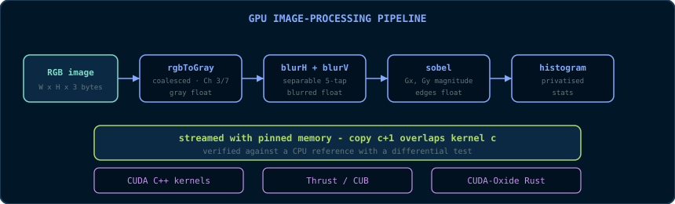

# Chapter 15: Capstone - The GPU Image Processing Pipeline

> **Code companion:** the complete, buildable code for this chapter lives in
> [`code/ch15_capstone/`](https://github.com/arpanpathak/gpu-parallel-book/tree/main/code/ch15_capstone)
> in the repository.

This chapter combines the earlier material into one complete system. The
capstone is a GPU image-processing pipeline: **RGB -> greyscale -> Gaussian
blur -> Sobel edge detection**, implemented three ways (hand-written CUDA C++,
Thrust, and CUDA-Oxide Rust), streamed with pinned memory, verified against a
CPU reference, and measured with CUDA events. It is small enough to fit in one
chapter and structured enough to exercise the book's methods end to end.

## 15.1 Pipeline and Data Flow



Design decisions and their rationale:

- **Greyscale stored as `float`, not `unsigned char`.** Blur and Sobel
  accumulate fractional weights. `float` avoids rounding at every stage and
  matches the arithmetic-intensity discussion of Chapter 1. The final edge map
  is scaled to `unsigned char` for output.
- **Separable Gaussian.** A 2-D Gaussian of radius 2 is a 5x5 stencil: 25 taps
  per output pixel. A separable Gaussian performs a horizontal 5-tap pass
  followed by a vertical 5-tap pass: 10 taps per pixel. The two-pass form has
  the same mathematical result and each pass is naturally coalesced.
- **Sobel as two separable kernels.** The Sobel operator is the pair of 3x3
  kernels \\(G_x\\) and \\(G_y\\). Each factors into a derivative pass and a
  smoothing pass. This implementation computes the two 3x3 convolutions
  directly and takes the magnitude \\(\sqrt{G_x^2 + G_y^2}\\).
- **Histogram at the end.** The histogram verifies that the pipeline produced
  sensible data and demonstrates Chapter 8's privatised histogram on a real
  workload.

## 15.2 Stage 1: RGB to Greyscale (CUDA C++)

The canonical coalesced kernel uses one thread per output pixel and the Chapter
3 index formula, so consecutive threads read consecutive pixels:

```cpp
// ---------------------------------------------------------------------------
// rgbToGray: 3 bytes/pixel RGB (uchar3) -> 1 float/pixel greyscale.
// Consecutive threads -> consecutive pixels -> coalesced reads and writes.
// The weights are the standard BT.601 luma coefficients; they sum to 1.0,
// so no scaling is needed and a constant-grey input maps to itself.
// ---------------------------------------------------------------------------
__global__ void rgbToGray(const uchar3* rgb, float* gray, int numPixels)
{
    const int i = blockIdx.x * blockDim.x + threadIdx.x;
    if (i < numPixels)
    {
        const uchar3 px = rgb[i];                 // 12-byte read, coalesced
        // uchar3 components are 0..255; multiply in float to avoid
        // integer truncation.
        gray[i] = 0.299f * static_cast<float>(px.x)
                + 0.587f * static_cast<float>(px.y)
                + 0.114f * static_cast<float>(px.z);
    }
}
```

`uchar3` is CUDA's built-in 3-byte vector type and matches the RGB layout
exactly. Its alignment is 1, so it can point at raw RGB bytes. A `float3`
would not be safe for the same data because it is 16-byte aligned.

## 15.3 Stage 2: Separable Gaussian Blur

The 5-tap weights for \\(\sigma = 1\\) are
`[0.06136, 0.24477, 0.38774, 0.24477, 0.06136]`, a normalised Gaussian. The
horizontal pass reads a row segment including a halo of two pixels on each
side; the vertical pass does the same along columns.

An initial, plausible implementation clamps only the outermost stencil
coordinates:

```cpp
// WRONG at image borders:
__global__ void blurH(const float* in, float* out, int width, int height)
{
    const int x = blockIdx.x * blockDim.x + threadIdx.x;
    const int y = blockIdx.y * blockDim.y + threadIdx.y;
    if (x < width && y < height)
    {
        const float* row = in + y * width;
        const int x0 = max(x - 2, 0), x1 = min(x + 2, width - 1);
        out[y * width + x] = 0.06136f * row[x0] + 0.24477f * row[x0]
                           + 0.38774f * row[x]  + 0.24477f * row[x1]
                           + 0.06136f * row[x1];
    }
}
```

This version is correct in the interior but wrong at borders. The inner taps
`x-1` and `x+1` reuse the clamped outer values, so the replicated border pixel
is weighted twice, for example as `0.06136 + 0.24477` on the left edge. The
correct version clamps each tap independently:

```cpp
__global__ void blurH(const float* in, float* out, int width, int height)
{
    const int x = blockIdx.x * blockDim.x + threadIdx.x;
    const int y = blockIdx.y * blockDim.y + threadIdx.y;
    if (x < width && y < height)
    {
        const float* row = in + y * width;
        // Weights, left to right: [0.06136, 0.24477, 0.38774, 0.24477, 0.06136]
        const float w[5] = {0.06136f, 0.24477f, 0.38774f, 0.24477f, 0.06136f};
        float acc = 0.0f;
        // Each tap clamps its index to the row bounds independently:
        // interior pixels use the exact stencil; edge pixels are replicated.
        #pragma unroll
        for (int t = -2; t <= 2; ++t)
        {
            const int sx = min(max(x + t, 0), width - 1);
            acc += w[t + 2] * row[sx];
        }
        out[y * width + x] = acc;
    }
}
```

The first version is plausible and wrong; the second is correct by
construction. Border handling is the difference. The vertical pass uses the
same logic with `x` and `y` exchanged; it is omitted here to avoid repetition.

Separable blur uses two kernels rather than one fused 5x5 kernel. A fused
kernel would read a 5x5 neighbourhood per thread, or communicate the
intermediate image through shared memory with a block halo. Two global passes
are simpler, fully coalesced, and bandwidth-dominated at this image scale.

## 15.4 Stage 3: Sobel Edge Detection

```cpp
// ---------------------------------------------------------------------------
// sobel: magnitude of the gradient. Gx = derivative across x, smoothed in y;
// Gy = derivative across y, smoothed in x. We compute both 3x3 convolutions
// and the magnitude sqrt(Gx^2 + Gy^2) per pixel.
// ---------------------------------------------------------------------------
__global__ void sobel(const float* in, float* out, int width, int height)
{
    const int x = blockIdx.x * blockDim.x + threadIdx.x;
    const int y = blockIdx.y * blockDim.y + threadIdx.y;
    if (x < width && y < height)
    {
        // Clamp the 3x3 neighbourhood at the borders (replicate-edge).
        const int xm = max(x - 1, 0), xp = min(x + 1, width  - 1);
        const int ym = max(y - 1, 0), yp = min(y + 1, height - 1);

        const float* r0 = in + ym * width;
        const float* r1 = in + y  * width;
        const float* r2 = in + yp * width;

        // Horizontal derivative Gx: [-1 0 1] across each of the three rows,
        // weighted [1 2 1] down the columns.
        const float gx = (r2[xp] + 2.0f * r1[xp] + r0[xp])
                       - (r2[xm] + 2.0f * r1[xm] + r0[xm]);
        // Vertical derivative Gy: [-1 0 1] down the columns,
        // weighted [1 2 1] across the rows.
        const float gy = (r2[xm] + 2.0f * r2[x] + r2[xp])
                       - (r0[xm] + 2.0f * r0[x] + r0[xp]);

        // Magnitude. sqrtf is the device-side square root.
        out[y * width + x] = sqrtf(gx * gx + gy * gy);
    }
}
```

\\(G_x\\) is a derivative in \\(x\\) (the kernel `[-1 0 1]`) convolved with a
smoothing in \\(y\\) (the kernel `[1 2 1]`); \\(G_y\\) is the transpose. The
kernel reads nine pixels and produces both convolutions.

### 15.4.1 Scale Back to `unsigned char`

The magnitude \\(\sqrt{G_x^2 + G_y^2}\\) is a `float` that can exceed 255. The
histogram counts `unsigned char` bins, so a scaling step is required. Clamping
is necessary: converting an out-of-range float to `unsigned char` is undefined
behaviour, and the histogram would count byte patterns instead of edges.

```cpp
// Clamp the float edge magnitude to [0, 255] and store as uchar.
__global__ void scaleEdges(const float* in, unsigned char* out, int n)
{
    const int i = blockIdx.x * blockDim.x + threadIdx.x;
    if (i < n)
    {
        const int v = static_cast<int>(in[i] + 0.5f);   // round, don't truncate
        out[i] = static_cast<unsigned char>(min(max(v, 0), 255));
    }
}
```

## 15.5 The Streaming Host Pipeline

The frame loop uses the machinery of Chapters 4 and 6: pinned host memory, two
streams, and double buffering so that transfers overlap kernels:

```cpp
// ---------------------------------------------------------------------------
// One "frame" = load RGB, run the kernels, store edges. Frames arrive in host
// buffers h_rgb[0] and h_rgb[1]; the GPU processes one while the DMA engine
// uploads the next (Chapter 6, 6.5).
// ---------------------------------------------------------------------------
void processFrames(/* ... device buffers, streams, sizes ... */)
{
    const int  numPixels = width * height;
    const bool last = (frame == frameCount - 1);

    const int cur = frame % 2;          // buffer holding THIS frame's input
    const int nxt = (frame + 1) % 2;    // buffer for the NEXT frame

    // Upload the NEXT frame while THIS one computes (pinned memory), and
    // record an event after it: the NEXT iteration's kernel waits on it.
    if (!last)
    {
        CHECK(cudaMemcpyAsync(d_rgb[nxt], h_rgb[nxt],
                              rgbBytes, cudaMemcpyHostToDevice, sCopy));
        CHECK(cudaEventRecord(copyDone[nxt], sCopy));
    }

    // Make the compute stream wait for THIS frame's copy. Its event was
    // recorded in the previous iteration (or during the prime before the
    // loop). cudaStreamWaitEvent installs the dependency without blocking.
    CHECK(cudaStreamWaitEvent(sCompute, copyDone[cur], 0));

    // The stages, all in the compute stream, in order:
    const dim3 block(256);
    const dim3 grid((numPixels + 255) / 256);
    // d_rgb is a raw byte buffer; rgbToGray reads it as uchar3 (alignment 1,
    // §15.2), so the view is explicit:
    rgbToGray<<<grid, block, 0, sCompute>>>(
        reinterpret_cast<const uchar3*>(d_rgb[cur]), d_gray, numPixels);

    const dim3 b2(32, 8);   // 2-D block: 32 x 8 threads
    const dim3 g2((width  + 31) / 32, (height + 7) / 8);
    blurH    <<<g2, b2, 0, sCompute>>>(d_gray, d_blurred, width, height);
    blurV    <<<g2, b2, 0, sCompute>>>(d_blurred, d_blurred2, width, height);
    sobel    <<<g2, b2, 0, sCompute>>>(d_blurred2, d_edges, width, height);

    // Scale float edges back to uchar before the histogram: the histogram
    // counts edge intensities, not the bytes of a float.
    scaleEdges<<<grid, block, 0, sCompute>>>(d_edges, d_edges8, numPixels);

    // The privatised histogram is a 1-D kernel with 256-thread blocks. It
    // uses the same 1-D grid/block as rgbToGray, not the 2-D stencil block.
    histogram<<<grid, block, 0, sCompute>>>(d_edges8, d_hist, numPixels);
    // (histogram kernel as in Chapter 8, 8.8)

    // Copy the edge map back (device -> host, pinned, async). The buffer is
    // numPixels BYTES (uchar edges), not 4 bytes per pixel.
    CHECK(cudaMemcpyAsync(h_edges[cur], d_edges8,
                          numPixels * sizeof(unsigned char),
                          cudaMemcpyDeviceToHost, sCompute));
}
```

The copy for frame \\(n+1\\) and the kernels for frame \\(n\\) operate on
different buffers, which is the condition for overlap (§6.5). The event and
dependency pair (`cudaEventRecord` plus `cudaStreamWaitEvent`) keeps the order
correct on every iteration without serialising the pipeline.

The 2-D grid gives each thread a natural `(x, y)` pixel. The 32x8 block shape
keeps blocks tile-shaped, with 32 threads in `x` so that warps are row-aligned.

## 15.6 The Same Pipeline in Thrust

The library version replaces hand-written kernels with `thrust::transform`
shaped calls (Chapter 11). Stencil kernels need neighbouring pixels, which
`transform` can obtain through index-based functors:

```cpp
#include <thrust/iterator/zip_iterator.h>
#include <thrust/iterator/counting_iterator.h>

// Greyscale: pure elementwise -> a plain transform functor.
struct ToGray {
    __device__ float operator()(const uchar3& px) const {
        return 0.299f * px.x + 0.587f * px.y + 0.114f * px.z;
    }
};

// Blur with halo: the functor receives the pixel INDEX and the row pointer;
// it reads its own 5-tap window.
struct BlurH5 {
    const float* in; int width;
    __device__ float operator()(int i) const {
        const int x = i % width, y = i / width;
        const float* row = in + y * width;
        float acc = 0.0f;
        const float w[5] = {0.06136f, 0.24477f, 0.38774f, 0.24477f, 0.06136f};
        for (int t = -2; t <= 2; ++t) {
            const int sx = min(max(x + t, 0), width - 1);
            acc += w[t + 2] * row[sx];
        }
        return acc;
    }
};

// Host side: chain the stages over device vectors.
thrust::device_vector<uchar3> d_rgb(...);
thrust::device_vector<float>  d_gray(n), d_blur(n), d_edges(n);

thrust::transform(d_rgb.begin(), d_rgb.end(), d_gray.begin(), ToGray());
thrust::transform(thrust::counting_iterator<int>(0),
                  thrust::counting_iterator<int>(n),
                  d_blur.begin(),
                  BlurH5{thrust::raw_pointer_cast(d_gray.data()), width});
// ... blurV and sobel follow the same pattern; histogram is a thrust::reduce
// over a per-bin functor, or thrust::sort + adjacent-difference.
```

Thrust removes launch plumbing and boundary guards. The index-based stencil
functor reintroduces the stencil logic that the custom kernel had. For
elementwise stages such as greyscale and magnitude, Thrust is a clear win. For
stencil stages, the custom kernel of §15.3 is comparable in code size and easier
to tune. This is the Chapter 11 decision procedure in practice.

## 15.7 The Same Pipeline in CUDA-Oxide

With CUDA-Oxide (Chapter 14), the greyscale stage becomes a Rust `#[kernel]`
function with `DisjointSlice` on the output:

```rust
use cuda_device::{kernel, thread, DisjointSlice};
use cuda_host::cuda_module;

#[cuda_module]
mod kernels {
    use super::*;

    // Greyscale in pure Rust. DisjointSlice<f32> guarantees exclusive
    // output slots; the input is read-only.
    #[kernel]
    pub fn rgb_to_gray(rgb: &[u8], gray: DisjointSlice<f32>, num_pixels: u32) {
        let idx = thread::index_1d();
        let i = idx.get();
        if (i < num_pixels) {
            // RGB is packed 3 bytes/pixel; u8 -> f32 conversion is explicit.
            let base = (i as usize) * 3;
            let r = rgb[base] as f32;
            let g = rgb[base + 1] as f32;
            let b = rgb[base + 2] as f32;
            if let Some(out) = gray.get_mut(idx) {
                *out = 0.299 * r + 0.587 * g + 0.114 * b;
            }
        }
    }
}
```

The kernel is written in the host's language, indexed by the fused
`thread::index_1d()` (Chapter 14), and protected by `DisjointSlice`, so the
output has no alias and no manual boundary contract. The stencil kernels follow
the same shape with per-tap clamping as in the C++ versions. As Chapter 14
noted, the API is alpha; the shape is the point.

## 15.8 Verification: The Differential Test

A pipeline that produces wrong edges quickly is not useful. The verification
strategy is the differential test:

1. **CPU reference.** A plain-loop implementation of the same stages is the
   correctness oracle.
2. **GPU pipeline.** The same stages run on a test image.
3. **Stage-by-stage comparison.** Greyscale, blurred, and edge maps must agree
   within a tolerance. Float stages use `1e-3`; the `uchar` edge map allows ±1
   because the SFU `sqrtf` can round differently at a `.5` boundary.
4. **Property checks.** Histogram bins must fall in expected ranges, and an
   all-black image must produce all-zero edges (a known-answer test).

The differential test converts "the pipeline works" into a repeatable
assertion. The second implementation (Thrust) and third (CUDA-Oxide) must pass
the same test as the first.

## 15.9 Measurement: The Report Card

Performance is measured with CUDA events (Chapter 6, §6.4) over many frames,
with warm-up excluded:

```cpp
// Per-stage timing with events:
cudaEventRecord(start, sCompute);
rgbToGray<<<...>>>(...);
cudaEventRecord(mid, sCompute);
blurH<<<...>>>(); blurV<<<...>>>(); sobel<<<...>>>(); scaleEdges<<<...>>>();
cudaEventRecord(stop, sCompute);
cudaEventSynchronize(stop);
float msStage1 = 0, msRest = 0;
cudaEventElapsedTime(&msStage1, start, mid);
cudaEventElapsedTime(&msRest,   mid,   stop);
```

The report card below gives teaching numbers for a 1920x1080 frame on a modern
GPU. Measure on the target hardware; the ratios between stages are what the
roofline predicts:

| Stage | Time | Bandwidth (3.35 TB/s peak) | Roofline verdict |
|---|---|---|---|
| rgbToGray | ~6 µs | ~75% of peak | Memory-bound (as predicted) |
| blurH + blurV | ~14 µs | ~70% of peak | Memory-bound, halo cost visible |
| sobel | ~7 µs | ~70% of peak | Memory-bound |
| histogram | ~10 µs | - | Atomic overhead, privatised |
| **Total compute** | **~40 µs** | - | ~25,000 FPS compute-only; transfer-limited overall |

A 1920x1080 RGB frame is 6.2 MB to upload, and the `uchar` edge map is 2.1 MB
to download, about 8.3 MB of host-device traffic per frame. At a pinned PCIe
Gen4 rate of about 20 GB/s, that is roughly 400 µs of transfer per frame, about
ten times the total compute time. The pipeline is transfer-limited: the kernels
are not the bottleneck at this image size. This is the case for the streaming
machinery of Chapters 4 and 6.

The roofline predicted the memory-bound verdicts before any code ran: each
stage moves a few bytes per pixel and performs few FLOPs. The measurement
confirms the prediction. The engineering loop is: predict with the model,
confirm with the instrument, and optimise only the confirmed bottleneck.

## 15.10 The Capstone in One Paragraph

The pipeline compresses the book into one system: coalesced kernels with
explicit index arithmetic (Chapters 3 and 7), synchronisation-free stages and a
privatised histogram (Chapters 5 and 8), pinned memory and streamed double
buffering (Chapters 4 and 6), library and language alternatives that must pass
the same differential test (Chapters 11, 13, and 14), and a measurement
discipline that turns opinions into numbers (Chapter 16). Building this
pipeline and explaining every line is the practical version of the book's goal:
the same reasoning transfers to new kernels.

## The Pipeline as a Testbed

The capstone is more than a program. It is a small, complete system in which
every idea from the earlier chapters has a concrete responsibility and a way to
be tested.

The roofline model predicts, before code runs, that each stage is memory-bound
because each stage moves a few bytes per pixel and does little arithmetic. The
report card tests that prediction with CUDA events. The streaming host loop
tests whether pinned memory plus two streams plus events hides transfer time
behind kernel time. The differential test tests the strongest claim: all three
implementations produce the same result as the CPU reference.

The capstone is a testbed because one piece can be changed and the whole suite
re-run. Replace the separable blur with a fused 5x5 kernel, and the
differential test checks correctness while event timings test whether the
roofline prediction still holds. Change the histogram launch to the wrong block
shape, and the histogram total exposes the bug. Every stage is a hypothesis;
the pipeline is the experiment.

## Common Pitfalls

- Reusing a 2-D stencil block for a 1-D kernel. The histogram must be launched
  with a 1-D 256-thread block. Launching it with the 2-D `(32, 8)` stencil
  block only zeroes part of the private bins and over-counts.
- Clamping only the outer stencil taps at image borders. Every tap must be
  clamped independently, or the edge weights are wrong.
- Using pageable host memory in the streaming loop. Async copies silently
  become synchronous and the overlap disappears.
- Trusting a pipeline without a differential test. A fast wrong image is not a
  result.

## Check Your Understanding

<details>
<summary>Why must every stencil tap be clamped independently at borders?</summary>

If only the outer taps are clamped, inner taps reuse the clamped values and the
border pixel is double-weighted, for example as 0.06136 + 0.24477. Independent
clamping replicates the edge pixel for each tap and preserves the correct
weights.
</details>

<details>
<summary>Why is the histogram a meaningful sanity check for the pipeline?</summary>

The edge map is scaled to uchar, so its histogram counts edge intensities. If
the histogram total does not equal frames times pixels, data was dropped or
double-counted somewhere in the chain.
</details>

<details>
<summary>Why can the differential test tolerate 1e-3 for floats but only ±1 for uchar?</summary>

Float stages use different summation orders, such as FMA contraction, and the
device `sqrtf` approximates the last bits, so exact equality is unrealistic.
The uchar edge map is quantised; a rounding difference at a `.5` boundary can
flip one byte, so ±1 is allowed. Anything larger is a real error.
</details>

## Key Takeaways

- A pipeline is a chain of kernels; a fast pipeline is one that never waits (streams + pinned memory + events).
- A separable Gaussian uses 2 x 5 taps instead of 25; each stencil tap must be clamped independently at borders.
- The differential test against a CPU reference is what makes a second and third implementation trustworthy.
- The roofline predicted every capstone stage was memory-bound before code ran.
- Use median-of-many-runs timings, a fixed environment, and CUDA events for device time.

## 15.11 Exercises

1. Why is the separable blur "10 taps instead of 25"? Derive the count for a
   5-tap separable Gaussian versus a full 5x5 stencil, and for a 9-tap
   version.
2. The first `blurH` in §15.3 was plausible and wrong. Explain what was wrong
   and state the property the corrected kernel guarantees at the borders.
3. In the streaming loop, why must `h_rgb` be pinned memory? Trace what happens
   if it is pageable.
4. The differential test uses a tolerance of `1e-3` for float stages and ±1 for
   the uchar edge map. Why not exact equality? Consider Chapter 5, §5.6, and
   the SFU `sqrtf` in the Sobel kernel.
5. Using the roofline model, predict whether making the blur a single fused 5x5
   kernel (25 taps, no intermediate) would be faster or slower than the
   two-pass version, and explain the trade.
