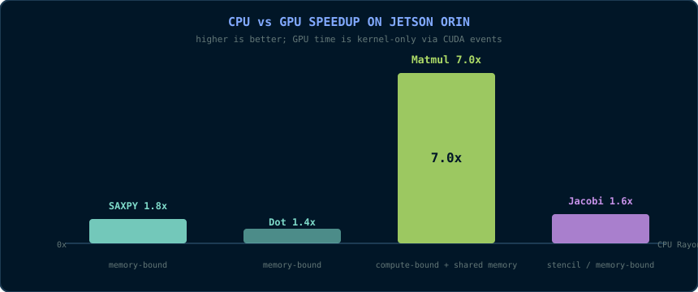
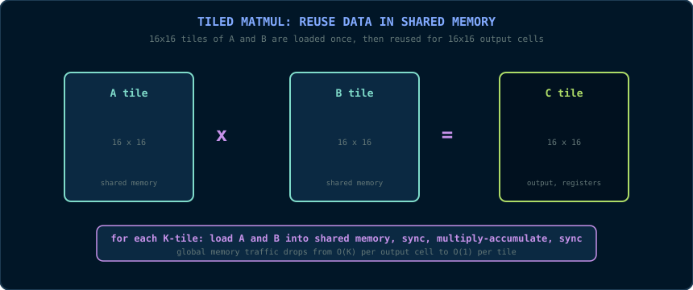
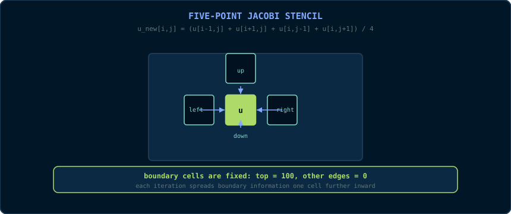

# Chapter 15b: Benchmarking CUDA-Oxide on Jetson Orin

> *"The GPU does not win because it has more cores. It wins when data is reused and the CPU is the bottleneck."*
> 📦 **Code companion:** the complete, buildable code for this chapter lives in [`arpanpathak/cuda-oxide-demo`](https://github.com/arpanpathak/cuda-oxide-demo). The article version is [`CUDA_RUST_JETSON_BENCHMARKS.md`](https://github.com/arpanpathak/cuda-oxide-demo/blob/main/CUDA_RUST_JETSON_BENCHMARKS.md).

Chapter 14 showed how CUDA-Oxide compiles idiomatic Rust kernels to PTX.
This chapter answers the next question: *how fast are those kernels on real
hardware, and when is the GPU actually worth it?*

We benchmark four kernels on a Jetson Orin:

1. **SAXPY** - memory-bound vector operation.
2. **Dot product** - block reduction.
3. **Matrix multiply** - naive vs shared-memory tiled.
4. **Jacobi solver for the 2D Laplace equation** - a stencil that solves a
   real partial differential equation.

Every GPU result is verified against a CPU reference. The CPU baseline uses
Rayon so all 8 ARM cores participate.

## 15b.1 The hardware reality check

The Jetson Orin is not a datacenter GPU. It is an embedded SoC where the CPU
and GPU share:

- the same DRAM bandwidth,
- the same power budget,
- the same thermal envelope.

This changes the performance story. On a discrete GPU, almost any kernel
beats the CPU. On an SoC, the CPU is surprisingly competitive for
memory-bound work because both processors are limited by the same memory
system.



The chart tells the real story:

- SAXPY: 1.8x GPU speedup.
- Dot product: roughly parity (0.7x to 1.8x across runs).
- Tiled matmul: **7.0x** GPU speedup.
- Jacobi global stencil: 1.6x GPU speedup.

Compute-bound work with data reuse is where the GPU dominates. Memory-bound
work is a toss-up.

## 15b.2 The kernels in the demo

The repository is deliberately modular. Each binary is split into small
single-purpose modules:

```
src/bin/06_benchmark/
├── main.rs        # entry point
├── kernels.rs     # #[kernel] device functions
├── cpu.rs         # Rayon CPU references
├── data.rs        # generators + correctness checks
├── measure.rs     # wall-clock / CUDA-event timing
├── bench.rs       # one small method per benchmark
└── report.rs      # Markdown/CSV output

src/bin/07_laplace_jacobi/
├── main.rs        # entry point + parameters
├── kernels.rs     # global + shared-memory stencils
├── cpu.rs         # Rayon CPU Jacobi reference
├── data.rs        # correctness checks
├── measure.rs     # CPU timing helper
├── bench.rs       # orchestration + GPU event timing
└── report.rs      # results printing + file output
```

### SAXPY

```rust
#[kernel]
pub fn saxpy(alpha: f32, input_x: &[f32], input_y: &[f32], mut output: DisjointSlice<f32>) {
    let index = thread::index_1d();
    let position = index.get();

    if let Some(slot) = output.get_mut(index) {
        *slot = alpha * input_x[position] + input_y[position];
    }
}
```

### Dot product block reduction

```rust
static mut SHARED: SharedArray<f32, 256> = SharedArray::UNINIT;
// grid-stride accumulation into local_sum ...
unsafe { SHARED[thread_id] = local_sum; }
thread::sync_threads();

let mut offset = 128;
while offset > 0 {
    if thread_id < offset {
        unsafe { SHARED[thread_id] += SHARED[thread_id + offset]; }
    }
    thread::sync_threads();
    offset /= 2;
}
```

### Tiled matrix multiply



Each 16x16 block loads a tile of `A` and a tile of `B` into shared memory,
synchronizes, computes the output tile from shared memory, synchronizes
again, and advances to the next K-tile. This single change turns the naive
GPU kernel into a 6x-faster kernel.

### Jacobi solver



The Laplace equation is the steady-state diffusion equation. On a grid, the
discrete form becomes:

```
u_new[i,j] = (u[i-1,j] + u[i+1,j] + u[i,j-1] + u[i,j+1]) / 4
```

Each iteration replaces every interior cell with the average of its four
neighbours. The top boundary is fixed at 100, the other edges at 0, and the
iteration spreads the boundary information inward.

## 15b.3 Why the Laplace equation matters

The Laplace equation `∇²u = 0` describes equilibrium in physics:

- **Heat conduction**: steady-state temperature in a solid.
- **Electrostatics**: electric potential in a charge-free region.
- **Fluid dynamics**: pressure in potential flow.
- **Image processing**: inpainting, smoothing, and edge detection.
- **Graphics**: surface fairing and smooth height fields.

The Poisson variant `∇²u = f` adds sources and appears in pressure
projection for fluid simulation, thermal simulation with heat sources, and
many other fields. Jacobi iteration is the simplest solver, and it is the
foundation for multigrid and Krylov methods used in production solvers.

## 15b.4 Benchmark methodology

- **CPU**: Rayon-parallel Rust, `std::time::Instant`, best of 5.
- **GPU**: CUDA events, best of 5, kernel time only.
- **Warm-up**: 5 GPU launches before timing so the Jetson's clocks ramp up.
- **Data**: deterministic pseudo-random `f32` vectors and matrices.
- **Verification**: every GPU result is compared against the CPU reference
  with a tolerance.

## 15b.5 Results

### Vector kernels

| Benchmark | CPU ms | CPU rate | GPU ms | GPU rate | Speedup |
|---|---:|---:|---:|---:|---:|
| SAXPY, N = 16,777,216 | 4.989 | 40.4 GB/s | 2.700 | 74.6 GB/s | 1.8x |
| Dot product, N = 33,554,432 | 6.926 | 38.8 GB/s | 4.891 | 54.9 GB/s | 1.4x |

### Matrix multiply

| Implementation | Time | Rate | Speedup vs CPU Rayon |
|---|---:|---:|---:|
| CPU, 1 thread | 214.480 ms | 10.0 GFLOPS | 0.35x |
| CPU, Rayon (8 cores) | 73.531 ms | 29.2 GFLOPS | 1.0x |
| GPU, naive | 66.490 ms | 32.3 GFLOPS | 1.1x |
| GPU, tiled 16x16 | 10.575 ms | 203.1 GFLOPS | 7.0x |

### Jacobi solver

| Implementation | ms/iteration | 500 iterations | Speedup |
|---|---:|---:|---:|
| CPU, Rayon | 0.2283 | 114.1 ms | 1.0x |
| GPU, global-memory stencil | 0.1460 | 73.0 ms | 1.6x |
| GPU, shared-memory tiled stencil | 0.2258 | 112.9 ms | 1.0x |

Both GPU Jacobi variants match the CPU field exactly after 500 iterations.

## 15b.6 Lessons

1. **Memory-bound kernels are a tie on SoCs.** When the CPU can already
   saturate the shared memory bandwidth, the GPU adds little.
2. **Shared memory tiling is the GPU's superpower.** Matmul jumps from 32 to
   203 GFLOPS, a 6.3x improvement over the naive kernel and 7x over the CPU.
3. **Shared memory is not always the answer.** The tiled Jacobi stencil is
   slower than the simple global stencil on the Orin because the unified L2
   cache absorbs the halo reads. Measure on your hardware.
4. **Warm-up matters on embedded GPUs.** Without warm-up launches, the first
   measured kernel can be 2x slower due to clock ramping.

## 15b.7 Reproduce

```bash
git clone https://github.com/arpanpathak/cuda-oxide-demo.git
cd cuda-oxide-demo

cargo oxide run --bin 06_benchmark
cargo oxide run --bin 07_laplace_jacobi
```

Release builds:

```bash
cargo oxide build -- --release --bin 06_benchmark --bin 07_laplace_jacobi
./target/release/06_benchmark
./target/release/07_laplace_jacobi
```

Reports are written to `benchmarks/benchmark_results.{md,csv}` and
`benchmarks/jacobi_results.{md,csv}`.
