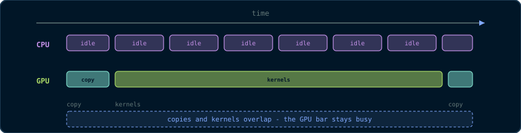

# Chapter 16: Profiling, Debugging & Performance Engineering

> *"A performance bug and a correctness bug are the same bug: your model of
> the machine is wrong. The tools in this chapter find the model."*

Every chapter so far has claimed "this is faster because...". This chapter is
about *proving* it. We cover the four instruments of GPU engineering  - 
**Nsight Systems** and **Nsight Compute** (profilers), **Compute Sanitizer**
(debugger), and **the benchmarking discipline** - plus the verification
techniques (differential and property testing) that keep optimisations honest.
By the end you can take any kernel from this book and answer two questions
reproducibly: *is it correct?* and *is it fast?*

## 16.1 The Two Profilers, and Why Both

NVIDIA ships two profilers with distinct jobs:

> **Primitive - Nsight Systems (`nsys`).** A *system-level* profiler. It
> shows the timeline of your whole program: when kernels ran, when transfers
> ran, when the CPU was idle, how streams overlapped. It answers *where the
> time goes* - and, crucially, whether the GPU was ever idle waiting for the
> host.
> **Primitive - Nsight Compute (`ncu`).** A *kernel-level* profiler. It
> reports per-kernel hardware counters: achieved occupancy, memory
> throughput, shared-memory bank conflicts, warp stall reasons, FLOP counts.
> It answers *why a kernel is slow*.

The workflow is always: **`nsys` first, `ncu` second.** If the GPU is idle
40% of the time, no amount of kernel tuning helps - the fix is streams and
overlap (Chapter 6). Only when the timeline shows the GPU busy do you drill
into a kernel with `ncu`.

```bash
# System-level timeline (10 seconds of the application):
nsys profile --duration=10 ./pipeline

# Kernel-level analysis of the sobel kernel (the profiler replays the
# kernel under instrumentation):
ncu --kernel-name regex:sobel --set full ./pipeline
```

**Why `ncu` "replays" the kernel.** Profiling with full counters changes
timing; `ncu` runs the kernel multiple times under instrumentation and
aggregates counters, so the numbers describe the kernel, not the profiler's
overhead. This is also why `ncu` cannot profile everything at once - use
`--set` presets for the metric groups you need.

## 16.2 Reading the Timeline (nsys)

A healthy streamed pipeline (Chapter 15) shows:



The GPU bar is continuously busy: copies and kernels overlap, and the only
gaps are the unavoidable pipeline priming. The unhealthy versions, and their
diagnoses:

| Timeline symptom | Diagnosis | Fix |
|---|---|---|
| GPU idle between kernel and next copy | Default-stream serialisation | Name streams, `cudaStreamNonBlocking` (Ch. 6) |
| Small kernel gaps every frame | Host launch overhead | CUDA Graphs (Ch. 6, §6.7) |
| Long grey "CPU time" blocks | Host-side stall (I/O, alloc) | Pre-allocate, pin memory (Ch. 4) |
| Copy and kernel never overlap | Pageable memory | `cudaMallocHost` (Ch. 4) |

Reading `nsys` output is the skill that separates engineers who *measure* from
engineers who *guess*: every one of these symptoms has a one-line fix, and
each fix is a chapter you have already read.

## 16.3 The Kernel Report (ncu)

For a single kernel, `ncu --set full` reports the metrics this book has
trained you to interpret:

- **Achieved occupancy** (§2.9) - warps resident versus the theoretical max.
  Low occupancy + memory stalls → not enough warps to hide latency.
- **Memory throughput** - percentage of peak DRAM bandwidth used. Near 100%
  on a memory-bound kernel means coalescing is working; far below it means
  the checklist of Chapter 7 (§7.9) applies.
- **Shared-memory bank conflicts** - the count of extra cycles lost to bank
  conflicts (§2.8, §7.5). Zero is achievable with padding.
- **Warp stall reasons** - *why* warps wait: `long_scoreboard` (waiting on a
  global load), `short_scoreboard` (shared memory), `barrier` (waiting at
  `__syncthreads`), `drain` (stores not flushed). Each stall reason points at
  a different chapter of this book.

The discipline: **record the metric, form a hypothesis, change one thing,
re-measure.** Change one variable at a time - two simultaneous changes make
the measurement uninterpretable.

## 16.4 Compute Sanitizer: The Debugger

> **Primitive - Compute Sanitizer (`compute-sanitizer`).** A runtime tool that
> instruments your kernel to detect memory and synchronisation errors that
> would otherwise be silent: out-of-bounds accesses, misaligned accesses,
> data races, and invalid `__syncthreads` usage.

```bash
# Memory checking: out-of-bounds, uninitialised, and misaligned accesses.
compute-sanitizer --tool memcheck ./pipeline

# Race checking: finds data races between threads (Chapter 5's bug class).
compute-sanitizer --tool racecheck ./pipeline

# Initialisation checking: reads of uninitialised memory.
compute-sanitizer --tool initcheck ./pipeline

# Synchronisation checking: divergent __syncthreads (Chapter 5, 5.3).
compute-sanitizer --tool synccheck ./pipeline
```

**Why these tools matter more on GPUs than on CPUs.** A CPU out-of-bounds
write usually crashes at the instruction; a GPU out-of-bounds write corrupts
*adjacent memory in the same allocation* - the kernel "succeeds", and the
corruption surfaces as a wrong image three stages later. `memcheck` finds the
write at the moment it happens, with the thread and instruction identified.

The relationship to this book: **every race, bank conflict, and divergence
you learned to reason about in Chapters 5 and 7 has a detector.** Run the
detector before you trust your reasoning.

## 16.5 cuda-gdb: The Kernel Debugger

For bugs that resist the automatic tools, `cuda-gdb` is the interactive
debugger for device code: set breakpoints *inside kernels*, inspect
`threadIdx`/`blockIdx`, watch registers and shared memory, and step warp by
warp.

```bash
cuda-gdb ./pipeline
(cuda-gdb) break sobel
(cuda-gdb) run
(cuda-gdb) set cuda break_on_launch application   # stop at every kernel
(cuda-gdb) info cuda kernels                      # list active kernels
(cuda-gdb) thread 5                               # select a specific thread
(cuda-gdb) print x                                # inspect kernel variables
```

**When to reach for cuda-gdb.** After Compute Sanitizer has cleared memory and
race errors, a *logical* bug (wrong index arithmetic, wrong stencil weights)
remains. Break on the kernel, pick a specific thread (`thread 5`), and check
the index formula by hand. This is the interactive version of the
comment-audit that Chapter 3's coding standards demand.

## 16.6 clock64(): Timing Inside the Kernel

Sometimes the profiler's replay changes the answer (e.g., for a kernel whose
performance depends on cache state). The escape hatch is `clock64()`, which
reads a per-SM cycle counter:

```cpp
// Time a code region from INSIDE the kernel. Returns SM cycles.
// Useful when profiler replay perturbs the measurement; otherwise prefer ncu.
__device__ long long profileRegion()
{
    const long long t0 = clock64();
    // ... the region being timed ...
    const long long t1 = clock64();
    return t1 - t0;              // SM cycles (see device clock rate)
}
```

**The caveats.** `clock64()` measures *this thread's* view - warps may be
preempted by the scheduler mid-region - and the SM clock can vary with power
state. Use it for *relative* comparisons of code paths within one kernel run,
not as a cross-run benchmark. For cross-run numbers, use events (Chapter 6)
and the discipline of §16.7.

## 16.7 The Benchmarking Discipline

A number from one run is a rumour. The reproducible protocol, applied to every
claim in this book:

1. **Warm up.** Run the kernel several times before measuring, so caches,
   page tables, and JIT state are steady.
2. **Repeat and report the median**, not the mean - the median is robust to
   the rare outlier (OS preemption, clock boost). Report the spread (P10/P90)
   alongside.
3. **Use events, not host timers**, for device work (Chapter 6, §6.4).
4. **Fix the environment.** Record the GPU (`nvidia-smi -L`), the CUDA
   version (`nvcc --version`), the driver, and the compiler flags
   (`-arch=sm_90`, `-O3`, `--use_fast_math` changes results!).
5. **Verify the output** before trusting the timing. A fast wrong kernel is
   not a result.

```cpp
// The protocol in miniature. ncu or nsys can further validate, but this
// structure is the minimum reproducible measurement.
float benchmarkKernel(int iters)
{
    // warm-up:
    kernel<<<grid, block>>>(...);  cudaDeviceSynchronize();

    std::vector<float> times;
    for (int r = 0; r < iters; ++r)
    {
        cudaEventRecord(start);  kernel<<<grid, block>>>(...);
        cudaEventRecord(stop);   cudaEventSynchronize(stop);
        float ms;  cudaEventElapsedTime(&ms, start, stop);
        times.push_back(ms);
    }
    std::sort(times.begin(), times.end());
    return times[times.size() / 2];   // median
}
```

## 16.8 Verification: Differential and Property Testing

Performance engineering without correctness is vandalism. Two techniques from
the capstone generalise:

- **Differential testing** - compare the GPU result against a trusted CPU
  reference (Chapter 15, §15.8). Run it in CI on every change; a
  "refactor" that changes the last bit of a reduction (Chapter 5, §5.6) gets
  caught, not shipped.
- **Property testing** - assert invariants that hold for *any* input:
  a histogram's counts sum to the input length; a transpose's output is the
  input's transpose; an edge map of a constant image is all zeros. Property
  tests find the bugs that differential tests miss (both may be wrong in the
  same way).

The engineering payoff: once the differential and property suites exist, an
optimisation is *just* a change you run through the suite. This is what
allows the whole optimisation literature - Chapter 7 through 9 - to proceed
without fear.

## 16.9 The Engineering Loop, Formalised

The chapter's whole content reduces to a loop:

1. **Measure** (`nsys` timeline; is the GPU busy?).
2. **Profile** (`ncu`; what is the kernel's bottleneck?).
3. **Hypothesise** (name the chapter that addresses the bottleneck).
4. **Change one thing** (and only one thing).
5. **Re-measure** (median of many runs, fixed environment).
6. **Verify** (differential + property tests still pass).

A loop that skips step 2 or 6 is a gambling habit. A loop that follows all six
steps is engineering. Everything in this book - the roofline of Chapter 1, the
coalescing of Chapter 7, the pipelines of Chapter 15 - is an argument about
what step 3 should say. The loop is how you know the argument was right.

## Key Takeaways

- nsys answers 'where does the time go' (is the GPU ever idle?); ncu answers 'why is this kernel slow' (counters).
- Compute Sanitizer finds what kernels hide: memcheck, racecheck, initcheck, synccheck.
- cuda-gdb debugs kernels interactively, thread by thread.
- The benchmark protocol: warm up, repeat, report the median, use events, fix the environment, verify the output.
- The loop - measure, profile, hypothesise, change one thing, re-measure, verify - is the discipline behind every claim in this book.

## 16.10 Exercises

1. A kernel shows 100% memory throughput in `ncu` but the whole application
   is slow. Which profiler do you run next, and what do you look for?
2. `racecheck` reports a race in a kernel that "passes all tests". Explain
   why this is not a contradiction, and what class of bug it represents
   (hint: Chapter 5, §5.1).
3. Why does the benchmark report the median rather than the mean? Give a
   concrete source of outliers that the median neutralises.
4. Your colleague optimises a kernel and reports a 30% speedup measured with
   `std::chrono` around a single launch. List the three things wrong with
   that measurement.
