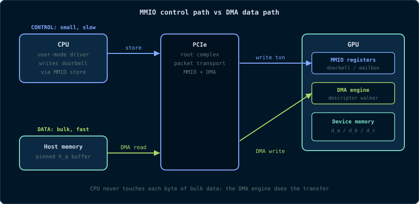

# Chapter 17: GPU Systems Programming & Memory-Mapped I/O

> *"A GPU is not a magic device. It is a PCIe peripheral with a very good
> DMA engine and an even better number cruncher."*

Everything in Chapters 3-16 treated the GPU as a black box with a friendly
API: `cudaMalloc`, `cudaMemcpy`, `kernel<<<...>>>`. This chapter opens the
box from the **systems** side. You will learn what actually happens on the
wire when the CPU tells the GPU to do something, why device memory is not
host memory, how data moves without the CPU, and what the words *memory-mapped
I/O*, *BAR*, *DMA* and *IOMMU* mean in the context of a GPU. None of this is
required to write correct CUDA, but it is required to **understand** CUDA - and
it is exactly the material that separates someone who can copy-paste kernels
from someone who can explain why a kernel is slow.

## 17.1 The GPU Is a PCIe Device

A discrete GPU (and an integrated GPU on a Jetson module, for that matter) is
connected to the CPU through a **PCIe** (Peripheral Component Interconnect
Express) link. PCIe is a packet-based serial bus that replaced the old
parallel PCI bus. Every PCIe device - GPU, NVMe SSD, network card, USB
controller - appears to the CPU as a **device** with:

- a **configuration space** (a 4 KB region the CPU reads at boot to discover
  the device, its vendor, its BARs, and its interrupts);
- one or more **BARs** (Base Address Registers) that tell the CPU where the
  device's control registers and device memory are mapped in the CPU's
  physical address space;
- **MMIO regions** (control registers, doorbells, mailbox);
- **DMA capabilities** (the device can read/write system memory directly).

This is the same model for every PCIe device. GPUs are just the most
interesting PCIe devices because they have enormous amounts of device memory
and extremely high DMA bandwidth.

> **Primitive - PCIe.** A packet-switched, point-to-point serial bus. Each
> "lane" is a differential pair; x16 means 16 lanes. PCIe Gen4 x16 delivers
> ~32 GB/s raw in each direction, which is why host↔device copies top out
> around 20-25 GB/s in practice (Chapter 4).

> **Primitive - BAR (Base Address Register).** A PCIe configuration-space
> register that defines where a device's registers/memory are mapped into the
> CPU's physical address space. The CPU can then read/write those addresses
> with ordinary load/store instructions.

**Why does the programming model have `cudaMemcpy`?** Because the CPU cannot
"see" GPU memory as ordinary RAM by default. GPU memory lives behind the
device's BAR (or behind a DMA mapping), and the cost model is completely
different: a CPU load from a GPU MMIO region can be extremely slow, whereas a
DMA engine can move gigabytes at near-bus speed without the CPU touching each
byte. The CUDA API exists precisely to manage these two worlds.

## 17.2 Memory-Mapped I/O: The Control Path

**Memory-mapped I/O (MMIO)** is the technique of exposing a device's control
registers as if they were memory addresses. The CPU writes a command by
storing a value to an address; the PCIe controller turns that store into a
PCIe **write transaction** that lands in the device's register file.

For a GPU, the MMIO region contains things like:

- the **doorbell** - a register the CPU writes to tell the GPU "I have queued
  new work for you";
- **command buffers / push buffers** - rings of commands the CPU writes into
  (often in host memory) and then "rings the doorbell";
- **mailbox registers** - for small status exchanges;
- **performance counters / temperature / power** - exposed through NVML and
  `nvidia-smi`, but read via the same underlying MMIO path.

The store is **posted**: the CPU does not wait for the GPU to process the
command; it continues immediately. This is why kernel launches are
asynchronous (Chapter 6): the host writes the launch command and rings the
doorbell, and the GPU processes it whenever it gets to it.



> **Primitive - MMIO.** A device's control registers are mapped into the
> CPU's physical address space; CPU loads/stores to those addresses become
> PCIe transactions to the device. MMIO is the *control* path: small, slow,
> and used for commands and status, not bulk data.

**Why is MMIO slow?** Every MMIO read/write is a round trip across the bus
and into the device's register file. A CPU store to MMIO can take hundreds of
nanoseconds and cannot be speculatively repeated. This is why you never move
bulk data through MMIO - you use DMA for that. MMIO is for telling the GPU
*where* the data is, not for moving the data itself.

## 17.3 BARs and PCIe Configuration Space

When Linux boots, it enumerates every PCIe device and reads its configuration
space. The relevant fields for a GPU are:

- **Vendor ID / Device ID** - e.g., NVIDIA's vendor ID is `0x10de`;
- **Class Code** - `0x03` for display controllers, `0x02` for network, etc.;
- **BARs** - up to six 32-bit or 64-bit base address registers;
- **MSI-X** - interrupt configuration.

The GPU's BARs typically map:

- **BAR0**: the MMIO register space (control registers, doorbells);
- **BAR1 / BAR2**: a window into the GPU's *framebuffer* (device memory);
  on some architectures this is how legacy VGA and framebuffer consoles work;
- **BAR3+**: other device-specific regions (e.g., UEFI GOP, ATS, resizable
  BAR).

You can inspect all of this on Linux with `lspci`:

```bash
lspci | grep -i nvidia
# 01:00.0 3D controller: NVIDIA Corporation GA102 [GeForce RTX 3080] (rev a1)

lspci -v -s 01:00.0
# ... Region 0: Memory at f0000000 (64-bit, prefetchable)
#     Region 2: Memory at ... (64-bit, prefetchable)
```

**Resizable BAR.** Modern GPUs support *Resizable BAR* (also called *Smart
Access Memory* on AMD platforms): the BAR window into device memory can be
enlarged so the CPU can map a large fraction of the GPU's memory (or all of
it) into the CPU's address space. This is the physical substrate that makes
unified memory and zero-copy efficient on modern systems: the CPU can reach
device memory through the BAR with ordinary loads/stores, albeit with PCIe
latency.

> **Primitive - device memory window.** The GPU's framebuffer (device memory)
> is not directly addressable by the CPU by default. The BAR creates a *CPU
> address window* that the CPU can map and access, but each access crosses
> PCIe and is subject to bus latency and ordering rules. CUDA's `cudaMalloc`
> gives you a *device* pointer, not a CPU pointer; `cudaHostAlloc` gives you a
> *host* pointer that the GPU's DMA engine can also reach.

## 17.4 DMA: The Data Path

If MMIO is the control path, **DMA** (Direct Memory Access) is the data path.
A DMA engine can copy data between system memory and device memory without
the CPU touching each byte. The sequence for `cudaMemcpy(d_a, h_a, nBytes,
cudaMemcpyHostToDevice)` is roughly:

1. The CPU (user-mode driver) **pins** the host buffer (for pageable memory,
   it may first copy into a pinned staging buffer - Chapter 4).
2. The CPU programs a **DMA descriptor** that says: *source = host physical
   address, destination = device address, length = nBytes*.
3. The CPU rings the DMA engine's doorbell.
4. The DMA engine walks the descriptor, fetches data from system memory, and
   writes it to device memory over PCIe. The CPU is free to do other work.
5. An interrupt or doorbell response notifies the driver that the copy is
   complete.

```
CPU memory        DMA engine          GPU memory
┌─────────┐   ┌──────────────┐   ┌─────────────┐
│ h_a     │──►│ read  ──────►│──►│ d_a         │
└─────────┘   └──────────────┘   └─────────────┘
             no CPU involvement in data movement
```

> **Primitive - DMA (Direct Memory Access).** A hardware engine that copies
> data between memory domains (host memory ↔ device memory, or device ↔
> device) without CPU per-byte involvement. The CPU sets up a descriptor and
> the engine does the bulk transfer.

**Why does pageable memory need a staging copy?** The DMA engine needs
**physical addresses** that will not change while the transfer is in flight.
Ordinary `malloc` pages can be swapped or moved by the OS. Pinning the pages
(`cudaMallocHost`) guarantees the physical pages stay put, so DMA can access
them directly. This is the systems-level reason for Chapter 4's rule: *pin
what you stream*.

## 17.5 IOMMU/SMMU: The DMA Firewall

An **IOMMU** (Intel/AMD terminology) or **SMMU** (ARM terminology) sits
between devices and system memory. It does for DMA what the CPU's MMU does
for CPU loads: it translates **device virtual addresses** to **physical
addresses** and enforces permissions.

Without an IOMMU, a buggy or malicious device could DMA to *any* physical
address - including kernel memory. That is a security and stability hole. With
an IOMMU:

- the device gets **virtual addresses** that the IOMMU maps to physical pages;
- the CPU can revoke mappings (important for hot-unplug and isolation);
- the device cannot touch memory it was not explicitly given;
- **scatter-gather** becomes natural: the device can use a list of
  non-contiguous physical pages as if they were contiguous.

The trade-off is **translation overhead** and, historically, lower bandwidth
on some platforms. That is why high-performance GPU users sometimes disable
IOMMU (or use bypass modes) after measuring, and why `cudaHostAlloc` +
pinned memory + DMA is still the fastest path: the driver can pre-map the
pinned pages into the IOMMU once and reuse the mapping.

> **Primitive - IOMMU/SMMU.** A hardware unit that translates and validates
> DMA addresses, giving devices virtual addresses and preventing them from
> accessing arbitrary physical memory.

**What does this mean for CUDA programmers?** It means `cudaMemcpy` is not
"memcpy on the GPU"; it is a sequence of *mapping, descriptor programming,
doorbell, DMA, unmap* operations. When you see `cudaMemcpyAsync` take
surprisingly long, part of the cost can be page-table and IOMMU work, not just
the wire transfer.

## 17.6 User-Mode Driver vs Kernel-Mode Driver

CUDA has two driver layers:

- **Kernel-Mode Driver (KMD)** - runs in the kernel (`nvidia` / `nvgpu` on
  Jetson). It owns the device, manages MMIO mappings, interrupt handling,
  power, and memory mappings. Only the kernel can program the device directly.
- **User-Mode Driver (UMD)** - runs in your process (`libcuda.so`). It is
  what your program actually links against. The UMD handles the CUDA API,
  launches, memory management, and context state. For performance, the UMD
  tries to avoid kernel round trips: it writes commands into **user-mapped
  command buffers** and rings the doorbell directly (this is why modern GPU
  launches can be so cheap - no kernel call per launch).

The split is why:

- a CUDA context is per-process, not per-thread;
- most CUDA API calls do *not* enter the kernel (they are user-space
  operations on command buffers);
- a GPU crash takes down the context, not the whole system (the KMD resets
  the GPU and returns an error).

```
   Your process                     Kernel                     GPU    
┌──────────────────┐   ioctl    ┌──────────────┐  MMIO/DMA ┌─────────┐
│ libcuda.so (UMD) │ ─────────► │ nvidia (KMD) │ ─────────►│ device  │
│  CUDA API        │  (rarely)  │  device mgmt │           │         │
│  command buffers │ ─────────► │  IRQ handling │          │         │
└──────────────────┘  doorbell  └──────────────┘           └─────────┘
```

> **Primitive - UMD (User-Mode Driver).** The library (`libcuda.so`) linked
> into your process. It implements the CUDA API, manages per-process state,
> and submits work to the GPU with as few kernel transitions as possible.
> **Primitive - KMD (Kernel-Mode Driver).** The kernel module that owns the
> device, handles interrupts and power, and is the only component allowed to
> program the hardware directly.

## 17.7 Observing the System on Linux

You do not need to write a driver to see this machinery. Linux exposes it:

```bash
# PCIe topology
lspci -tv

# GPU MMIO regions / BARs
lspci -v -s $(lspci | grep -i nvidia | awk '{print $1}' | head -1)

# Kernel driver in use
lspci -k -s $(lspci | grep -i nvidia | awk '{print $1}' | head -1)

# Interrupts / IOMMU groups
ls /sys/kernel/iommu_groups/
cat /proc/interrupts | grep -i nvidia

# Device memory size as the kernel sees it
cat /sys/bus/pci/devices/*/resource 2>/dev/null | head
```

On a Jetson, the GPU is part of the SoC, but the same concepts appear through
`/sys/class/misc/nvhost-*`, debugfs, and the `nvgpu` driver interface.

**What should you look for?** The BAR sizes, the driver name, and whether the
device is in an IOMMU group. If your GPU is behind an IOMMU with a slow
translation path, you now know where to point when someone asks "why is my
copy slower than the spec?".

## 17.8 From MMIO to CUDA APIs

Every CUDA API maps onto the systems concepts above:

| CUDA API | Systems concept |
|---|---|
| `cudaMalloc` | Allocates device memory (managed by KMD); returns a device pointer, not a CPU pointer |
| `cudaMemcpy` | Pins/maps host memory, programs a DMA descriptor, rings a doorbell |
| `cudaMemcpyAsync` | Same, but queued in a stream so DMA overlaps kernels |
| `cudaMallocHost` | Allocates **pinned** host memory so DMA can access it directly |
| `cudaHostAllocMapped` / `cudaHostGetDevicePointer` | Maps host memory into the device's address space (zero-copy) |
| `cudaMallocManaged` | Uses the CPU page fault / migration machinery (plus IOMMU and/or BAR mapping) to present one virtual address space |
| `cudaDeviceEnablePeerAccess` | Programs the GPU's P2P DMA path (Chapter 18) |

The deep lesson: **CUDA is a systems API disguised as a math API.** Every
call you make is a transaction with a driver, a DMA engine, and a memory
map. When performance surprises you, the answer is almost always in this
chapter's model: MMIO for control, DMA for data, IOMMU for safety, pinning
for speed.

## 17.9 Deeper Explanation: Why the CPU Cannot Just Read GPU Memory

A common beginner question is: "why can't I dereference a device pointer on
the host?" The systems answer is precise:

1. The device pointer is a **GPU virtual address**, meaningful only inside
   the GPU's address space.
2. The GPU's memory is behind a BAR; the CPU could map it, but:
   - mapping all of device memory into the CPU's address space costs page
     table entries and IOMMU entries;
   - each CPU access crosses PCIe and is slow;
   - the GPU may be actively using the memory, and CPU accesses must be
     ordered with GPU accesses;
3. Therefore the driver gives you a **handle** (the device pointer) and
   explicit copy APIs. The copy API does the expensive thing (DMA) in the
   efficient direction, and the driver handles all the ordering.

**Why is `cudaMallocManaged` different?** Unified memory asks the driver to
present one virtual address that *both* CPU and GPU can dereference. The
driver uses page faults, migrations, and (on modern systems) the BAR window
or ATS (Address Translation Services) to make it work. The cost is that every
fault/migration is a systems operation with hidden latency - which is exactly
why Chapter 4 said "prefetch explicitly".

## 17.10 Common Pitfalls

1. **Treating device pointers as host pointers** - dereferencing a `d_`
   pointer on the CPU is undefined behaviour and usually a segfault or worse.
2. **Not pinning streaming buffers** - pageable memory forces a staging copy
   and silently destroys async-copy performance.
3. **Believing MMIO is "just memory"** - MMIO is not cacheable RAM; a CPU
   store to a doorbell is a command, not data storage. Never use MMIO for
   bulk data.
4. **Ignoring IOMMU overhead** - on some platforms, DMA through the IOMMU is
   measurably slower. Measure with and without; then decide.
5. **Assuming `cudaMemcpy` is synchronous by hardware design** - it is
   synchronous in the API sense, but underneath it is a DMA operation; the
   real cost is descriptor setup + transfer, which is why async copies on
   pinned memory overlap so well.

## 17.11 Check Your Understanding

<details>
<summary>What is the difference between MMIO and DMA?</summary>

MMIO is the **control path**: the CPU writes commands/status to device
registers via PCIe transactions (e.g., a doorbell). DMA is the **data path**:
a hardware engine moves bulk data between memory domains without CPU
per-byte involvement. MMIO is for telling the device *what* to do; DMA is for
moving the *data* the device operates on.
</details>

<details>
<summary>Why does pageable host memory need a staging copy for DMA?</summary>

DMA requires physical addresses that remain valid for the duration of the
transfer. Pageable pages can be swapped or moved by the OS, so the runtime
copies the data into a pinned staging buffer whose physical pages are locked.
Pinned memory (`cudaMallocHost`) skips that staging copy.
</details>

<details>
<summary>What does the IOMMU protect against?</summary>

It prevents a device from DMAing to arbitrary physical memory. The IOMMU
translates device virtual addresses to physical addresses and enforces
permissions, so a buggy or malicious device can only touch memory the driver
explicitly mapped for it.
</details>

## 17.12 Exercises

1. Run `lspci -v` on your machine and identify the GPU's BARs. What is the
   size of the BAR that maps device memory? (On Jetson, look at the SoC's
   memory map instead.)
2. Explain, using the MMIO/DMA model, why `cudaMemcpyAsync` can overlap with
   a kernel while `cudaMemcpy` (synchronous) cannot.
3. Draw the full path of a `cudaMemcpy` from a pinned host buffer to device
   memory, naming every component: UMD, KMD, IOMMU, DMA engine, PCIe, device
   memory.
4. Why is it a bad idea to expose device memory as a plain CPU-mapped BAR and
   let applications dereference device pointers directly? Give two reasons
   from this chapter.
