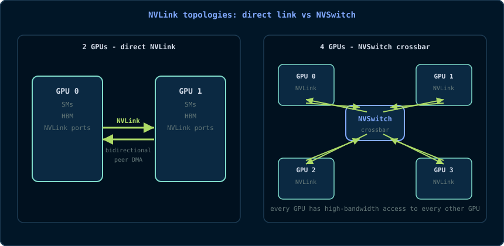

# Chapter 18: NVLink & NVSwitch - The Multi-GPU Interconnect

> *"One GPU is a fast computer. Two GPUs are a fast computer with a problem:
> how do they talk to each other?"*

So far the book has been single-GPU. This chapter introduces the hardware
that makes multi-GPU programming possible: **NVLink** (NVIDIA's high-bandwidth
point-to-point interconnect) and **NVSwitch** (a switch that turns many
point-to-point links into a full mesh). You will learn the topology, the
memory semantics, how to use peer-to-peer copies in CUDA, and when NVLink
actually helps versus when PCIe is good enough.

## 18.1 Why a Single GPU Is Not Enough

Training a large model or processing a huge dataset eventually exceeds one
GPU's memory and compute. The classic options:

1. **Model parallelism** - split the model across GPUs; each GPU holds a
   piece.
2. **Data parallelism** - each GPU holds a full model copy but processes a
   different batch; gradients must be **reduced across GPUs** every step.
3. **Pipeline parallelism** - different stages of a model live on different
   GPUs.

All three need to move data between GPUs. The speed of that movement is the
difference between a multi-GPU system that scales and one that idles waiting
for communication. NVLink exists to make inter-GPU movement fast.

## 18.2 NVLink: Point-to-Point, High-Bandwidth

**NVLink** is a high-bandwidth, low-latency, point-to-point interconnect
between two GPUs (or GPU↔CPU on some platforms). It is not PCIe. Key
properties:

- **Much higher bandwidth than PCIe.** A single NVLink connection is
  bidirectional; e.g., NVLink 3.0 (Ampere) provides 25 GB/s per direction per
  link, and A100 has 12 links = 600 GB/s total bidirectional bandwidth. PCIe
  Gen4 x16 gives ~32 GB/s total. NVLink can be 10-20× faster than PCIe for
  P2P traffic.
- **Lower latency and better small-message performance.** NVLink is designed
  for GPU-to-GPU traffic, with a simpler protocol than PCIe's root-complex
  round trip.
- **Direct GPU-to-GPU DMA.** One GPU's DMA engine can read/write another
  GPU's memory directly, without a bounce through host memory.

```
GPU 0                GPU 1
┌──────┐   NVLink    ┌──────┐
│ SM   │◄───────────►│ SM   │
│ HBM  │◄───────────►│ HBM  │
└──────┘             └──────┘
   peer-to-peer DMA, no host involvement
```

> **Primitive - NVLink.** NVIDIA's proprietary high-bandwidth,
> point-to-point GPU interconnect. It carries data and (on supported
> architectures) coherent memory traffic directly between GPUs.

**How does NVLink connect to the GPU?** Each GPU has a fixed number of NVLink
lanes/links. On A100 there are 12 links; on H100 there are 18 links; on
consumer cards like RTX 30/40 there are fewer (or none - many consumer cards
use PCIe only). The links can be used as:

- direct GPU↔GPU connections (2-GPU systems);
- connections through an **NVSwitch** (4+ GPU systems).

## 18.3 NVSwitch and Topologies

With more than two GPUs, point-to-point links get complicated: a full mesh of
N GPUs needs N×(N-1)/2 links. For N=8, that is 28 links per GPU - too many.
**NVSwitch** solves this by acting as a crossbar inside the box: every GPU
connects to the switch, and the switch forwards traffic between any pair.

- **2 GPUs:** direct NVLink (no switch needed).
- **4 GPUs (DGX A100):** 4 GPUs connected to 2 NVSwitches.
- **8 GPUs (DGX A100/H100):** 8 GPUs connected to NVSwitches in a fat-tree
  topology; every GPU can talk to every other GPU at near-full NVLink
  bandwidth.
- **NVIDIA HGX baseboards** use NVSwitches to give every GPU full bandwidth
  to every other GPU.

```
With NVSwitch (4 GPUs):

        NVSwitch
       /   |   \
      /    |    \
   GPU0  GPU1  GPU2  GPU3
```



This is the physical reason `nvidia-smi topo -m` can report `NV#` (NVLink)
for P2P paths: the topology decides whether a copy between two GPUs is a
direct link, a switch hop, or a PCIe/root-complex path.

> **Primitive - NVSwitch.** A crossbar switch that connects many GPUs'
> NVLink ports, giving each GPU high-bandwidth access to every other GPU
> without a full mesh of direct links.

## 18.4 NVLink Memory Semantics: P2P, Atomics, Coherence

NVLink is not just "fast PCIe". It changes the memory model between GPUs:

- **Peer-to-peer (P2P) access.** A kernel on GPU 0 can read/write GPU 1's
  memory (if enabled and the topology allows it). The access goes over NVLink
  at NVLink speed, not through host memory.
- **Peer atomics.** Atomic operations can be performed on another GPU's
  memory. This enables lock-free multi-GPU algorithms, but the atomic
  throughput over NVLink is lower than local HBM atomics - use them
  sparingly.
- **Coherent/address-translation features.** On architectures with
  NVLink-C2C (chip-to-chip) and Grace-Hopper, NVLink can carry coherent CPU↔GPU
  memory traffic with hardware-managed cache coherence. This is how Grace CPU +
  Hopper GPU appear as one unified memory domain at the hardware level.
- **Unified memory over NVLink.** With `cudaMallocManaged`, pages can migrate
  between GPUs over NVLink. This is convenient but can be slower than explicit
  P2P copies because every page migration is a system operation.

The practical rule: **explicit P2P copies (`cudaMemcpyPeerAsync`) are
predictable and fast; unified memory is convenient but you must measure.**

## 18.5 Peer-to-Peer in CUDA

The CUDA API for P2P is small:

```cpp
// 1. Query whether P2P is possible and enable it.
int canAccess = 0;
cudaDeviceCanAccessPeer(&canAccess, device0, device1);
if (canAccess) {
    cudaSetDevice(device0);
    cudaDeviceEnablePeerAccess(device1, 0);
}

// 2. Copy directly between device memories.
cudaMemcpyPeerAsync(d_buf1, device1,
                    d_buf0, device0,
                    bytes, stream);

// 3. Or, once peer access is enabled, a kernel on GPU 0 can read GPU 1's
//    pointer directly (subject to topology and architecture support).

// 4. Disable when done.
cudaDeviceDisablePeerAccess(device1);
```

> **Primitive - peer access.** The CUDA mechanism that lets one device access
> another device's memory. It requires hardware support (NVLink or PCIe P2P),
> a compatible topology, and explicit enabling via `cudaDeviceEnablePeerAccess`.

**Check the topology first.** `cudaDeviceCanAccessPeer` returns true only if
the platform supports it. On many systems, two GPUs can do P2P over PCIe if
they share a root complex; over NVLink it is always supported. Use
`nvidia-smi topo -m` to see which GPUs are NVLink-connected:

```bash
nvidia-smi topo -m
#        GPU0  GPU1  GPU2  GPU3 ...
# GPU0    X    NV#   NV#   NV#
# ...
```

## 18.6 Bandwidth/Latency Model: When Does NVLink Matter?

The cost of a multi-GPU program is dominated by communication. The model is
simple:

```
total_time ≈ compute_time + communication_time
speedup = single_gpu_time / (compute_time/N + communication_time)
```

If communication time is a significant fraction of compute time, adding GPUs
does not scale. NVLink helps by shrinking communication_time.

**When NVLink matters:**

- Frequent small/medium all-reduces (gradient sync every step in data-parallel
  training).
- Pipeline parallelism where activations are passed between GPUs.
- Multi-GPU databases or graph analytics with fine-grained P2P reads.

**When PCIe is fine:**

- One-time dataset uploads (host→GPU).
- Coarse-grained task parallelism where GPUs rarely talk.
- Communication is dwarfed by compute (embarrassingly parallel batches).

**Measurement discipline (Chapter 16):** do not assume. Use `cudaMemcpyPeer`
with CUDA events, or `nvidia-smi topo -m` + `nccl-tests` (Chapter 19), and
measure the actual achievable P2P bandwidth on your hardware.

## 18.7 Topology Discovery

Knowing the topology before writing code saves hours:

```bash
# Matrix of GPU-to-GPU links (NV# = NVLink, PIX/PXB = PCIe paths)
nvidia-smi topo -m

# Detailed NVLink status (link count, active links, errors)
nvidia-smi nvlink -s

# NVML in C/C++: nvmlDeviceGetTopologyCommonAncestor, etc.
```

The NVML API is the programmatic way to discover the same information. It is
useful in tools that must adapt to the hardware automatically.

## 18.8 Deeper Explanation: Why NVLink Is Not Just Faster PCIe

The surface answer is "higher bandwidth", but the deeper answer is about
**where the data path goes**:

- PCIe P2P between two GPUs often still goes **through the root complex**:
  GPU 0 → PCIe switch/root complex → GPU 1. This adds latency and shares the
  host's PCIe bandwidth.
- NVLink is a **direct GPU-to-GPU link** (or through a switch crossbar). There
  is no host memory hop, no root-complex arbitration, and the protocol is
  optimized for GPU memory semantics (including atomics and, on some
  architectures, coherence).

The result is not just higher peak bandwidth; it is **lower latency per
message** and **more concurrent independent streams** of communication. That
is why NCCL (Chapter 19) prefers NVLink topologies: collective algorithms
need many simultaneous point-to-point transfers, and NVLink can carry them all
at once.

**What about NVLink-C2C?** On Grace-Hopper, NVLink-C2C connects the CPU and
GPU with coherent memory semantics. The CPU and GPU can share a pool of
memory with hardware coherence, removing the copy from the programming model.
This is a genuinely different memory model from discrete PCIe GPUs; Chapter 18
stays with the discrete model, but the concepts (P2P, atomics, topology) all
apply.

## 18.9 Common Pitfalls

1. **Assuming all GPUs can do P2P.** Always check
   `cudaDeviceCanAccessPeer`; many consumer platforms do not support PCIe P2P
   or require special settings.
2. **Using unified memory instead of explicit P2P for hot paths.** Page
   migration over NVLink is convenient but not free; measure before replacing
   `cudaMemcpyPeerAsync`.
3. **Ignoring topology.** Two GPUs on different PCIe switches may have a
   much slower path than two GPUs on the same root complex. Read
   `nvidia-smi topo -m`.
4. **Peer atomics on hot paths.** NVLink atomics are slower than local HBM
   atomics; use them for rare synchronization, not per-element updates.
5. **Forgetting to disable peer access** before changing device context or
   shutting down - the runtime can leave stale mappings.

## 18.10 Check Your Understanding

<details>
<summary>Why is NVLink faster than PCIe for GPU-to-GPU traffic?</summary>

NVLink is a direct, high-bandwidth GPU interconnect with low latency and no
host/root-complex round trip. PCIe P2P often routes through the root complex
and shares host PCIe bandwidth; NVLink is purpose-built for GPU memory
semantics and carries more concurrent traffic.
</details>

<details>
<summary>What does NVSwitch add over direct NVLink?</summary>

It allows more than two GPUs to communicate at high bandwidth without a full
mesh of direct links. Each GPU connects to the switch, and the switch forwards
traffic between any pair, enabling all-to-all patterns in 4/8-GPU systems.
</details>

<details>
<summary>What does cudaDeviceEnablePeerAccess do?</summary>

It enables one device to access another device's memory directly (subject to
hardware support and topology). After enabling, `cudaMemcpyPeer` and, in some
cases, kernels can read/write the peer's memory without going through host
memory.
</details>

## 18.11 Exercises

1. Run `nvidia-smi topo -m` on a multi-GPU machine (or research a DGX
   topology diagram). Identify which GPU pairs are NVLink-connected.
2. Write a small program that measures `cudaMemcpyPeer` bandwidth between two
   GPUs with CUDA events, and compare it to host↔device copy bandwidth.
3. Explain why a full mesh of direct NVLink links is impractical for 8 GPUs,
   and how NVSwitch solves the problem.
4. In data-parallel training, gradients are all-reduced every step. Would you
   prefer NVLink or PCIe for that workload? Justify with the bandwidth/latency
   model from §18.6.
