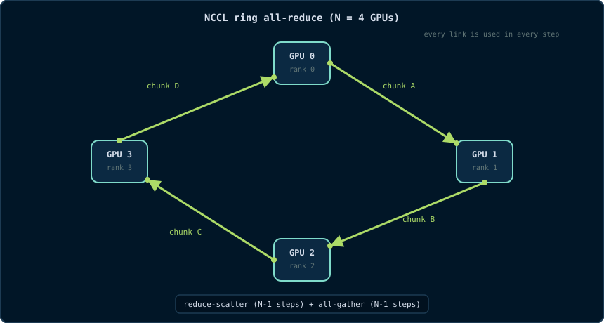

# Chapter 19: NCCL & Multi-GPU Collective Communication

> *"A multi-GPU program is a distributed program wearing a shared-memory
> costume."*

Chapter 18 gave you the hardware (NVLink/NVSwitch). This chapter gives you
the software that turns that hardware into scalable multi-GPU programs:
**NCCL** (NVIDIA Collective Communications Library). NCCL implements the
**collective operations** - all-reduce, broadcast, all-gather, reduce-scatter
- that every data-parallel training loop needs. It is the library that makes
PyTorch's `DistributedDataParallel` and TensorFlow's MirroredStrategy work
across GPUs.

## 19.1 The Multi-GPU Programming Problem

In data-parallel training, each GPU holds a copy of the model and processes a
different batch. At the end of a step, every GPU has computed a *local
gradient*. The next step requires the **average gradient** on every GPU, so
the GPUs must combine their gradients and give every GPU the result. That is
an **all-reduce**.

The naive approach is a single GPU collecting all gradients, summing them, and
broadcasting back. It works but does not scale: the collector becomes the
bottleneck, and most links are idle. Collective algorithms fix this by using
**all links simultaneously** in structured patterns.

> **Primitive - collective operation.** An operation that involves every rank
> in a group and produces a result that depends on data from *all* ranks.
> Examples: all-reduce, broadcast, reduce, all-gather, reduce-scatter.

## 19.2 The Collective Zoo

| Operation | Input | Output | Analogy |
|---|---|---|---|
| **Broadcast** | one rank has data | all ranks have it | "everyone gets my file" |
| **Reduce** | all ranks have data | one rank has the combination | "send me the sum" |
| **All-reduce** | all ranks have data | all ranks have the combination | "everyone gets the sum" |
| **All-gather** | each rank has a piece | every rank has all pieces | "everyone collects the full picture" |
| **Reduce-scatter** | each rank has data | each rank has a combined piece | "sum everything, then give me my slice" |

The mathematical operation is usually **sum**, but collectives generalize to
min, max, product, etc. NCCL supports `ncclSum`, `ncclProd`, `ncclMin`,
`ncclMax`.

## 19.3 NCCL Architecture

NCCL is a library that:

- discovers the **topology** (which GPUs are NVLink-connected, which go
  through PCIe, which are on different hosts);
- builds a **communication plan** (ring, tree, or hybrid);
- creates **channels** - independent communication paths that can run
  concurrently;
- uses CUDA **streams**, **peer access**, and (on modern systems) **NVLink
  atomics and multicast** to move data as fast as the hardware allows.

NCCL operations are launched on a CUDA stream like kernels; they are
asynchronous and participate in stream ordering. A typical call:

```cpp
// Each rank does:
ncclCommInitRank(&comm, nranks, ncclUniqueId, rank);
// ... work ...
ncclAllReduce(sendbuff, recvbuff, count,
              ncclFloat, ncclSum,
              comm, stream);
// NCCL is asynchronous; synchronize the stream when you need results.
```

> **Primitive - rank.** A process/GPU participating in a collective group.
> Ranks are numbered 0..n-1 and each rank has its own `ncclComm`.
> **Primitive - communicator (`ncclComm`).** The NCCL object that represents
> a rank's membership in a group. All collective calls take a communicator.

## 19.4 Ring All-Reduce

The classic NCCL algorithm is the **ring all-reduce**. Imagine N GPUs arranged
in a ring:

```
GPU0 → GPU1 → GPU2 → ... → GPU(N-1) → GPU0
```

The algorithm splits the data into N chunks and performs two phases:

1. **Reduce-scatter.** Each GPU sends chunk *i* to its neighbor, receives
   chunk *i-1*, adds its own chunk, and passes the partial result on. After
   N-1 steps, each GPU holds the *complete reduced* value for one chunk.
2. **All-gather.** Each GPU sends its reduced chunk around the ring again.
   After N-1 steps, every GPU has every reduced chunk.

The beauty is that every link is used in every step. For N GPUs and a message
of size M:

- data moved per GPU ≈ 2M × (N-1)/N
- optimal bandwidth utilization for large messages
- latency grows with N (N-1 steps), so rings are best for **large messages**,
  not tiny ones.

```
Ring all-reduce (N=4), reduce-scatter phase:
Step 1: GPU0 sends chunk A0 to GPU1, GPU1 sends B1 to GPU2, ...
Step 2: partial sums move one more step
...
After N-1 steps: GPU_i holds reduced chunk i
Then the all-gather phase rotates reduced chunks to everyone.
```



## 19.5 Tree All-Reduce

For small messages or many ranks, a **tree** algorithm has lower latency than
a ring because the number of steps is O(log N) instead of O(N).

```
        GPU0
       /    \
    GPU1    GPU2
    /  \    /  \
 GPU3 GPU4 GPU5 GPU6
```

- **Reduce phase:** leaves send their data up; each parent sums children and
  its own data.
- **Broadcast phase:** the root sends the total down the tree.

Trees have higher bandwidth requirements per link (the root handles a lot)
but much lower latency. NCCL chooses ring vs tree (or a hybrid) based on
message size, rank count, and topology. There is also **NVLS** (NVLink
SHARP) on NVSwitch systems, where the switch itself performs reduction in
flight - the ultimate optimization: data is reduced *while moving through the
switch*, so all-reduce becomes nearly as cheap as a single send.

> **Primitive - ring all-reduce.** A bandwidth-optimal all-reduce for large
> messages: reduce-scatter around a ring, then all-gather around the ring.
> **Primitive - tree all-reduce.** A latency-optimal all-reduce for small
> messages: a tree reduce followed by a tree broadcast.

## 19.6 A Complete NCCL Example

A minimal all-reduce program (requires a multi-GPU machine with NCCL
installed):

```cpp
// all_reduce.cu - run with one process per GPU, e.g. mpirun -np 4
#include <cstdio>
#include <cstdlib>
#include <vector>
#include <cuda_runtime.h>
#include <nccl.h>

#define CHECK_CUDA(call) do { cudaError_t e = (call); \
    if (e != cudaSuccess) { fprintf(stderr, "CUDA %s\n", cudaGetErrorString(e)); exit(1); } } while (0)
#define CHECK_NCCL(call) do { ncclResult_t r = (call); \
    if (r != ncclSuccess) { fprintf(stderr, "NCCL %s\n", ncclGetErrorString(r)); exit(1); } } while (0)

int main(int argc, char** argv)
{
    const int nranks = 4;             // number of GPUs/processes
    const int rank   = atoi(argv[1]); // this process's rank (0..n-1)
    const int count  = 1 << 20;       // floats per rank

    CHECK_CUDA(cudaSetDevice(rank));  // rank i uses GPU i in this simple setup

    ncclUniqueId id;
    if (rank == 0) ncclGetUniqueId(&id);
    // In real deployments use MPI to broadcast id to all ranks.

    ncclComm_t comm;
    CHECK_NCCL(ncclCommInitRank(&comm, nranks, id, rank));

    float *sendbuf, *recvbuf;
    CHECK_CUDA(cudaMalloc(&sendbuf, count * sizeof(float)));
    CHECK_CUDA(cudaMalloc(&recvbuf, count * sizeof(float)));
    CHECK_CUDA(cudaMemset(recvbuf, 0, count * sizeof(float)));

    // Each rank's data: rank + 1 (so the all-reduce sum is known).
    std::vector<float> h(count, static_cast<float>(rank + 1));
    CHECK_CUDA(cudaMemcpy(sendbuf, h.data(), count * sizeof(float),
                          cudaMemcpyHostToDevice));

    cudaStream_t stream;
    CHECK_CUDA(cudaStreamCreate(&stream));

    // All-reduce: every rank ends up with sum = 1+2+3+4 = 10 per element.
    CHECK_NCCL(ncclAllReduce(sendbuf, recvbuf, count,
                             ncclFloat, ncclSum,
                             comm, stream));
    CHECK_CUDA(cudaStreamSynchronize(stream));

    std::vector<float> out(count);
    CHECK_CUDA(cudaMemcpy(out.data(), recvbuf, count * sizeof(float),
                          cudaMemcpyDeviceToHost));
    printf("rank %d: out[0] = %f (expected 10)\n", rank, out[0]);

    CHECK_NCCL(ncclCommDestroy(comm));
    CHECK_CUDA(cudaFree(sendbuf));
    CHECK_CUDA(cudaFree(recvbuf));
    return 0;
}
```

Build and run (simplified; real multi-node runs use MPI or a launcher):

```bash
nvcc -arch=compute_60 all_reduce.cu -o all_reduce -lnccl
# start one process per GPU with the unique ID propagated by MPI
```

> **Why is this "systems programming"?** Because the hard part is not the
> math - it is creating the communicator, distributing the unique ID,
> choosing the topology-aware algorithm, and making sure every rank calls the
> collective in the same order on a compatible stream.

## 19.7 NCCL in PyTorch

You will rarely call NCCL directly; you will use it through frameworks.
PyTorch's `DistributedDataParallel` uses NCCL as its backend:

```python
import torch.distributed as dist

dist.init_process_group(backend="nccl", world_size=4, rank=rank)
model = torch.nn.parallel.DistributedDataParallel(model)
# forward/backward
loss.backward()          # DDP hooks an all-reduce of gradients via NCCL
```

The framework handles the communicator setup and launches NCCL collectives on
the right streams. Understanding NCCL's ring/tree behavior still matters:
`NCCL_P2P_LEVEL`, `NCCL_ALGO`, and message sizes affect whether you get ring
(bandwidth-optimal) or tree (latency-optimal) behavior.

## 19.8 Debugging and Tuning NCCL

```bash
# Verbose logs: topology, chosen algorithms, channel count
NCCL_DEBUG=INFO ./train.py

# Detailed trace for a single collective
NCCL_DEBUG=TRACE ./train.py

# Force specific algorithms / transports
NCCL_ALGO=Ring ./train.py
NCCL_P2P_LEVEL=NV ./train.py

# Measure raw collective bandwidth/latency
# (from the nccl-tests repository)
./build/all_reduce_perf -b 8 -e 128M -f 2 -g 4
```

Common issues:

- **Communicator setup hangs** - the unique ID was not distributed correctly,
  or ranks disagree on world size.
- **Slow all-reduce on small messages** - the algorithm may be ring when tree
  would be better; try `NCCL_ALGO=Tree`.
- **P2P disabled or blocked** - check `NCCL_P2P_LEVEL` and topology.
- **Stream mismatch** - the NCCL call must be on the same stream as the
  kernels whose results it consumes (or use events to order).

## 19.9 Deeper Explanation: Why Ring Beats a Centralized All-Reduce

A centralized all-reduce has the collector read N-1 messages, combine, and
write N-1 messages: total traffic through one GPU is O(N·M), and all other
links idle. A ring all-reduce spreads the work: every GPU sends and receives
N-1 chunks of size M/N, so total data per GPU is O(M) and **all links are
busy in every step**. For large M, ring is bandwidth-optimal. For small M,
the N-1 serial steps make latency dominate, so tree (O(log N) steps) wins.
NCCL's planner picks the algorithm by measuring the actual hardware - the same
"measure, don't guess" discipline as Chapter 16.

**What about NVLS (NVLink SHARP)?** On NVSwitch systems, the switch can
perform arithmetic on data as it forwards it. An all-reduce can then be done
with each GPU sending its data once and receiving the reduced result once -
the switch does the combining. This is the multi-GPU version of "compute in
the memory system", and it is why NVLink/NVSwitch + NCCL is the backbone of
large-scale training.

## 19.10 Common Pitfalls

1. **Calling NCCL collectives in different order on different ranks.**
   Collective operations must be matched across ranks; mismatched order
   deadlocks or corrupts data.
2. **Forgetting stream ordering.** NCCL calls are async; if you read results
   without synchronizing or ordering events, you may race.
3. **Using the default communicator ID everywhere.** In multi-process runs,
   the unique ID must be generated once and broadcast (MPI, file, or env);
   every rank must use the same ID.
4. **Ignoring topology.** A ring over PCIe-only GPUs is much slower than a
   ring over NVLink; check `nvidia-smi topo -m` and `NCCL_P2P_LEVEL`.
5. **Assuming NCCL is only for training.** NCCL is useful for any all-to-all
   GPU communication: distributed inference, multi-GPU sorts, graph
   processing, scientific computing.

## 19.11 Check Your Understanding

<details>
<summary>What is the difference between ring and tree all-reduce?</summary>

Ring all-reduce is bandwidth-optimal for large messages: each GPU sends and
receives N-1 chunks and every link stays busy, but latency grows with N. Tree
all-reduce has O(log N) steps and is better for small messages, but the root
and upper links carry more traffic. NCCL picks between them based on message
size, rank count, and topology.
</details>

<details>
<summary>Why must the ncclUniqueId be shared among ranks?</summary>

The unique ID is the bootstrap token that lets all ranks agree they are
joining the same communicator group. It is generated by rank 0 and must be
distributed (via MPI, file, or environment) before `ncclCommInitRank`.
</details>

<details>
<summary>Why is all-reduce the core operation of data-parallel training?</summary>

Every GPU computes a local gradient for the same model parameters. The next
step needs the same averaged gradient on every GPU, so the per-parameter
gradients must be summed (or averaged) across all GPUs and the result made
available to all - exactly an all-reduce.
</details>

## 19.12 Exercises

1. Trace ring all-reduce for N=4 and a 4-chunk message: list what each GPU
   sends and receives in each of the 6 steps (3 reduce-scatter + 3
   all-gather).
2. Using `nccl-tests`, measure `all_reduce_perf` for 8 bytes vs 128 MB and
   explain which algorithm NCCL chose and why.
3. Modify the example program to use `ncclBroadcast` instead of all-reduce:
   rank 0 sends its buffer, all ranks receive it. Verify with a known value.
4. Explain how NVLink SHARP (NVLS) makes all-reduce cheaper than the ring
   algorithm, and why the switch is a natural place to do arithmetic.
